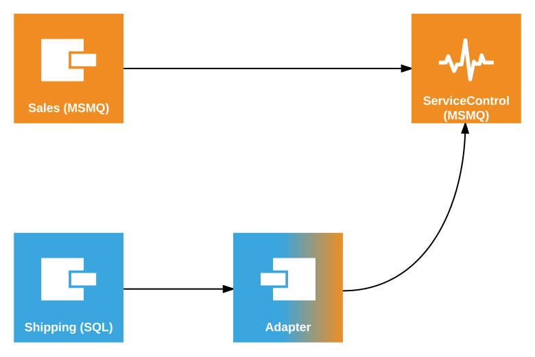

This sample shows how to configure ServiceControl to monitor endpoints and retry messages when using mixed transports. The main transport for the solution is MSMQ and this is the transport used by the ServiceControl. Some endpoints, however, use SQL Server transport.

## Prerequisistes

 1. [Install ServiceControl](/servicecontrol/installation.md). 
 2. Using [ServiceControl Management](/servicecontrol/license.md#servicecontrol-management-app) tool, set up ServiceControl to monitor endpoints using MSMQ transport:
	 
   * Add a new ServiceControl instance:
   * Use default `Particular.ServiceControl` as the instance name (ensure there is no other instance of SC running with the same name).

NOTE: If other ServiceControl instances have been running on this machine, it's necessary to specify a non-default instance name and port number. [Adjust ServicePulse settings](/servicepulse/host-config.md#changing-the-servicecontrol-url) accordingly to point to this location.
 
 3. Ensure the `ServiceControl` process is running before running the sample.
 4. [Install ServicePulse](/servicepulse/installation.md)

NOTE: In order to connect to a different SQL Server instance, ensure all database connection strings are updated in the sample.

include: adapter-running-project-simple

## Code walk-through 

The following diagram shows the topology of the solution:

The code base consists of three projects.

### Sales

The Sales project contains an endpoint that simulates the execution of a business process by sending a message to itself. It includes a message processing failure simulation mode (toggled by pressing `f`) which can be used to generate failed messages for demonstrating message retry functionality. The Sales endpoint uses the MSMQ transport (same as ServiceControl).

### Shipping

The Shipping project also contains an endpoint that simulates the execution of a business process by sending a message to itself. It includes message processing failure simulation mode (toggled by pressing `f`) which can be used to generate failed messages for demonstrating message retry functionality.

The Shipping endpoint uses the SQL Server transport and requires an adapter in order to communicate with ServiceControl.

The Shipping endpoint has the Heartbeats plugin installed to enable uptime monitoring via ServicePulse.

### Adapter

The Adapter project hosts the `ServiceControl.TransportAdapter`. The adapter has two sides: endpoint-facing and ServiceControl-facing. In this sample the endpoint-facing side uses SQL Server transport and the ServiceControl-facind side uses MSMQ:

snippet: AdapterTransport

The following code configures the adapter to use SQL Server transport when communicating with the business endpoints (Shipping).

snippet: EndpointSideConfig

### Duplicates

By default NServiceBus transports use the highest supported transaction modes. In case of MSMQ and SQL Server transports this means `TransactionScope`. Because of that the Adapter requires the Distributed Transaction Coordinator (DTC) service to be configured. In this mode there is no risk of creating duplicate messages when moving messages between the transports. This is especially important for the messages that are selected for retry.
