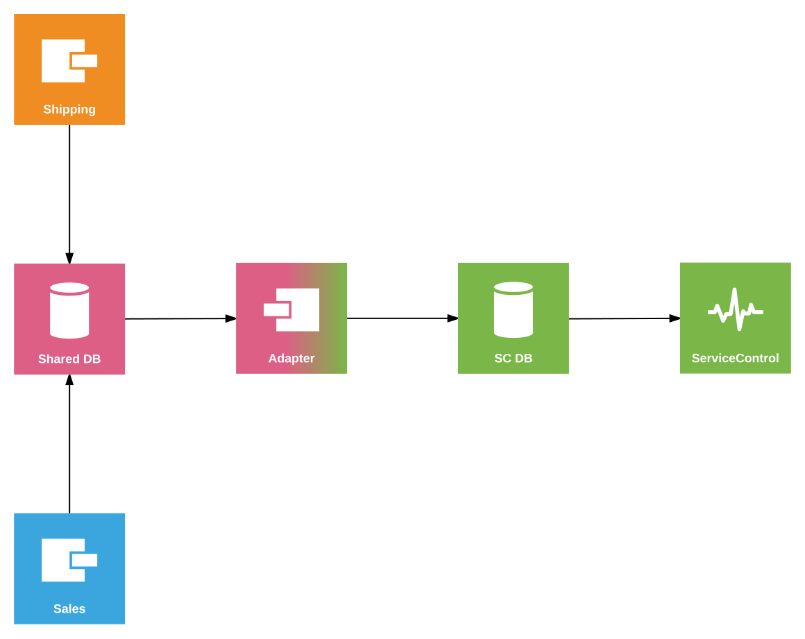

This sample shows how to configure ServiceControl to monitor endpoints and retry messages when using SQL Server transport with endpoints using separate schemas for queues.

The purpose of the adapter is to isolate ServiceControl from the specifics of the physical deployment topology of the business endpoints (such as [SQL Server multi-schema](/transports/sql/deployment-options.md#multi-schema) mode) which are not supported out-of-the-box by ServiceControl.

## Prerequisistes

 1. [Install ServiceControl](/servicecontrol/installation.md).
 2. Create `ServiceControl` database on the local SQL Server instance.
 3. Using [ServiceControl Management](/servicecontrol/license.md#servicecontrol-management-app) tool, set up ServiceControl to monitor endpoints using SQL Server transport:
	 
   * Add a new ServiceControl instance:
   * Use `Particular.ServiceControl.SQL` as the instance name (ensure there is no other instance of SC running with the same name).
   * Use "User" account and provide credentials to allow for integrated authentication.
   * Specify `Data Source=.\SqlExpress;Initial Catalog=ServiceControl;Integrated Security=True;Max Pool Size=100;Min Pool Size=10` as a connection string. ServiceControl Manager will automatically create queue tables in the database.

NOTE: If other ServiceControl instances have been running on this machine, it's necessary to specify a non-default port number for API. [Adjust ServicePulse settings](/servicepulse/host-config.md#changing-the-servicecontrol-url) accordingly to point to this location.
 
 4. Ensure the `ServiceControl` process is running before running the sample.
 5. [Install ServicePulse](/servicepulse/installation.md).

NOTE: In order to connect to a different SQL Server instance, ensure all database connection strings are updated in the sample.

include: adapter-running-project

## Code walk-through 

The following diagram shows the topology of the solution:

The code base consists of four projects.

### Shared

The Shared project contains the message contracts.

### Sales and Shipping

The Sales and Shipping projects contain endpoints that simulate the execution of a business process. The process consists of two events: `OrderAccepted` published by Sales and subscribed by Shipping and `OrderShipped` published by Shipping and subscribed by Sales.

The Sales and Shipping endpoints use separate schemas within the same database. The configuration of the schemas differs slightly because the Sales endpoint uses NServiceBus 6 while Shipping uses NServiceBus 5. The following code shows the Version 6 configuration:

snippet: SchemaV6

And the following code shows similar configuration expressed using Version 5 APIs:

snippet: SchemaV5

Both snippets show how to map the ServiceControl queues to the adapter schema, how to configure the schema for the current endpoint and how to specify other endpoints' schemas.

The business endpoints include a message processing failure simulation mode (toggled by pressing `f`) which can be used to generate failed messages for demonstrating message retry functionality.

The Shipping endpoint has the Heartbeats plugin installed to enable uptime monitoring via ServicePulse.

### Adapter

The Adapter project hosts the `ServiceControl.TransportAdapter`. The adapter has two sides: endpoint-facing and ServiceControl-facing. In this sample both use SQL Server transport:

snippet: AdapterTransport

The following code configures the adapter to use a custom schema (`adapter`) within the shared database. It also maps the schema for the Shipping endpoint. Notice there is no need to map the schema for the Sales endpoint. This is because NServiceBus Version 5 and below did not include the schema name in the address.

snippet: EndpointSideConfig

Starting from Version 6, the schema name [is included in the address](/transports/sql/addressing.md?version=sqlserver_3).

The following code configures the adapter to communicate with ServiceControl:

snippet: SCSideConfig

Because the ServiceControl has been installed under a non-default instance name (`Particular.ServiceControl.SQL`) the control queue name needs to be overridden in the adapter configuration:

snippet: ControlQueueOverride

