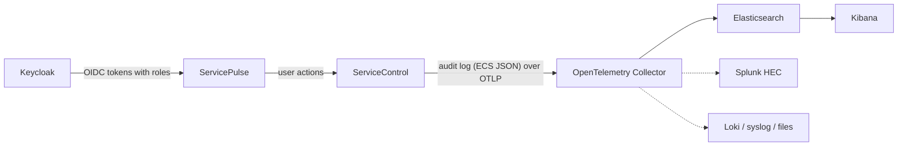

When [role-based access control](/servicecontrol/security/configuration/authorization.md) is enabled, ServiceControl writes every authorization decision — allowed and denied — to a dedicated audit log formatted as [Elastic Common Schema (ECS)](https://www.elastic.co/docs/reference/ecs) JSON. This sample shows how to ship that audit trail over OTLP (OpenTelemetry Protocol) to an [OpenTelemetry Collector](https://opentelemetry.io/docs/collector/), which can then deliver it to a SIEM (Security Information and Event Management system — a log aggregator such as Elastic Security, Splunk, or Microsoft Sentinel) for alerting and compliance retention.



## Prerequisites

- Docker (or Podman) with the compose plugin
- A `.env` file next to `docker-compose.yml` containing a valid license:

  ```
  PARTICULARSOFTWARE_LICENSE=<license file contents>
  ```

## The stack

The `docker-compose.yml` starts:

| Service | Purpose |
|---------|---------|
| `keycloak` | Identity provider; the imported realm defines the `reader`, `writer`, and `admin` roles and one demo user per role (password equals the username) |
| `rabbitmq`, `ravendb` | ServiceControl transport and storage |
| `servicecontrol` | Primary instance with authentication + role-based access control enabled and the audit log exported over OTLP |
| `servicepulse` | Web UI, to generate audit events interactively |
| `otel-collector` | Receives the OTLP log stream and forwards the audit trail |
| `elasticsearch`, `kibana` | The SIEM backend the audit trail is delivered to |

> [!WARNING]
> For simplicity, this sample runs the identity provider over **plain HTTP** and sets `Authentication.RequireHttpsMetadata` to `false`. However, production deployments must use **HTTPS** end-to-end — see [securing ServiceControl](/servicecontrol/security/) for details.

## Configuring ServiceControl

Two things happen in the ServiceControl service definition: role-based access control is switched on, and the OTLP logging provider is added alongside the default NLog provider via the `LoggingProviders` setting. The standard `OTEL_EXPORTER_OTLP_ENDPOINT` environment variable points the exporter at the collector.

snippet: audit-otlp-compose-servicecontrol

With `LoggingProviders=NLog,Otlp`, the operational log keeps flowing to the console/log files through NLog, while every log record — including the audit trail — is additionally exported as OTLP log records. The audit trail is emitted on the logger categories `ServiceControl.Audit` (authorization decisions and message operations) and `ServiceControl.Audit.Messages` (per-message entries of bulk operations), with the pre-rendered ECS JSON document as the OTLP log record *body*. Allowed decisions are logged at `Information` level, while denied decisions are logged at `Warning` level, so alerting on denials does not require parsing the payload.

The `ServiceControl.Audit.Messages` category can be high volume on large bulk retries or archives. It can be filtered independently of the operation-level trail through standard `Microsoft.Extensions.Logging` configuration — see [filtering the per-message audit stream](/servicecontrol/logging.md#authorization-audit-trail-filtering-the-per-message-audit-stream).

## Configuring the OpenTelemetry collector

The collector runs as a regular container next to ServiceControl:

snippet: audit-otlp-compose-collector

It receives all ServiceControl logs, keeps only the audit categories, parses the ECS document, and hands it to one or more exporters:

snippet: audit-otlp-collector-config

Four details worth calling out:

- **Filtering by category.** The `Microsoft.Extensions.Logging` category name arrives as the OTLP *instrumentation scope name*, so the `filter` processor can isolate the audit trail (`ServiceControl.Audit*`) from operational logs without inspecting payloads.
- **Parsing the body.** ServiceControl deliberately exports each audit entry as a self-contained ECS JSON string in the record body. The `transform` processor's `ParseJSON` turns it into a structured body so backends index the individual fields.
- **Mapping mode.** The `elastic.mapping.mode` scope attribute selects the Elasticsearch exporter's `bodymap` mode, which indexes the parsed body verbatim — the Elasticsearch document is then exactly the ECS document ServiceControl emitted. (Since collector 0.156, the exporter's `mapping::mode` config option is deprecated and ignored; the scope attribute or the `X-Elastic-Mapping-Mode` client metadata key replaces it.)
- **Fan-out.** A single collector pipeline can deliver the same stream to multiple destinations — a SIEM for alerting plus rotated files for long-term retention.

## Running the sample

```bash
docker compose up -d
```

Once healthy, generate audit events. Either log into ServicePulse at `http://localhost:9090` (e.g. as `reader` / `reader`) and browse around, or use the API directly:

```bash
# An allowed request: 'reader' may view failed messages
TOKEN=$(curl -s http://localhost:8088/realms/particular/protocol/openid-connect/token \
  -d grant_type=password -d client_id=servicepulse \
  -d username=reader -d password=reader \
  -d scope="openid profile servicecontrol" | jq -r .access_token)

curl -s -H "Authorization: Bearer $TOKEN" http://localhost:33333/api/errors > /dev/null

# A denied request: 'reader' may not retry messages
curl -s -X POST -H "Authorization: Bearer $TOKEN" http://localhost:33333/api/errors/retry/all
```

Then watch the audit entries arrive at the collector:

```bash
docker compose logs otel-collector | grep "Body:"
```

Each OTLP record carries the ECS document as its body, together with the resource attributes `service.name`, `service.version`, and `service.instance.id` identifying which ServiceControl instance emitted it.

### Querying the audit trail in Elasticsearch and Kibana

The collector delivers the same entries to Elasticsearch, into the `logs-servicecontrol.audit-default` data stream. Elasticsearch's built-in `logs-*-*` index template recognizes the ECS field names and maps them correctly (`event.category`, `event.outcome`, and `user.name` become `keyword` fields; `@timestamp` becomes a `date`) — no custom mapping or index template needs to be installed. Query the denied decisions directly:

```bash
curl -s "http://localhost:9200/logs-servicecontrol.audit-default/_search?q=event.category:iam%20AND%20event.outcome:failure" | jq .hits.total.value
```

Or use Kibana at `http://localhost:5601`: create a data view for `logs-servicecontrol.audit-*` with `@timestamp` as the time field (**Stack management** → **Data views**), then run the KQL query in **Discover**:

```
event.category:iam and event.outcome:failure
```

Every denied authorization decision appears, with the full ECS document expandable per hit. Because `user.name` is a `keyword` field it is aggregatable, so visualizations and alert rules such as "failures per user over time" work immediately.

## The ECS audit document

ECS is Elastic's open specification for naming log fields consistently so that tooling — dashboards, correlation rules, detection content — works across data sources. It is the de-facto ingestion schema for SIEMs beyond Elastic's own: most systems either ingest ECS natively or ship converters for it. In 2023, Elastic [donated ECS to OpenTelemetry](https://opentelemetry.io/blog/2023/ecs-otel-semconv-convergence/), and the two schemas are converging namespace by namespace, though the security-relevant `event.*` classification fields remain ECS-only for now.

An *allowed* decision looks like:

```json
{
  "@timestamp": "2026-07-07T16:57:13.7857082+00:00",
  "event": {
    "kind": "event",
    "category": ["iam"],
    "type": ["allowed"],
    "action": "error:messages:view",
    "outcome": "success"
  },
  "user": {
    "id": "38589380-f1ca-43da-9585-b9e94b2a49ad",
    "name": "reader"
  },
  "servicecontrol": {
    "permission": "error:messages:view",
    "reason": "User holds 'error:messages:view' via role(s) [reader]"
  }
}
```

A *denied* decision differs in `event.type` (`["denied"]`), `event.outcome` (`"failure"`), the log level (`Warning`), and the reason. The fields follow ECS's [categorization model](https://www.elastic.co/docs/reference/ecs/ecs-category-field-values-reference):

| Field | Meaning |
|-------|---------|
| `@timestamp` | When the decision was made (UTC, ISO 8601) |
| `event.kind` | `event` — a regular occurrence, as opposed to an alert or a metric |
| `event.category` | `iam` (Identity and Access Management) for authorization decisions; `configuration` for message operations such as retry or archive |
| `event.type` | Sub-categorization: `allowed`/`denied` for decisions, `change`/`deletion` for operations |
| `event.action` | The specific action attempted, expressed as the ServiceControl permission (`instance:resource:action`) |
| `event.outcome` | `success` or `failure` — the field SIEM detection rules key on |
| `user.id` / `user.name` | The caller, taken from the token claims configured by `Authentication.SubjectIdClaim` and `Authentication.SubjectNameClaim` |
| `servicecontrol.*` | Application-specific detail (permission, resource, reason, message/operation ids) in a custom namespace, as ECS prescribes for non-standard fields |

Because the documents are already ECS, they ingest into Elastic/Kibana with no custom mapping, and SIEM content such as "alert when `event.category:iam AND event.outcome:failure` spikes for one `user.name`" works out of the box — [querying the audit trail](#running-the-sample-querying-the-audit-trail-in-elasticsearch-and-kibana) demonstrates exactly this query against the included Elasticsearch container.

## Delivering to a SIEM

Is there something that can *output* the logs to the destination of choice? Yes — that is exactly the OpenTelemetry Collector's job. The `otel/opentelemetry-collector-contrib` distribution ships exporters for the common destinations; the sample delivers to Elasticsearch and its collector config contains ready-to-uncomment blocks for the others:

| Destination | Exporter | Notes |
|-------------|----------|-------|
| Elasticsearch / Elastic Security | `elasticsearch` | The `bodymap` mapping mode indexes the parsed ECS document exactly as emitted; `ecs` mode instead maps OpenTelemetry semantic-convention attributes onto ECS names |
| Splunk | `splunk_hec` | Sends to the HTTP Event Collector endpoint |
| Grafana Loki | `otlphttp` | Loki 3.0+ ingests OTLP natively at `/otlp`; the dedicated Loki exporter was retired |
| Generic / legacy SIEM | `syslog` | RFC 5424 over TCP/TLS as lowest common denominator |
| Compliance archive | `file` | Rotated JSON files |

Alternatives to the OpenTelemtry collector that also speak OTLP include: 

- [Elastic Agent embeds an OpenTelemetry Collector distribution](https://www.elastic.co/docs/reference/fleet/elastic-agent-as-otel-collector) (EDOT)
- [Vector](https://vector.dev/docs/reference/configuration/sources/opentelemetry/) (has an OpenTelemetry source)
- [Fluent Bit](https://docs.fluentbit.io/manual/data-pipeline/inputs/opentelemetry) (ships OTLP input/output plugins)

However, the OpenTelemetry collector is recommended here because the ECS documents need no re-mapping — any OTLP-capable pipeline can carry them.

Deployments that cannot use OTLP can still collect the audit trail from its file/console destination: when running as a Windows service the audit trail is written to `audit.json` in the instance log directory, and in containers it goes to standard output — see [the authorization documentation](/servicecontrol/security/configuration/authorization.md#authorization-audit-log) for details.
