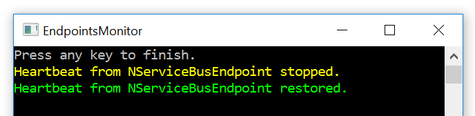

## Prerequisistes

1. [Install ServiceControl](/servicecontrol/installation).
1. Using [ServiceControl Management Utility](/servicecontrol/license#licensing-servicecontrol-servicecontrol-management-utility) tool, set up ServiceControl to monitor endpoints using MSMQ transport.
1. Make sure the `ServiceControl` process is running before running the sample. 

## Running the project

The project presents how to handle two kinds of events:

### MessageFailed event

A `MessageFailed` event is emitted whenever processing a message fails and message is moved to the error queue.

In order to observe that, press `Enter` in the `NServiceBusEndpoint` console window. That will send a new `SimpleMessage`. Processing of the message fails every time.

When a `MessageFailed` event is received, the `EndpointsMonitor` prints a red `Received ServiceControl 'MessageFailed' event for a SimpleMessage.` text in its console window.

### HeartbeatStopped and HeartbeatRestored events

The `HeartbeatStopped` event is emitted whenever an endpoint fails to send a control message at expected interval. The `HeartbeatRestored` event is emitted whenever the endpoint successfully sends a control message again. 

Note that Monitor needs to receive at least one control message, before it can observe that endpoint stopped responding, and that `HeartbeatStopped` event is emitted only following the `HeartbeatStopped` event. 

In order to observe that, stop the `NServiceBusEndpoint` application and wait for up to 30 seconds. When a `HeartbeatStopped` event is received, the `EndpointsMonitor` prints a yellow `Heartbeat from NServiceBusEndpoint stopped.` text in its console window.

Then restart the `NServiceBusEndpoint` application and wait for up to 30 seconds. When a `HeartbeatRestored` event is received, the `EndpointsMonitor` prints a green `Heartbeat from EndpointsMonitoring.NServiceBusEndpoint restored.` text in its console window.

## Code walk-through 

The solution consists of two projects. The `NServiceBusEndpoint` is a simple endpoint which is monitored by the `EndpointsMonitor`.

### NServiceBusEndpoint

The `MessageFailed` event is published for any standard NServiceBus endpoint that is monitored by ServiceControl.

In order to receive `HeartbeatStopped` and `HeartbeatRestored` events, the endpoint needs to use the [heartbeats plugin](/servicecontrol/plugins/heartbeat.md).

NOTE: Hearbeat control messages are sent [every 30 seconds by default](/servicecontrol/plugins/heartbeat.md#configuration-ttl). That means there might be up to 30 seconds delay before ServiceControl realizes that it lost or restored connection with the endpoint. 

### EndpointsMonitor

In order to get notifications when the exposed ServiceControl events occur, create an NServiceBus endpoint. Then reference the `ServiceControl.Contracts` NuGet package and implement a handler which handles ServiceControl events:

snippet:ServiceControlEventsHandlers
