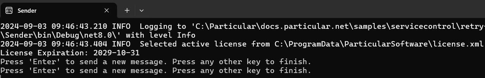
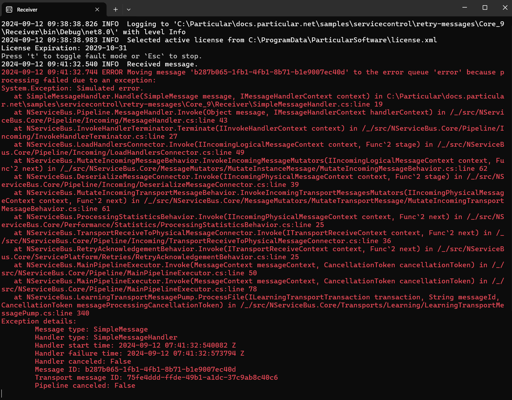
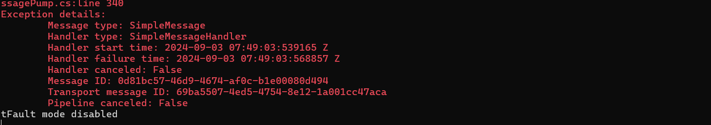
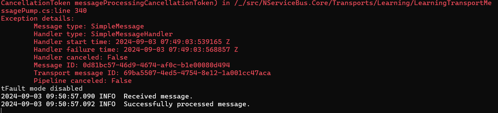

This sample shows how to retry a failed message. The sample uses the [Learning Transport](/transports/learning/) and a portable version of the Particular Service Platform tools. Installing ServiceControl is **not** required.

include: platformlauncher-windows-required

downloadbutton

## Running the project

Running the project will result in 3 console windows. Wait a moment until the ServicePulse window opens in the browser.

### Sender

The sender is a program that uses NServiceBus to send simple test messages.

Press <kbd>Enter</kbd> in the Sender console window to send one.

### Receiver

The receiver is a program that uses NServiceBus to read messages off a queue and process them. It has a fault simulation mode that is enabled by default. Because of that, the message that has just been sent fails to be processed.

Press <kbd>t</kbd> to disable the fault simulation mode so that the message is processed correctly once retried.

### ServicePulse

Go back to the ServicePulse browser window. You can see that now the dashboard view indicates that there is a failed message. 

Click on the failure symbol to see the datails. You can inspect the message headers as well as the payload.

Now click `Request retry` to initiate the message retry process.

Once the process is completed, go back to the Receiver console window.

### Receiver

You can now notice that the message has been successfully processed.

## Code walk-through

Retries are disabled in the sample for simplicity; messages are immediately moved to the error queue after a processing failure:

snippet: DisableRetries

This endpoint processes messages of type `SimpleMessage`. Depending on the value of the `FaultMode` property, the message processing might end with an exception.

snippet: ReceiverHandler