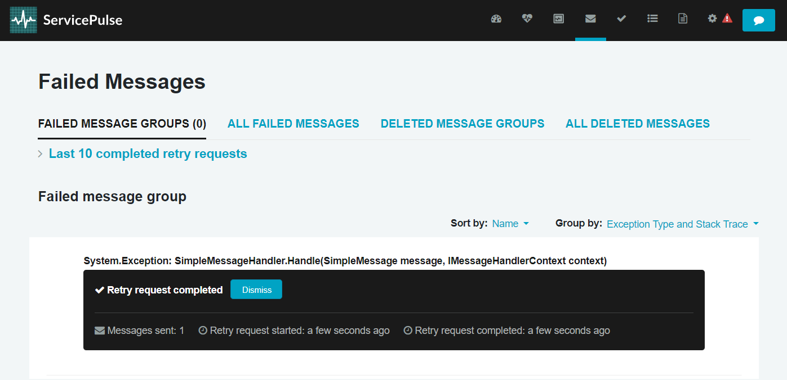

This sample shows how to retry a failed message. The sample uses the [Learning Transport](/transports/learning/) and a portable version of the Particular Service Platform tools. Installing ServiceControl is **not** required.


downloadbutton

## Running the solution

Running the solution starts 3 console windows. Wait a moment until the ServicePulse window opens in the browser.


### Sender

The sender is a program that uses NServiceBus to send simple test messages.

```cmd
2024-09-12 09:38:38.902 INFO  Logging to 'C:\Particular\docs.particular.net\samples\servicecontrol\retry-messages\Core_9\Sender\bin\Debug\net8.0\' with level Info
2024-09-12 09:38:39.070 INFO  Selected active license from C:\ProgramData\ParticularSoftware\license.xml
License Expiration: 2029-10-31
Press 'Enter' to send a new message. Press any other key to finish.
```

Press <kbd>Enter</kbd> in the Sender console window to send one.

### Receiver

The receiver reads messages off a queue and processes them. By default, it runs in a fault simulation mode, which causes message processing to fail, including the one that has just been sent.

```cmd
2024-09-12 09:38:38.826 INFO  Logging to 'C:\Particular\docs.particular.net\samples\servicecontrol\retry-messages\Core_9\Receiver\bin\Debug\net8.0\' with level Info
2024-09-12 09:38:38.983 INFO  Selected active license from C:\ProgramData\ParticularSoftware\license.xml
License Expiration: 2029-10-31
Press 't' to toggle fault mode or `Esc` to stop.
2024-09-12 09:41:32.540 INFO  Received message.
2024-09-12 09:41:32.744 ERROR Moving message 'b287b065-1fb1-4fb1-8b71-b1e9007ec40d' to the error queue 'error' because processing failed due to an exception:
System.Exception: Simulated error.
   at SimpleMessageHandler.Handle(SimpleMessage message, IMessageHandlerContext context) in C:\Particular\docs.particular.net\samples\servicecontrol\retry-messages\Core_9\Receiver\SimpleMessageHandler.cs:line 19
   at NServiceBus.Pipeline.MessageHandler.Invoke(Object message, IMessageHandlerContext handlerContext) in /_/src/NServiceBus.Core/Pipeline/Incoming/MessageHandler.cs:line 43
   at NServiceBus.InvokeHandlerTerminator.Terminate(IInvokeHandlerContext context) in /_/src/NServiceBus.Core/Pipeline/Incoming/InvokeHandlerTerminator.cs:line 27
   at NServiceBus.LoadHandlersConnector.Invoke(IIncomingLogicalMessageContext context, Func`2 stage) in /_/src/NServiceBus.Core/Pipeline/Incoming/LoadHandlersConnector.cs:line 49
   at NServiceBus.MutateIncomingMessageBehavior.InvokeIncomingMessageMutators(IIncomingLogicalMessageContext context, Func`2 next) in /_/src/NServiceBus.Core/MessageMutators/MutateInstanceMessage/MutateIncomingMessageBehavior.cs:line 62
   at NServiceBus.DeserializeMessageConnector.Invoke(IIncomingPhysicalMessageContext context, Func`2 stage) in /_/src/NServiceBus.Core/Pipeline/Incoming/DeserializeMessageConnector.cs:line 39
   at NServiceBus.MutateIncomingTransportMessageBehavior.InvokeIncomingTransportMessagesMutators(IIncomingPhysicalMessageContext context, Func`2 next) in /_/src/NServiceBus.Core/MessageMutators/MutateTransportMessage/MutateIncomingTransportMessageBehavior.cs:line 61
   at NServiceBus.ProcessingStatisticsBehavior.Invoke(IIncomingPhysicalMessageContext context, Func`2 next) in /_/src/NServiceBus.Core/Performance/Statistics/ProcessingStatisticsBehavior.cs:line 25
   at NServiceBus.TransportReceiveToPhysicalMessageConnector.Invoke(ITransportReceiveContext context, Func`2 next) in /_/src/NServiceBus.Core/Pipeline/Incoming/TransportReceiveToPhysicalMessageConnector.cs:line 36
   at NServiceBus.RetryAcknowledgementBehavior.Invoke(ITransportReceiveContext context, Func`2 next) in /_/src/NServiceBus.Core/ServicePlatform/Retries/RetryAcknowledgementBehavior.cs:line 25
   at NServiceBus.MainPipelineExecutor.Invoke(MessageContext messageContext, CancellationToken cancellationToken) in /_/src/NServiceBus.Core/Pipeline/MainPipelineExecutor.cs:line 50
   at NServiceBus.MainPipelineExecutor.Invoke(MessageContext messageContext, CancellationToken cancellationToken) in /_/src/NServiceBus.Core/Pipeline/MainPipelineExecutor.cs:line 78
   at NServiceBus.LearningTransportMessagePump.ProcessFile(ILearningTransportTransaction transaction, String messageId, CancellationToken messageProcessingCancellationToken) in /_/src/NServiceBus.Core/Transports/Learning/LearningTransportMessagePump.cs:line 340
Exception details:
        Message type: SimpleMessage
        Handler type: SimpleMessageHandler
        Handler start time: 2024-09-12 07:41:32:540082 Z
        Handler failure time: 2024-09-12 07:41:32:573794 Z
        Handler canceled: False
        Message ID: b287b065-1fb1-4fb1-8b71-b1e9007ec40d
        Transport message ID: 75fe4ddd-ffde-49b1-a1dc-37c9ab8c40c6
        Pipeline canceled: False
```

Press <kbd>t</kbd> to disable the fault simulation mode so that the message is processed correctly once retried.

```cmd
Exception details:
        Message type: SimpleMessage
        Handler type: SimpleMessageHandler
        Handler start time: 2024-09-12 07:41:32:540082 Z
        Handler failure time: 2024-09-12 07:41:32:573794 Z
        Handler canceled: False
        Message ID: b287b065-1fb1-4fb1-8b71-b1e9007ec40d
        Transport message ID: 75fe4ddd-ffde-49b1-a1dc-37c9ab8c40c6
        Pipeline canceled: False
t
Fault mode disabled
```

### ServicePulse

Going back to the ServicePulse browser window, there is a notification on the dashboard about one failed message. 


Click on the failure symbol to see the datails. You can inspect the message headers as well as the payload.


Now click `Request retry` to initiate the message retry process i.e. sending the message back to the receiver's input queue for reprocessing.


Once the process is completed, go back to the Receiver console window.



### Receiver

You can now notice that the message has been successfully processed.

```cmd
Exception details:
        Message type: SimpleMessage
        Handler type: SimpleMessageHandler
        Handler start time: 2024-09-12 07:41:32:540082 Z
        Handler failure time: 2024-09-12 07:41:32:573794 Z
        Handler canceled: False
        Message ID: b287b065-1fb1-4fb1-8b71-b1e9007ec40d
        Transport message ID: 75fe4ddd-ffde-49b1-a1dc-37c9ab8c40c6
        Pipeline canceled: False
t
Fault mode disabled
2024-09-12 09:44:43.779 INFO  Received message.
2024-09-12 09:44:43.781 INFO  Successfully processed message.
```

## Code walk-through

For simplicity, both [the immediate](/nservicebus/recoverability/index.md#immediate-retries) and [the delayed retries](/nservicebus/recoverability/index.md#delayed-retries) are disabled in the sample. As a result, messages are moved to the error queue after a single failed processing attempt:

snippet: DisableRetries

The receiver's failure mode is controlled by the `FaultMode` property. When `true` processing of `SimpleMessage` messages ends with an exception.

snippet: ReceiverHandler