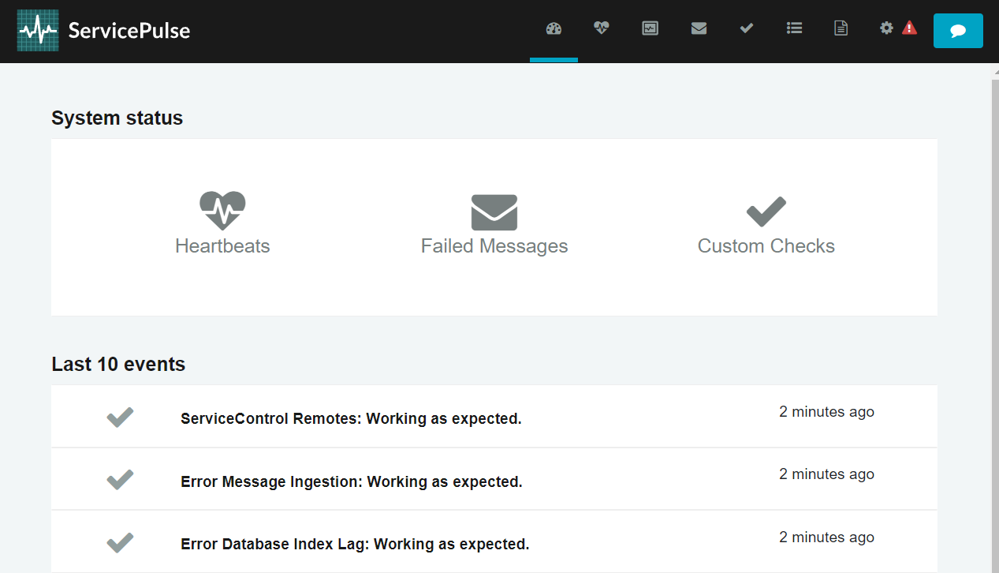
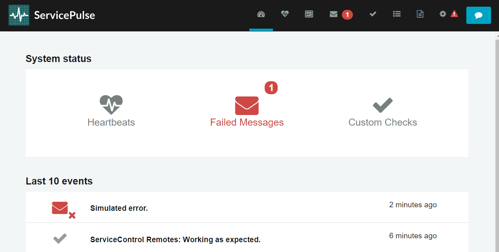
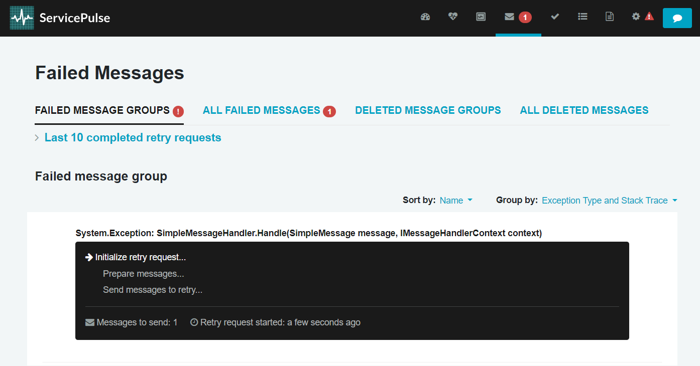

This sample shows how to retry a failed message. The sample uses the [Learning Transport](/transports/learning/) and a portable version of the Particular Service Platform tools. Installing ServiceControl is **not** required.


downloadbutton

## Running the solution

Running the solution starts 3 console windows. Wait a moment until the ServicePulse window opens in the browser.



### Sender

The sender is a program that uses NServiceBus to send simple test messages.

```cmd
info: NServiceBus.LicenseManager[0]
      Selected active license from C:\ProgramData\ParticularSoftware\license.xml
      License Expiration: 2026-07-15
Press 'Enter' to send a new message. Press any other key to finish.
info: Microsoft.Hosting.Lifetime[0]
      Application started. Press Ctrl+C to shut down.
info: Microsoft.Hosting.Lifetime[0]
      Hosting environment: Production
info: Microsoft.Hosting.Lifetime[0]
      Content root path: C:\git\p\docs.particular.net\samples\servicecontrol\retry-messages\Core_9\Sender\bin\Debug\net9.0
Press 'Enter' to send a new message. Press any other key to finish.
```

Press <kbd>Enter</kbd> in the Sender console window to send one.

### Receiver

The receiver reads messages off a queue and processes them. By default, it runs in a fault simulation mode, which causes message processing to fail, including the one that has just been sent.

```cmd
info: NServiceBus.LicenseManager[0]
      Selected active license from C:\ProgramData\ParticularSoftware\license.xml
      License Expiration: 2026-07-15
Press 't' to toggle fault mode.
info: Microsoft.Hosting.Lifetime[0]
      Application started. Press Ctrl+C to shut down.
info: Microsoft.Hosting.Lifetime[0]
      Hosting environment: Production
info: Microsoft.Hosting.Lifetime[0]
      Content root path: C:\git\p\docs.particular.net\samples\servicecontrol\retry-messages\Core_9\Receiver\bin\Debug\net9.0
info: Toggle[0]
      Received message.
fail: NServiceBus.MoveToError[0]
      Moving message '6e387659-ea6b-47ee-8223-b31b00aa3d9f' to the error queue 'error' because processing failed due to an exception:
      System.Exception: Simulated error.
         at SimpleMessageHandler.Handle(SimpleMessage message, IMessageHandlerContext context) in C:\git\p\docs.particular.net\samples\servicecontrol\retry-messages\Core_9\Receiver\SimpleMessageHandler.cs:line 25
         at NServiceBus.Pipeline.MessageHandler.Invoke(Object message, IMessageHandlerContext handlerContext) in /_/src/NServiceBus.Core/Pipeline/Incoming/MessageHandler.cs:line 43
(...)
```

Press <kbd>t</kbd> to disable the fault simulation mode so that the message is processed correctly once retried.

```cmd
t
Fault mode disabled
```

### ServicePulse

Going back to the ServicePulse browser window, there is a notification on the dashboard about one failed message.



Click on the failure symbol to see the datails. You can inspect the message headers as well as the payload.


Now click `Request retry` to initiate the message retry process i.e. sending the message back to the receiver's input queue for reprocessing.



Once the process is completed, go back to the Receiver console window.


### Receiver

You can now notice that the message has been successfully processed.

```cmd
t
Fault mode disabled
info: Toggle[0]
      Received message.
info: Toggle[0]
      Successfully processed message.
```

## Code walk-through

For simplicity, both [the immediate](/nservicebus/recoverability#immediate-retries) and [the delayed retries](/nservicebus/recoverability/#delayed-retries) are disabled in the sample. As a result, messages are moved to the error queue after a single failed processing attempt:

snippet: DisableRetries

The receiver's failure mode is controlled by the `FaultMode` property. When `true` processing of `SimpleMessage` messages ends with an exception.

snippet: ReceiverHandler