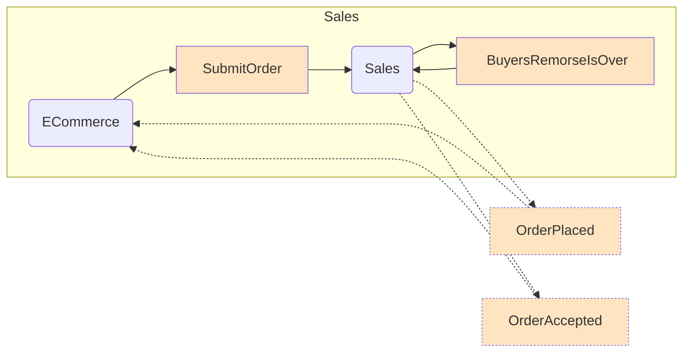
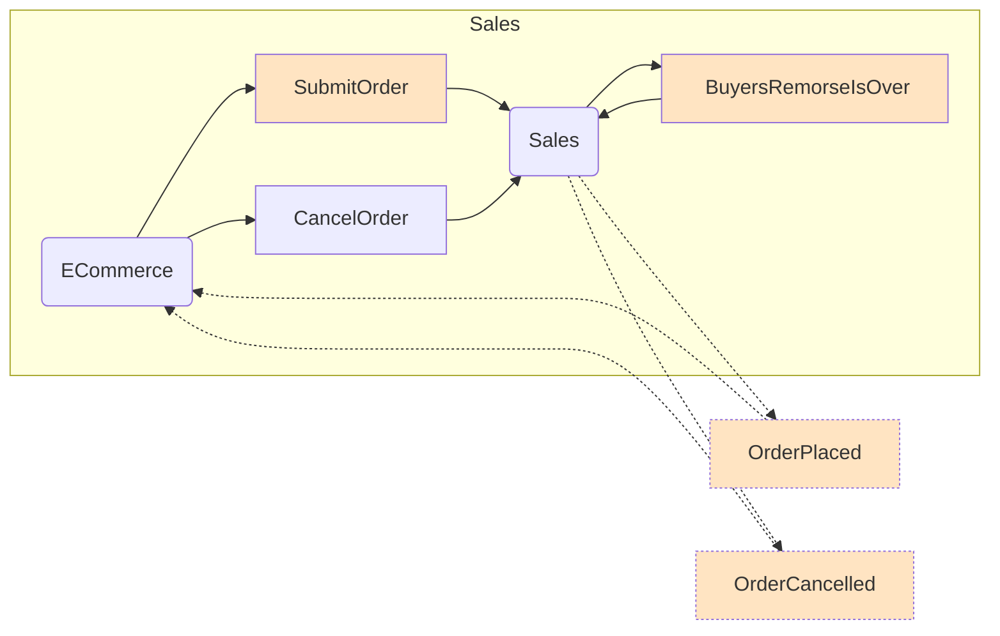
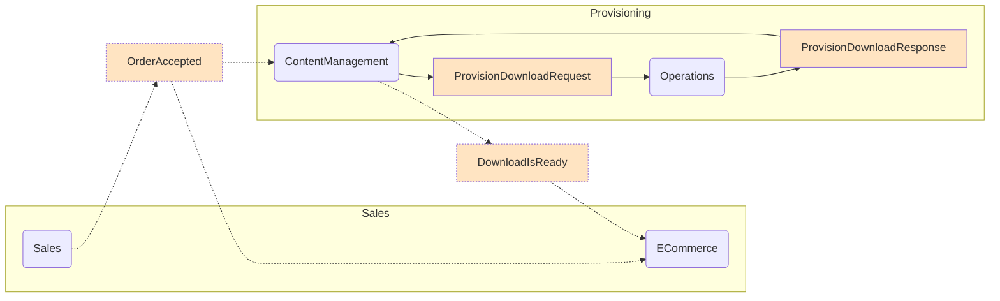
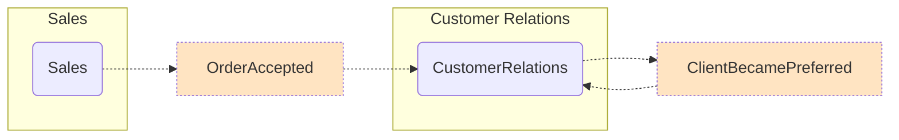

This sample implements a fictional store. It is different from most samples in that it shows many features of NServiceBus working together

## Walk through

Users can order products from the website. Once orders are submitted, there is a window of time allocated for handling cancellations due to buyer's remorse. Once the order has been accepted, they are provisioned and made available for download. 

### Sales

The web application hosts the ECommerce endpoint. When a user presses the Place Order button on the website, the ECommerce endpoint sends a `SubmitOrder` command to the Sales endpoint. Upon receiving a `SubmitOrder` command the Sales endpoint will immediately publish an `OrderPlaced` event and request to be called back in 20 seconds (`BuyersRemorseIsOver`). If the user does not cancel their order before the end of the buyers remorse period then the Sales endpoint will publish an `OrderAccepted` event.

The ECommerce endpoint is subscribed to the `OrderPlaced` and `OrderAccepted` events in order to update the web page. It does this by forwarding events to the client using SignalR.

If the user presses the Cancel button before the buyers remorse period ends then the ECommerce endpoint sends a `CancelOrder` command to the Sales endpoint which publishes an `OrderCancelled` event instead of an `OrderAccepted` event. The ECommerce endpoint subscribes to `OrderCancelled` and updates the UI via SignalR to mark the order as cancelled.

### Provisioning

Once an order is accepted, it can be provisioned. The ContentManagement endpoint subscribes to the `OrderAccepted` event and sends a `ProvisionDownloadRequest` message to the Operations endpoint. When Operations handles `ProvisionDownloadRequest` it sends back a `ProvisionDownloadResponse` message. When the response is received by ContentManagement it publishes a `DownloadIsReady` event. The ECommerce endpoint subscribes to `DownloadIsReady` to update the UI via SignalR.

### Customer Relations

The CustomerRelations endpoint is subscribed to `OrderAccepted` events. When a customer order is accepted, the CustomerRelations endpoint publishes a `ClientBecamePreferred` event. This event only has one subscriber, CustomerRelations itself, which will use send the customer a welcome pack and a limitied time offer when a customer becomes preferred.

## Feature usage

In implementing the above workflow various aspects are highlighted:

### Sagas

Illustrates the use of the Saga pattern to handle the buyer's remorse scenario.

### Request / Response

The request/response pattern is illustrated for the product provisioning between the ContentManagement endpoint and the Operations Endpoint.

### ASP MVC and SignalR

The ECommerce endpoint is implemented as an ASP.NET application which uses SignalR to show feedback to the user.

### Message Mutator

The use of message headers and message mutator is also illustrated when the user clicks on the Check box on the ECommerce web page, which conveniently stops at the predefined breakpoints in the message handler code on the endpoints.

### Encryption

The use of encryption is illustrated by passing in the Credit Card number and the Expiration date from the ECommerce web site. The UnobtrusiveConventions defined in the ECommerce endpoint show how to treat certain properties as encrypted. Both the ECommerce and the Sales endpoint is setup for RijndaelEncryption and the encryption key is provided in the config file. If the messages are inspected in the queue, both the Credit Card number and the Expiration Date will show the encrypted values. 
