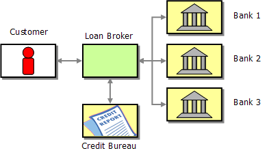
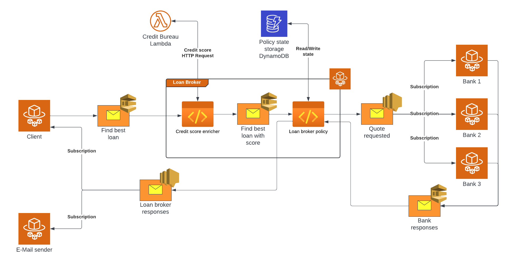

## Scenario

The AWS Loan Broker Showcase is a basic loan broker implementation following the [structure presented](https://www.enterpriseintegrationpatterns.com/patterns/messaging/ComposedMessagingExample.html) by [Gregor Hohpe](https://www.enterpriseintegrationpatterns.com/gregor.html) in his book - [Enterprise Integration Patterns](https://www.enterpriseintegrationpatterns.com/).



The AWS Loan Broker Showcase simplifies serverless messaging on AWS. It demonstrates how to build distributed systems with NServiceBus and the Particular Service Platform, using AWS services - eliminating the complexity of managing dozens of Lambda functions and Step Functions with a streamlined, enterprise-grade messaging pattern.

> [!NOTE]
> The showcase, by default, runs locally using LocalStack, and no AWS account is needed. The how to run the example section details how to configure the solution to connect to AWS services.



The example is composed by:

- A client application, sending loan requests.
- A credit bureau providing the customers' credit score.
- A loan broker service that receives loan requests enriches them with credit scores and orchestrates communication with downstream banks.
- Three bank adapters, acting like Anti-Corruption layers (ACL), simulate communication with downstream banks offering loans.
- An email sender simulating email communication with customers.

The example also ships the following monitoring services:

- The Particular platform to monitor endpoints, capture and visualize audit messages, and manage failed messages.
- A Prometheus instance to collect, store, and query raw metrics data.
- A Grafana instance with three different metrics dashboards using Prometheus as the data source.
- A Jaeger instance to visualize OpenTelemetry traces.
- AWS Distro for OpenTelemetry collector (ADOT) to collect and export metrics and traces to various destinations.

The example also exports metrics and traces to AWS CloudWatch and XRay.

## Prerequsities

1. .NET 10 SDK
2. Docker
3. Docker Compose

## Running the sample

The simplest way to run the example is using Docker for both the endpoints and the infrastructure.
The client application, the loan broker service, the e-mail sender, and the bank adapters can be deployed as Docker containers alongside the Particular platform to monitor the system, LocalStack to mock the AWS services, and the additional containers needed for enabling OpenTelemetry observability.

To run the complete example in Docker, publish the endpoint container images and start the Compose environment from the root folder:

```
dotnet publish src/AwsLoanBrokerSample.sln -c Release --os linux /t:PublishContainer
docker compose up -d
```

The `dotnet publish` commands build the projects and publish Linux container images to the local Docker registry using the .NET SDK's built-in container support. The Docker Compose command starts those endpoint images and configures all the additional infrastructural containers.

To stop the running solution and remove all deployed containers. Using a command prompt, execute the following command:

```
docker compose down
```

To run the solution without rebuilding container images, execute the following command:

```
docker compose up -d
```

> [!NOTE]
> To run transport and persistence using AWS services instead of LocalStack:
> - remove the `AWS_ENDPOINT_URL` variable from the [aws.env](env/aws.env) file
> - ensure the following environment variables are defined with appropriate values:
>   - `AWS_ACCESS_KEY_ID`
>   - `AWS_SECRET_ACCESS_KEY`
>   - `AWS_REGION`

### Running endpoints from the IDE

If you prefer to start the endpoints from your IDE to debug the code, execute the following command from a command prompt in the root directory to start the required infrastructure:

```
docker compose --profile infrastructure up -d
```

## Things to try

Once the project is running, here are some things to try. (Links are to `localhost` and will only work when the project is running.)

1. Explore some [traces in the Jaeger UI](http://localhost:16686/search?service=LoanBroker).
    * The green circles are traces where the entire flow completed successfully.
    * The red circles are traces that contain an exception at some point. (Bank3 fails 1/3 of the time.) Click into the failed steps and find the exception message and stack trace in the logs.
2. Check out a selection of [business metrics in Grafana](http://localhost:3000/d/edmhjobnxatc0c/loan-broker-demo?orgId=1&refresh=5s&from=now-15m&to=now&timezone=browser). (User `admin` and password `admin`.)
    * Some metrics are available for individual message types, even though the messages are processed from the same message queue.
    * Many more metrics are available by navigating to [Dashboards](http://localhost:3000/dashboards) and selecting a different dashboard.
3. Explore the [ServicePulse endpoint monitoring dashboard](http://localhost:9999/#/monitoring?historyPeriod=1), then navigate to [LoanBroker](http://localhost:9999/#/monitoring/endpoint/LoanBroker?historyPeriod=1) to see how these metrics are available for individual message types as well.
4. Investigate the EmailSender failures (the code is rigged to fail 5% of the time) in the [ServicePulse Failed Messages view](http://localhost:9999/#/failed-messages/failed-message-groups).
    * Navigate into the failed message group, then to an individual message.
    * Click on the tabs to see how the stack trace, message headers, and message body help a developer to troubleshoot and fix [systemic errors](https://particular.net/blog/but-all-my-errors-are-severe).
    * Return to the [failed message groups view](http://localhost:9999/#/failed-messages/failed-message-groups) and request a retry for the entire batch of failed messages.
    * The message handler will still fail 5% of the time. Click into the message group and see if there are any messages showing Retry Failures.

## Monitoring

The example comes with the [Particular platform](https://docs.particular.net/platform/), automatically available as Docker containers.

Monitoring information is available in [ServicePulse](http://localhost:9999).

## Telemetry

NServiceBus supports OpenTelemetry. Starting with NServiceBus 9.1, the following metrics are available:

- `nservicebus.messaging.successes` - Total number of messages processed successfully by the endpoint
- `nservicebus.messaging.fetches` - Total number of messages fetched from the queue by the endpoint
- `nservicebus.messaging.failures` - Total number of messages processed unsuccessfully by the endpoint
- `nservicebus.messaging.handler_time` - The time the user handling code takes to handle a message
- `nservicebus.messaging.processing_time` - The time the endpoint takes to process a message
- `nservicebus.messaging.critical_time` - The time between when a message is sent and when it is fully processed
- `nservicebus.recoverability.immediate` - Total number of immediate retries requested
- `nservicebus.recoverability.delayed` - Total number of delayed retries requested
- `nservicebus.recoverability.error` - Total number of messages sent to the error queue

For more information, refer to the [NServiceBus OpenTelemetry documentation](https://docs.particular.net/nservicebus/operations/opentelemetry).

All endpoints are configured to send OpenTelemetry traces to Jaeger. To visualize traces, open the [Jaeger dashboard](http://localhost:16686).

Similarly, endpoints send metrics to Prometheus. To visualize metrics, open the [Grafana dashboards](http://localhost:3000/dashboards). The default Grafana credentials are:

- Username: `admin`
- Password: `admin`