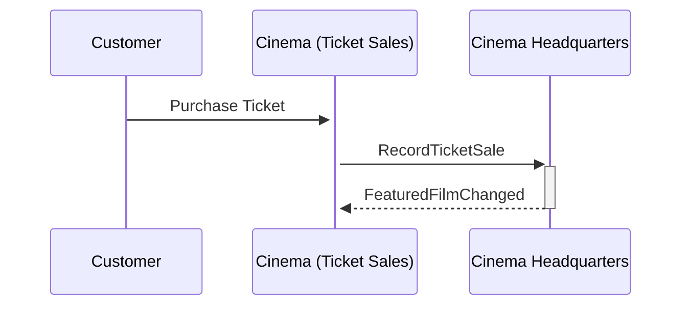

## Scenario

This sample was created as part of a [demo](https://youtu.be/83UYne9LjZk) showcasing the ease with which a distributed system can be created using the [Particular dotnet new Templates](/nservicebus/dotnet-templates/).

The scenario for the solution is to keep track of ticket sales at cinemas and feature the film with the most tickets sold for the current month.

## Running the sample

1. Run the solution. Two console applications will start.
2. In the Ticket Sales application, press B or O to sell a ticket for one of the two films.
3. In the Headquarters application, monitor the logs to see which film has the most sales.
4. In the Ticket Sales application, monitor the logs to see when the featured film changes.

## Follow along

### Prerequsities

1. [Visual Studio](https://visualstudio.microsoft.com/downloads/)
1. [Particular.Templates](/nservicebus/dotnet-templates/) package.
1. [.NET SDK](https://dotnet.microsoft.com/en-us/download)

### TicketSales project

The Cinema.TicketSales project provides a console interface to sell tickets for two films. These ticket sales are reported to the Headquarters endpoint by sending a `RecordTicketSale` message.

snippet: sales-desk

The TicketSales endpoint displays a message when the featured film is changed by the Headquarters endpoint.

snippet: featured-film-changed-handler

> [!NOTE]
> The project was created with the [NServiceBus Endpoint (Particular Software)](/nservicebus/dotnet-templates/#nservicebus-endpoint) template.
>
> The `FeaturedFilmChangedHandler` handler was created with the [NServiceBus Message Handler (Particular Software)](/nservicebus/dotnet-templates/#nservicebus-handler) template.

### Headquarters project

The Cinema.Headquarters project aggregates ticket sales and publishes an event when the featured film for the month changes.

snippet: ticket-sales-handler

> [!NOTE]
> The project was created with the [NServiceBus Endpoint (Particular Software)](/nservicebus/dotnet-templates/#nservicebus-endpoint) template.
>
> The `FeaturedFilmSaga` saga was created with the [NServiceBus Saga (Particular Software)](/nservicebus/dotnet-templates/#nservicebus-saga) template.

### Messages project

This shared message assembly contains the commands and events that are exchanged between the two endpoints.