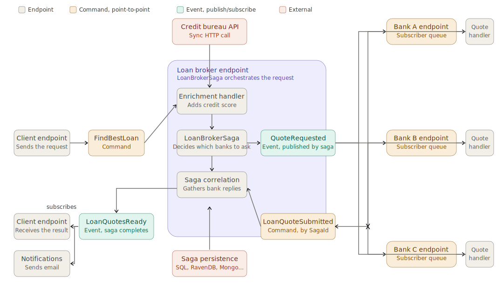

## Loan Broker showcase

The Loan Broker showcase is a basic loan broker implementation following the [structure presented](https://www.enterpriseintegrationpatterns.com/patterns/messaging/ComposedMessagingExample.html) by [Gregor Hohpe](https://www.enterpriseintegrationpatterns.com/gregor.html) in his book - [Enterprise Integration Patterns](https://www.enterpriseintegrationpatterns.com/).

The Loan Broker showcase demonstrates how to build distributed systems with NServiceBus and the Particular Service Platform. It's available in two flavors, one for AWS and one for Azure, each using equivalent cloud services for messaging, persistence, and hosting.

The [AWS Loan Broker showcase](https://github.com/Particular/AwsLoanBrokerShowcase) uses [AWS SQS and SNS](/transports/sqs/) for message queueing and event publishing, [DynamoDB](/persistence/dynamodb/) for [saga](/nservicebus/sagas/) data persistence, and [Lambda functions](/nservicebus/hosting/aws-lambda-simple-queue-service/) to host some of the loan broker components.

The [Azure Loan Broker showcase](https://github.com/Particular/AzureLoanBrokerShowcase) uses [Azure Service Bus](/transports/azure-service-bus/) for message queueing and event publishing, [SQL Server](/persistence/sql/) for [saga](/nservicebus/sagas/) data persistence, and [Azure Functions](/nservicebus/hosting/azure/functions/) to host some of the loan broker components.

The showcase is composed of:

- A client application, sending loan requests.
- A credit bureau provides the customers' credit scores.
- A loan broker service that receives loan requests enriches them with credit scores and orchestrates communication with downstream banks.
- Three bank adapters, acting like Anti-Corruption layers (ACL), simulate communication with downstream banks offering loans.
- An email sender simulating email communication with customers.

The example also ships the following monitoring services:

- The Particular platform to monitor endpoints, capture and visualize audited messages, and manage failed messages.
- A Prometheus instance to collect, store, and query raw metrics data.
- A Grafana instance with three different metrics dashboards using Prometheus as the data source.
- A Jaeger instance to visualize OpenTelemetry traces.
- AWS Distro for OpenTelemetry collector (ADOT) to collect and export metrics and traces to various destinations.

### Repositories

- [AWS Loan Broker Showcase](https://github.com/Particular/AwsLoanBrokerShowcase)
- [Azure Loan Broker Showcase](https://github.com/Particular/AzureLoanBrokerShowcase)
