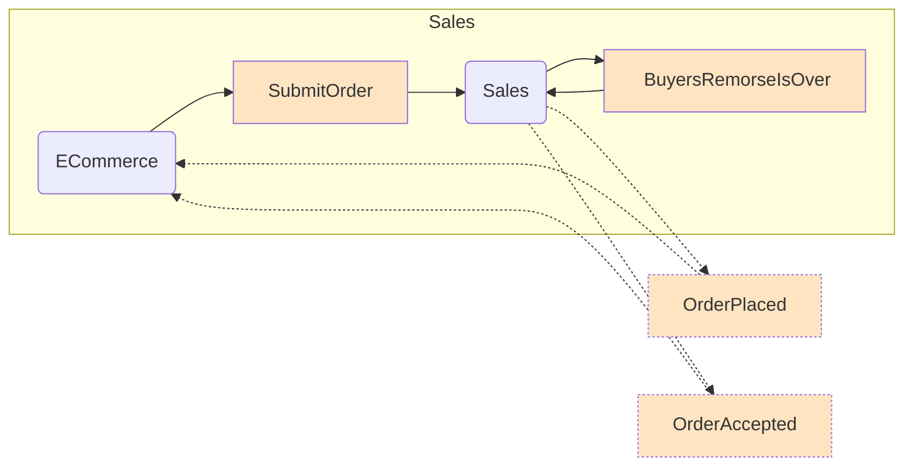
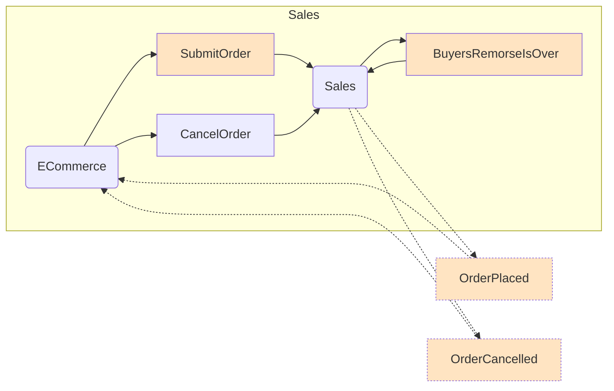
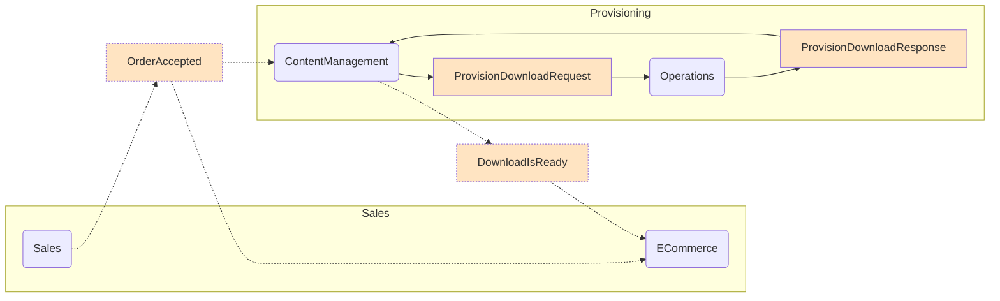
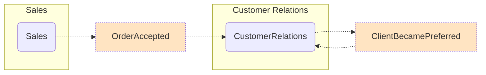

## Walk through

Users can order products from the website. Once orders are submitted, there is a window of time allocated for handling cancellations due to buyer's remorse. Once an order has been accepted, the purchased items are provisioned and made available for download. 

### Sales

The web application hosts the ECommerce endpoint. When a user presses the Place Order button on the website, the ECommerce endpoint sends a `SubmitOrder` command to the Sales endpoint. Upon receiving a `SubmitOrder` command the Sales endpoint publishes an `OrderPlaced` event and request to be called back in 20 seconds (`BuyersRemorseIsOver`). If the user does not cancel their order before the end of the buyers remorse period then the Sales endpoint publishes an `OrderAccepted` event.

The ECommerce endpoint is subscribed to the `OrderPlaced` and `OrderAccepted` events in order to update the web page. The communication between the ECommerce endpoint and the browser is done via SignalR.

If the user presses the Cancel button before the buyers remorse period is over the ECommerce endpoint sends a `CancelOrder` command to the Sales endpoint. This causes the Sales endpoint to publish an `OrderCancelled` event instead of an `OrderAccepted` event. The ECommerce endpoint subscribes to `OrderCancelled` and updates the UI via SignalR to mark the order as cancelled.

### Provisioning

Once an order is accepted, it can be provisioned. The ContentManagement endpoint subscribes to the `OrderAccepted` event and sends a `ProvisionDownloadRequest` command to the Operations endpoint. When Operations handles `ProvisionDownloadRequest` it replies back with a `ProvisionDownloadResponse` message. When ContentManagement receives that reply it publishes a `DownloadIsReady` event. The ECommerce endpoint subscribes to `DownloadIsReady` to update the UI via SignalR.

### Customer Relations

The CustomerRelations endpoint is subscribed to `OrderAccepted` events. When a customer order is accepted, the CustomerRelations endpoint publishes a `ClientBecamePreferred` event. This event is subscribed by CustomerRelations itself. Processing it triggers sending the customer a welcome pack and a limited time offer.

