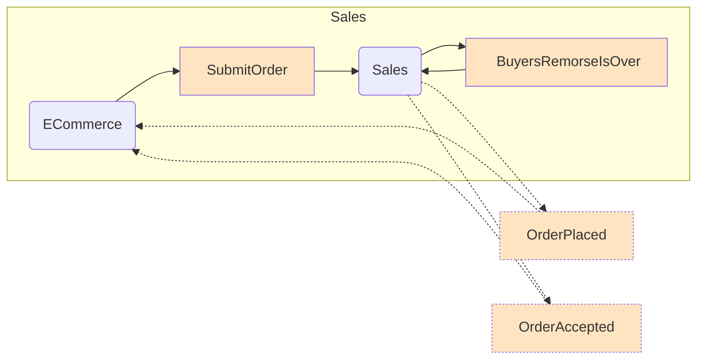
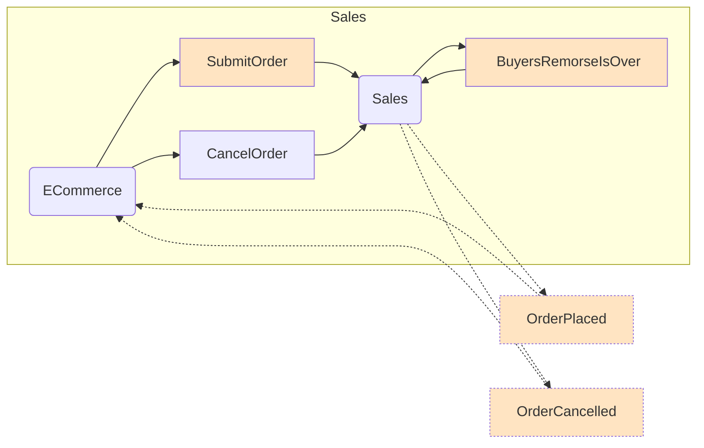
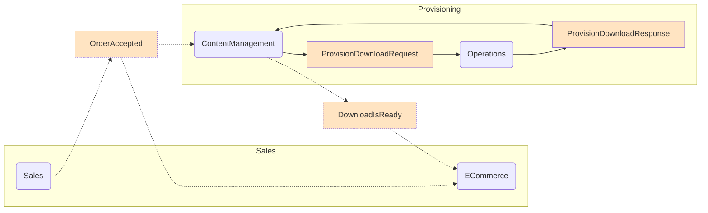
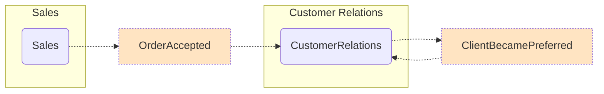

## Walk-through

Users can order products from the website. Once orders are submitted, there is a window of time allocated for handling cancellations due to buyer's remorse. Once the order has been accepted, it is provisioned and made available for download. 

### Sales

The web application hosts the ECommerce endpoint. When a user presses <kbd>Place Order</kbd> on the website, the ECommerce endpoint sends a `SubmitOrder` command to the Sales endpoint. Upon receiving a `SubmitOrder` command the Sales endpoint will immediately publish an `OrderPlaced` event with a request to be called back in 20 seconds (`BuyersRemorseIsOver`). If the user does not cancel the order before the end of the buyer's remorse period, the Sales endpoint will publish an `OrderAccepted` event.

The ECommerce endpoint subscribes to the `OrderPlaced` and `OrderAccepted` events in order to update the web page. It does this by forwarding events to the client using SignalR.

If the user presses <kbd>Cancel</kbd> before the buyer's remorse period ends, the ECommerce endpoint sends a `CancelOrder` command to the Sales endpoint which publishes an `OrderCancelled` event instead of an `OrderAccepted` event. The ECommerce endpoint subscribes to `OrderCancelled` and updates the UI via SignalR to mark the order as cancelled.

### Provisioning

Once an order is accepted, it can be provisioned. The ContentManagement endpoint subscribes to the `OrderAccepted` event and sends a `ProvisionDownloadRequest` message to the Operations endpoint. When Operations handles `ProvisionDownloadRequest` it responds with a `ProvisionDownloadResponse` message. When the response is received by ContentManagement it publishes a `DownloadIsReady` event. The ECommerce endpoint subscribes to `DownloadIsReady` to update the UI via SignalR.

### CustomerRelations

The CustomerRelations endpoint subscribes to `OrderAccepted` events. When a customer order is accepted, the CustomerRelations endpoint publishes a `ClientBecamePreferred` event. This event has only one subscriber, CustomerRelations itself, which will send the customer a welcome pack and a limited time offer when a customer becomes preferred.

