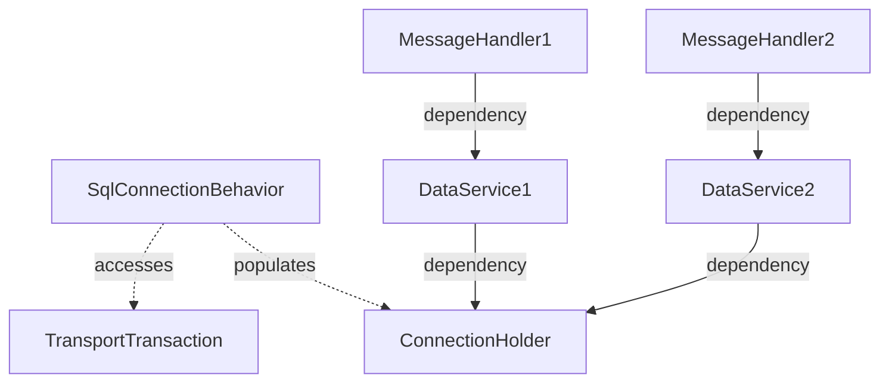

The recommended method of [accessing business data](/nservicebus/handlers/accessing-data.md) in an NServiceBus message handler is to use the [synchronized storage session](/nservicebus/handlers/accessing-data.md#synchronized-storage-session) to get access to the native database connection that is already being used by NServiceBus. That way, the same connection and transaction used, for example, by the [outbox feature](/nservicebus/outbox/), is the same connection and transaction used to store business data, ensuring that all data stored by the message handler is done so atomically.

In message handlers, some developers prefer to use an injected data service (for example, a class implementing the [repository pattern](https://deviq.com/design-patterns/repository-pattern)) to interact with business data. In this case it's important to ensure that the injected data service also shares the same connection and transaction with the message handler.

In this sample, which uses [SQL Server transport](/transports/sql/) and [SQL persistence](/persistence/sql/), the message handler accepts an `IDataService` which is injected through the constructor. The sample will show how to use a [message pipeline behavior](/nservicebus/pipeline/manipulate-with-behaviors.md) to access the transport's ambient connection and transaction information, and then store that information within an intermediate `ConnectionHolder` class that can be used when the `DataService` implementation is constructed by the container.

downloadbutton

## Prerequisites

This sample requires:

* An instance of SQL Server Express, accessible as `.\SqlExpress`.
* At startup, the endpoint creates its required SQL assets, including databases, tables, and schemas.
* The database created by this sample is `NsbSamplesInjectedServices`.

## Dependency injection relationships

This diagram shows the relationships between components:



Because there may be many data services, a `ConnectionHolder` class serves as a storage point for the database connection and transaction information. The `SqlConnectionBehavior` executes earlier than the message handlers, so at that point, the behavior accesses the `TransportTransaction` (containing the connection and transaction used to receive the message from the SQL Server transport) and populates the details of the `ConnectionHolder`. By taking a dependency on the connection holder, each data service is able to access the connection and transaction for the message currently being processed.

## Connection holder

The `ConnectionHolder` class is just a bucket to store the connection and transaction in properties:

snippet: ConnectionHolder

## Data service interface

The `IDataService` interface represents a data service. The service specifies an operation to save business data, as well as an `IsSame()` method which will be used later to show that the data service's connection and transaction are the same as would be used if [accessing data via SQL persistence](/persistence/sql/accessing-data.md).

snippet: ServiceInterface

## Data service implementation

By taking a constructor dependency on `ConnectionHolder`, the data service implementation is able to get access to the SqlConnection and SqlTransaction stored there.

snippet: ServiceImplementation

## Dependency injection configuration

The sample uses [NServiceBus.Extensions.DependencyInjection](/nservicebus/dependency-injection/extensions-dependencyinjection.md) to integrate with the Microsoft dependency injection system. If the sample were using the [.NET Generic Host](https://docs.microsoft.com/en-us/dotnet/core/extensions/generic-host), the [NServiceBus.Extensions.Hosting](/nservicebus/hosting/extensions-hosting.md) package would be used instead, which would also integrate with Microsoft's dependency injection abstractions.

In the configuration, both `ConnectionHolder` and `IDataService` are registered as **Scoped**, which in NServiceBus means that each message being processed will get a new instance. `DataService` is registered as the implementation for `IDataService`.

snippet: DependencyInjectionConfig

## Behavior

In order for the `ConnectionHolder` to be filled with the details from the current message processing pipeline, a [pipeline behavior](/nservicebus/pipeline/manipulate-with-behaviors.md) is used, which will run before the message handler.

snippet: Behavior

The hardest part is retrieving the current connection/transaction information, as this is different based on the transport and/or persistence in use. In this case, SQL Server transport is managing the connection and transaction as part of receiving the message, so the necessary data resides in the `TransportTransaction` that is accessible as an extension point on the behavior's `context` variable.

INFO: For help finding the correct ambient connection/transaction information in a specific scenario, [contact support](https://particular.net/support).

Using `Behavior<IIncomingLogicalMessageContext>` ensures that the behavior will be run in the stage just before the message handler is invoked. Calling the `next()` delegate determines where the next step of the pipeline chain (i.e. the message handler) will be called. For more information on the ordering of pipeline stages see [Steps, stages, and connectors](/nservicebus/pipeline/steps-stages-connectors.md).

Once the behavior class exists, it must be registered with the pipeline:

snippet: BehaviorConfig

## Message handler

With the connection holder, data service, and behavior established, message handlers can now take a dependency on `IDataService` and have a data service injected that already knows about the ambient connection and transaction:

snippet: Handler

When executed, the sample generates output similar to the following:

```console
Press S to send a message, or Enter to exit
DataService details same as NServiceBus: True
Saving business data: 76a9419b-bde0-470e-b1fa-83cefb544f84
DataService details same as NServiceBus: True
Saving business data: ebe1b32b-e1b9-4262-95ed-a29e9b68dc7a
```

This shows that the business data is persisted to the database, and that the connection and transaction used are the same that would be obtained by calling `.SqlPersistenceSession()`.