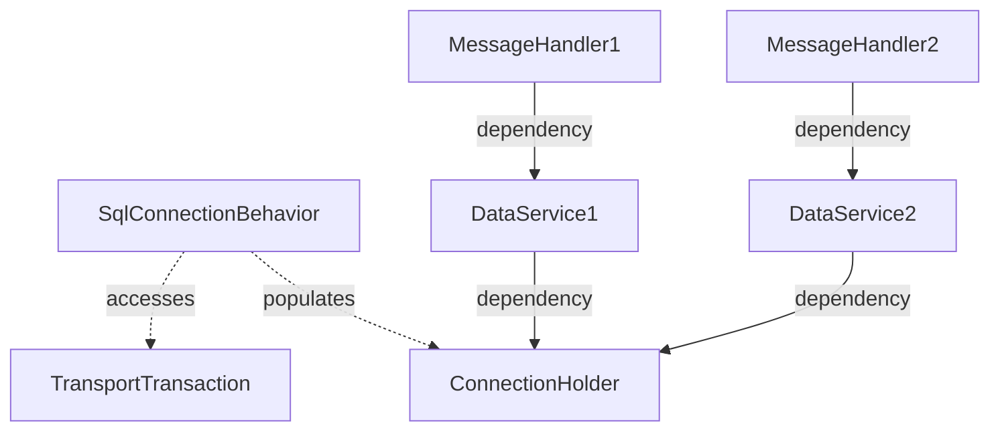

The recommended method of [accessing business data](/nservicebus/handlers/accessing-data.md) in an NServiceBus message handler is to use the [synchronized storage session](/nservicebus/handlers/accessing-data.md#synchronized-storage-session) to get access to the native database connection that is being used by NServiceBus. The synchronized storage session gives access to the same native connection and transaction being used by the NServiceBus persistence. This ensures that all business data changes in the message handler are stored atomically with any NServiceBus internal data, such as [outbox records](/nservicebus/outbox/).

Some developers prefer to inject data services into message handlers (for example, a class implementing the [repository pattern](https://deviq.com/design-patterns/repository-pattern)) to interact with business data. In this case, it's important to ensure that the injected data service also shares the same connection and transaction with the message handler.

In this sample, using [SQL Server transport](/transports/sql/) and [SQL persistence](/persistence/sql/), the message handler accepts an `IDataService` instance injected through the constructor. A [message pipeline behavior](/nservicebus/pipeline/manipulate-with-behaviors.md) is used to access the transport's ambient connection and transaction information.  Data using an intermediate `ConnectionHolder` class that is used when the `DataService` implementation is constructed by the dependency injection container.

downloadbutton

## Prerequisites

include: sql-prereq

The database created by this sample is `NsbSamplesInjectedServices`.

## Dependency injection relationships

This diagram shows the relationships between components:



The `ConnectionHolder` class is a central storage point for the database connection and transaction and can be shared by multiple data services. The `SqlConnectionBehavior` executes before the message handlers, accesses the `TransportTransaction`, and populates the details from the `ConnectionHolder`. Each data service is able to access the connection and transaction for the message currently being processed by taking a dependency on the connection holder.

## Connection holder

The `ConnectionHolder` class stores the current connection and transaction in properties:

snippet: ConnectionHolder

## Data service interface

The `IDataService` interface represents a data service. The service specifies an operation to save business data. It also has an `IsSame()` method which is used to verify that the data service's connection and transaction are the same ones that would be used if business data was [accessed via SQL Persistence](/persistence/sql/accessing-data.md) instead.

snippet: ServiceInterface

## Data service implementation

By taking a constructor dependency on `ConnectionHolder`, the data service implementation is able to get access to the SqlConnection and SqlTransaction stored there.

snippet: ServiceImplementation

## Dependency injection configuration

In the configuration, both `ConnectionHolder` and `IDataService` are registered as **Scoped**, which, in NServiceBus, means that each message being processed will get a new instance. `DataService` is registered as the implementation for `IDataService`.

snippet: DependencyInjectionConfig

## Behavior

In order for the `ConnectionHolder` to be filled with the details from the current message processing pipeline, a [pipeline behavior](/nservicebus/pipeline/manipulate-with-behaviors.md) is used, which will run before the message handler.

snippet: Behavior

Retrieving the current connection/transaction information will depend on the transport and persistence in use. In this case, the SQL Server transport is managing the connection and transaction as part of receiving the message, so the necessary data resides in the `TransportTransaction` which is accessible as an extension point on the behavior's `context` variable.

> [!NOTE]
> For help finding the correct ambient connection/transaction information in a specific scenario, [contact support](https://particular.net/support).

Using `Behavior<IIncomingLogicalMessageContext>` ensures that the behavior will be run before the message handler is invoked. For more information on the ordering of pipeline stages see [Steps, stages, and connectors](/nservicebus/pipeline/steps-stages-connectors.md).

Once the behavior class exists, it must be registered with the pipeline:

snippet: BehaviorConfig

## Message handler

With the connection holder, data service, and behavior established, message handlers can now take a dependency on an `IDataService` instance that will automatically use the ambient connection and transaction:

snippet: Handler

When executed, the sample generates output similar to the following:

```console
Press S to send a message, or Enter to exit
DataService details same as NServiceBus: True
Saving business data: 76a9419b-bde0-470e-b1fa-83cefb544f84
DataService details same as NServiceBus: True
Saving business data: ebe1b32b-e1b9-4262-95ed-a29e9b68dc7a
```

This shows that the business data is persisted to the database using the same connection and transaction as the SQL Persistence session.
