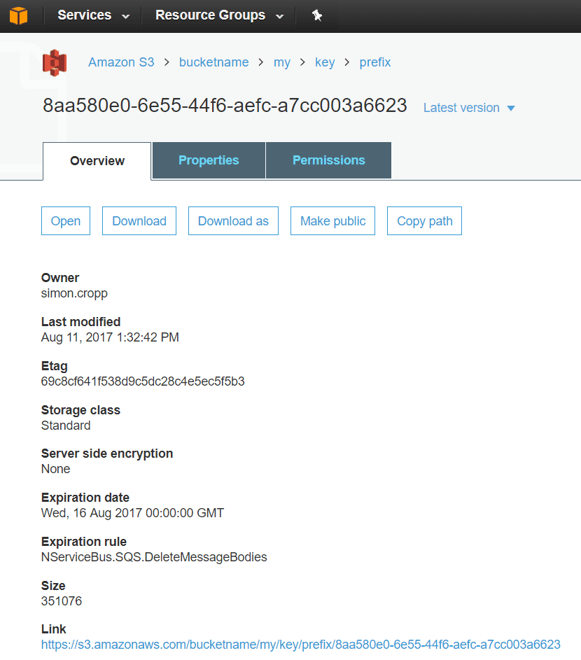

This sample shows basic usage of SQS as a transport for NServiceBus. The application sends an empty message to itself, via the SQS transport, and writes to the console when the message is received.

downloadbutton

## AWS Setup

### Security and access configuration

Add the [AWS Access Key ID and AWS Secret Access Key](http://docs.aws.amazon.com/general/latest/gr/aws-sec-cred-types.html#access-keys-and-secret-access-keys) to the following environment variables:

 * Access Key ID in `AWS_ACCESS_KEY_ID`
 * Secret Access Key in `AWS_SECRET_ACCESS_KEY`

See also [AWS Account Identifiers](http://docs.aws.amazon.com/general/latest/gr/acct-identifiers.html), [Managing Access Keys for a AWS Account](http://docs.aws.amazon.com/general/latest/gr/managing-aws-access-keys.html), and [IAM Security Credentials](https://console.aws.amazon.com/iam/home#/security_credential).

### SQS

Several [Amazon SQS](https://aws.amazon.com/sqs/) queues are required to run this sample. These will be created at start-up via the [Installer mechanism](/nservicebus/operations/installers.md) of NServiceBus. The queues can be seen in the [SQS management UI](https://console.aws.amazon.com/sqs/home).

 * `Samples-Sqs-Simple`: The main message processing queue.
 * `Samples-Sqs-Simple-Retries`: Queue used for [Delayed Retries](/nservicebus/recoverability/#delayed-retries).
 * `error`: Queue used for [Error handling](/nservicebus/recoverability/configure-error-handling.md).

### S3

A [Amazon S3](https://console.aws.amazon.com/s3) bucket is required to leverage the [S3 Bucket For Large Messages](/transports/sqs/configuration-options.md#s3bucketforlargemessages) feature of the SQS transport. [Create an S3 Bucket](http://docs.aws.amazon.com/AmazonS3/latest/UG/CreatingaBucket.html) and replace the `bucketname` in the sample startup with the the name of the created bucket.

## Endpoint Configuration

Configure the endpoint to use the [SQS Transport](/transports/sqs/) and set the appropriate [AWS Region](http://docs.aws.amazon.com/general/latest/gr/rande.html).

snippet: ConfigureEndpoint

## Run the sample

Start the endpoint. A message will be sent and received by a handler. 

### View a message in transit

At startup the endpoint will send two messages. On is a message that falls under the 256kb size limit. The other is above that limit and will leverage the [S3 Bucket For Large Messages](/transports/sqs/configuration-options.md#s3bucketforlargemessages) feature of the SQS transport.

snippet: sends

To view a message in transit change the endpoint to be [Send Only](/nservicebus/hosting/#self-hosting-send-only-hosting). There is commented out code already in this samples configuration.

snippet: sendonly

Start the endpoint. Since the endpoint is now Send Only, the messages will be written to SQS but not dequeued. The message can now be viewed in the [SQS management UI](https://console.aws.amazon.com/sqs/home). 

The large message contents can be be viewed in the [S3 management UI](https://console.aws.amazon.com/s3).

See also [Receiving and Deleting a Message from an Amazon SQS Queue](http://docs.aws.amazon.com/AWSSimpleQueueService/latest/SQSDeveloperGuide/sqs-receive-delete-message.html).
