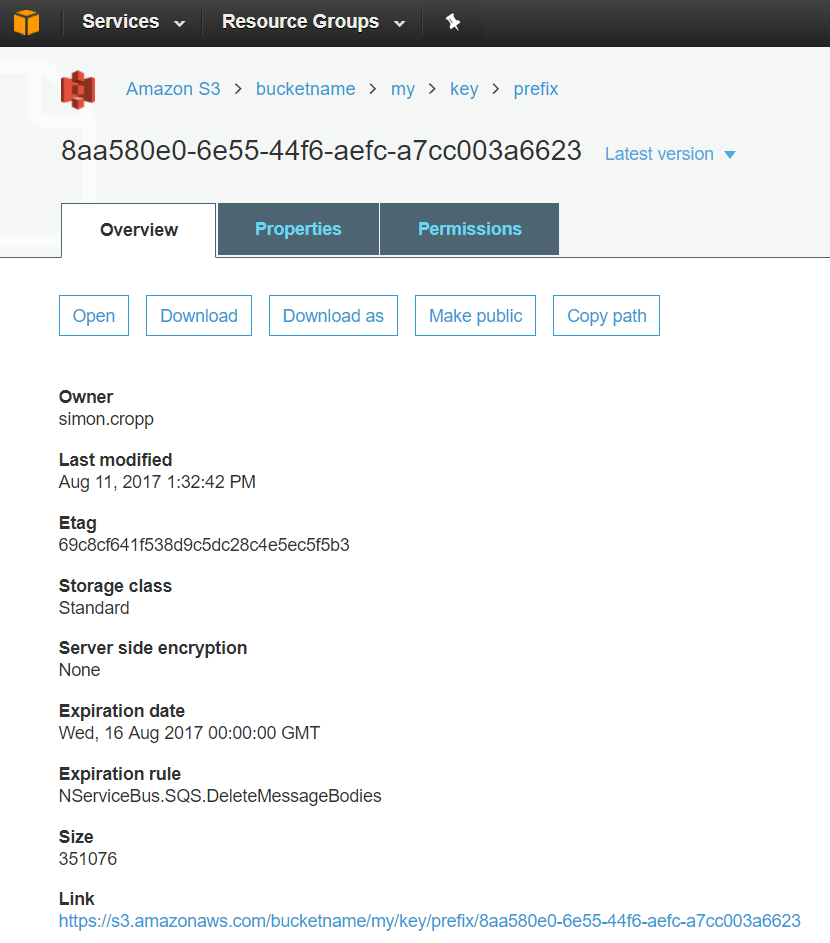

This sample shows basic usage of SQS as a transport for NServiceBus. The application sends messages between two endpoints, via the SQS transport, and writes a message to the console when a message is received.

downloadbutton

## AWS setup

### Security and access configuration

Add the [AWS Access Key ID and AWS Secret Access Key](https://docs.aws.amazon.com/general/latest/gr/aws-sec-cred-types.html#access-keys-and-secret-access-keys) to the following environment variables:

 * Access Key ID in `AWS_ACCESS_KEY_ID`
 * Secret Access Key in `AWS_SECRET_ACCESS_KEY`
 * Default Region in `AWS_REGION`

See also [AWS Account Identifiers](https://docs.aws.amazon.com/general/latest/gr/acct-identifiers.html), [Managing Access Keys for an AWS Account](https://docs.aws.amazon.com/general/latest/gr/managing-aws-access-keys.html), and [IAM Security Credentials](https://console.aws.amazon.com/iam/home#/security_credential).

See also [AWS Regions](https://docs.aws.amazon.com/general/latest/gr/rande.html) for a list of available regions.

### SQS

Several [Amazon SQS](https://aws.amazon.com/sqs/) queues are required to run this sample. These will be created at start-up via the [installer mechanism](/nservicebus/operations/installers.md) of NServiceBus. The queues can be seen in the [SQS management UI](https://console.aws.amazon.com/sqs/home).

 * `Samples-Sqs-Simple`: The main message processing queue.
 * `Samples-Sqs-Simple-Retries`: Queue used for [delayed retries](/nservicebus/recoverability/#delayed-retries).
 * `error`: Queue used for [error handling](/nservicebus/recoverability/configure-error-handling.md).

### S3

An [Amazon S3](https://console.aws.amazon.com/s3) bucket is required to leverage the [S3 bucket for large messages](/transports/sqs/configuration-options.md#s3bucketforlargemessages) feature of the SQS transport. [Create an S3 bucket](https://docs.aws.amazon.com/AmazonS3/latest/UG/CreatingaBucket.html) and replace the `bucketname` in the sample startup with the the name of the created bucket.

## Endpoint configuration

Configure the endpoints to use the [SQS transport](/transports/sqs/).

snippet: ConfigureEndpoint

## Run the sample

Start the endpoints. Two console applications will be started, a receiver endpoint can send commands or publish events to the subscriber endpoint. In addition, large message bodies can be sent using S3 as the storage for the message payload.

### View a message in transit

To view a message in transit, stop the receiver endpoint while sending/publishing further messages from the sender endpoint. The messages will be written to SQS but not dequeued. The message can now be viewed in the [SQS management UI](https://console.aws.amazon.com/sqs/home).

The large message contents can be be viewed in the [S3 management UI](https://console.aws.amazon.com/s3).

See also [Receiving and Deleting a Message from an Amazon SQS Queue](https://docs.aws.amazon.com/AWSSimpleQueueService/latest/SQSDeveloperGuide/sqs-receive-delete-message.html).
