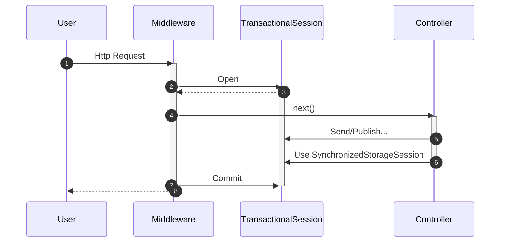

include: webhost-warning

This sample shows how to send messages and modify data in a database atomically within the scope of a webrequest using the `NServiceBus.TransactionalSession` package in conjunction with ASP.NET Core. The operations are triggered by an incoming HTTP request to ASP.NET Core which will manage the `ITransactionalSession` lifetime inside a request middleware.

## Prerequisites

- Visual Studio 2019
- LocalDB support. A custom connection string needs to be configured otherwise.

## Running the solution

When the solution is run, a new browser window/tab opens, as well as a console application. The browser will navigate to `http://localhost:58118/`.

An async [WebAPI](https://dotnet.microsoft.com/apps/aspnet/apis) controller handles the request. It stores a new document using Entity Framework and sends an NServiceBus message to the endpoint hosted in the console application.

The message will be processed by the NServiceBus message handler and result in `"Message received at endpoint"`-message printed to the console. In addition, the handler will update the previously created entity.

## Configuration

The endpoint is configured using the `UseNServiceBus` extension method:

snippet: txsession-nsb-configuration

The transactional session is enabled via the `endpointConfiguration.EnableTransactionalSession()` method call. Note that the transactional session feature requires [the Outbox](/nservicebus/outbox/) to ensure that operations across the storage and the message broker are atomic.

ASP.NET Core uses `ConfigureWebHostDefaults` for configuration and a custom middleware is registered for the `ITransactionalSession` lifetime management:

snippet: txsession-web-configuration

Entity Framework support is configured by this registration for the `DbContext`:

snippet: txsession-ef-configuration

The registration ensures that the `MyDataContext` type is built using the same session and transaction that is used by the `ITransactionalSession`. Once the transactional session is committed, it notifies the Entity Framework context to call `SaveChangesAsync`.

## Using the session

The message session is injected into `SendMessageController` via constructor injection along with the entity framework database context. Message operations executed on the `ITransactionalSession` API are transactionally consistent with the database operations performed on the `MyDataContext`.

snippet: txsession-controller

The lifecycle of the session is managed by the `MessageSessionMiddleware`. It opens the session when an HTTP request arrives and takes care of committing the session once the ASP.NET pipeline completes:

snippet: txsession-middleware

This diagram visualizes the interaction between the middleware, `ITransactionalSession`, and the Web API controller:

## Handling the message

The `MyHandler` handles the message sent by the ASP.NET controller and accesses the previously committed data stored by the controller:

snippet: txsession-handler
