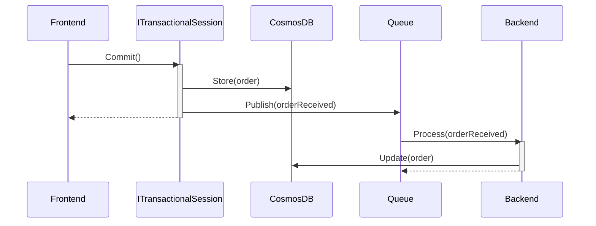

This sample uses the [transactional session](/nservicebus/transactional-session) feature  with the [CosmosDB persistence](/persistence/cosmosdb) to achieve transactionally consistent database changes and message operations.

downloadbutton

## Overview

The sample contains a frontend and a backend service both accessing the same CosmosDB database instance. When the `ITransactionalSession` on the frontend is committed, an `Order` document is created with the status `Received` and an `OrderReceived` event is published. The backend service subscribes to the event and loads the order document to update its status to `Accepted`.

The database and transport operations are executed atomically when the session is committed. If the session is aborted, all database and transport operations are rolled back.

## Prerequisites

The sample is intended to be used with the [CosmosDB emulator](https://docs.microsoft.com/en-us/azure/cosmos-db/local-emulator?tabs=ssl-netstd21) to run locally. Alternatively, a connection string to an Azure CosmosDB instance can be provided.

## Configuration

### Frontend

The `Frontend` service needs to enable the transactional session feature in the endpoint configuration. The endpoint is also configured to use the CosmosDB persistence with a default container and partition key path:

snippet: cosmos-txsession-frontend-config

Note: The `Outbox` feature must be enabled to achieve atomicity with the transactional session feature.

### Backend

The `Backend` service contains a message handler for the `OrderReceived` event. The `Backend` endpoint also needs to be configured for CosmosDB:

snippet: cosmos-txsession-backend-persistence

Note that the backend service requires a [partition key mapping](/persistence/cosmosdb/transactions.md#specifying-the-partitionkey-to-use-for-the-transaction) configured for the `OrderReceived` to determine what partition needs to be used to access the order.

## Running the sample

Start the `Frontend` and `Backend` endpoints.

On the Frontend application, press `[s]` to create a new `OrderDocument` and publish an `OrderReceived`. Database and queue operations are not executed until the session is committed. Press the `[s]` key several times to enlist multiple document and message operations in the same transaction.

Press `[c]` to commit the transaction. All previously created orders will now show up in the database with a status of `Received`. The `OrderReceived` events will be published to the `Backend` service. Once the `Backend` service receives the event, it will load the order document and update its status to `Accepted`. Once committed, a new session will be opened in the sample.

Press `[a]` to abort the transaction. All database and queue operations will be rolled back. A new session will be opened in the sample.