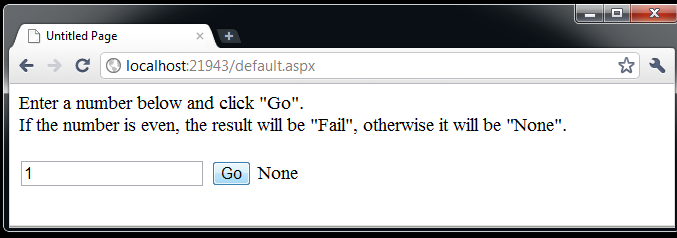

Run the solution. A new browser window/tab opens, as well as a console application.

Enter the number "1" into the text box in the browser and click "Go". Notice the result "None" appears, as shown:

Changing the number in the text box from even to odd numbers changes the result in the Server console.

The web page renders synchronously; from the user's perspective, the interaction is synchronous and blocking, even though behind the scenes NServiceBus is doing asynchronous messaging.

This sample has three projects: `Shared`, `Server`, and `WebApplication`. `WebApplication` is a web application that sends messages (found in the `Shared` project) to the Server project, which is hosted as a console application.

## Initializing the bus

In `WebApplication`, open `Global.asax.cs` and look at the code in the `ApplicationStart` method:

snippet: ApplicationStart

## Sending a message

Open `Default.aspx.cs` in `WebApplication` to see the `Button1Click` method:

snippet: ActionHandling

The first line of code parses the text passed in by the user. The second line creates a new NServiceBus message of the type `Command`, and initializes its `Id` property with the value from the text box.

Open the class definition for the `Command` type in the `Shared` project:

snippet: Message

Return to `Default.aspx.cs` and look at the code `Global.Bus.Send(command)`. Global.Bus references the Bus property of the Global class in `Global.asax.cs`. Then the code calls the Send method, passing in the newly created command object.

The "bus" isn't anything special in code; it is just an object for calling methods.

Skip the rest of the code and see what happens to the message just sent.

## Handling the message

In the Server project, find this code in the `CommandMessageHandler` class:

snippet: Handler

This class implements the NServiceBus interface `IHandleMessages<T>` where `T` is the specific message type being handled; in this case, the Command message. NServiceBus manages classes that implement this interface. When a message arrives in the input queue, it is deserialized and then, based on its type, NServiceBus instantiates the relevant classes and calls their `Handle` method, passing in the message object.

In the method body notice the response being returned to the originating endpoint. This will result in a message being added to the input queue for `MyWebClient`.

## Handling the response

When the response arrives back at `WebApplication`, the bus invokes the callback that was registered when the request was sent.

The `Register` method takes the callback code and tells the bus to invoke it when the response is received. There are several overloads to this method; the code above accepts a generic Enum parameter, effectively casting the return code from the server to the given enum.

Finally, the code updates the Text property of a label on the web page, setting it to the string that represents the enum value: sometimes `None`, sometimes `Fail`.
