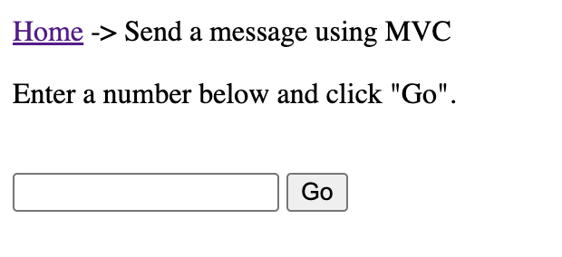

This sample shows how to send messages from an ASP.NET Core web application to an NServiceBus endpoint using several ASP.NET frameworks:
- MVC
- Web API
- Razor Pages
- Blazor

## Run the sample

There are three projects in the solution:
- `Server` - A console application which hosts the NServiceBus endpoint that handles messages sent from the `WebApp` project
- `WebApp` - An ASP.NET web application that sends messages to the `Server` endpoint using the frameworks listed above
- `Shared` - A library which contains the message definition, shared by both the `Server` and `WebApp` projects

Both the `Server` and `WebApp` projects must be running.  When the `WebApp` is run, a browser window will open to display links for sending messages using different technologies.

Excluding the Web API link, which sends a message from a `GET` request, the other links will display a version of the following form for sending the message using the specified framework:

Changing the number in the text box changes the Id of the command sent to the `Server` which can be observed in console output, as well as on the web page.

### Initializing NServiceBus

In the `WebApp` project, open `Program.cs` and look at the endpoint configuration:

snippet: ApplicationStart

The `builder.UseNServiceBus(endpointConfiguration);` line configures the web application to start an NServiceBus endpoint and registers an instance of `IMessageSession` for dependency injection. 

### Sending a message

Regardless of the framework used, a message is sent using an [injected](/nservicebus/hosting/asp-net.md#dependency-injection) instance of `IMessageSession`. This is an API used to send messages outside of the NServiceBus message handling pipeline (i. e. from MVC controllers, Razor Pages, and Blazor components).

Each framework example uses `IMessageSession.Send` to send the following message to the `Server` endpoint:

snippet: Message

> [!NOTE]
> The basic steps of sending a message using ASP.NET are the same:
> 1. Inject `IMessageSession`
> 2. Use `IMessageSession` to send a message
> 
> Reference the framework example most relevant to your needs.

#### MVC

The MVC implementation can be found at `WebApp/Controllers/SampleController.cs`:

snippet: MVCSendMessage

#### Web API

The Web API implementation can be found at `WebApp/Api/SampleApiController.cs`:

snippet: WebApiSendMessage

#### Razor Pages

The Razor Pages implementation can be found at `WebApp/Pages/SendMessageRazorPages.cshtml.cs`:

snippet: RazorPagesSendMessage

#### Blazor

The Blazor implementation can be found at `WebApp/Pages/Shared/SendMessageBlazor.razor`:

snippet: BlazorSendMessage

> [!NOTE]
> There is a `Blazor` action in the MVC controller that is used to render the Blazor component used in the example.

### Handling the message

In the `Server` project, the `CommandMessageHandler` class handles the message that is sent from the `WebApp`:

snippet: Handler

This class implements the NServiceBus interface `IHandleMessages<T>` where `T` is the specific message type being handled; in this case, the `Command` message. When a message arrives in the input queue, it is deserialized and then, based on its type, NServiceBus instantiates the relevant message handler classes and calls their `Handle` method, passing in the message object.
