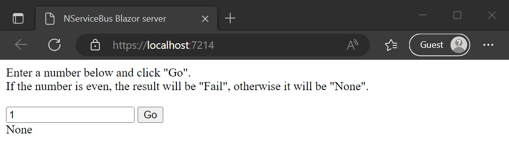

This sample shows how to send messages from a Blazor server application to an NServiceBus endpoint.

## Run the sample

When running the solution, a console application and new browser window/tab opens.

Enter the number "1" into the text box in the browser and click "Go". Notice the result "None" appears, as shown:

Changing the number in the text box from even to odd numbers changes the result in the Server console.

The web page renders synchronously. From the user's perspective, the interaction is synchronous and blocking, even though behind the scenes NServiceBus is implementing an asynchronous send-reply pattern using the [callbacks package](/nservicebus/messaging/callbacks.md).

## Configuration

This sample has three projects: `Shared`, `Server`, and `WebApp`. `WebApp` is a Blazor server application that sends messages (found in the `Shared` project) to the `Server` project, which is hosted as a console application.

### Initializing NServiceBus

In `WebApp`, open `Program.cs` and look at the code in the `UseNServiceBus` method:

snippet: ApplicationStart

### Sending a message

Open `Index.razor` in `WebApp` to see the `HandleValidSubmit` method:

snippet: ActionHandling

The first line of code parses the text passed in by the user. The second line creates a new NServiceBus message of the type `Command` and initializes its `Id` property with the value from the text box.

Open the class definition for the `Command` type in the `Shared` project:

snippet: Message

Return to `Index.razor` and look at the code `messageSession.Request`. The `messageSession` interface is resolved through [dependency injection](/nservicebus/hosting/extensions-hosting.md#dependency-injection-integration) as part of the generic host that configures the NServiceBus endpoint.  The message session offers methods to send messages via NServiceBus. Skip the rest of the code and see what happens to the message just sent.

### Handling the message

In the `Server` project, find this code in the `CommandMessageHandler` class:

snippet: Handler

This class implements the NServiceBus interface `IHandleMessages<T>` where `T` is the specific message type being handled, which in this case is the `Command` message. NServiceBus manages classes that implement this interface. When a message arrives in the input queue, it is deserialized, and then, based on its type, NServiceBus instantiates the relevant message handler classes and calls their `Handle` method, passing in the message object.

In the method body, notice the response being returned to the originating endpoint. This will result in a message being added to the input queue for `MyWebClient` endpoint.

## Handling the response

When the response arrives back at `WebApp`, NServiceBus invokes the callback that was registered when the request was sent.

The `messageSession.Request` method takes the callback code and tells NServiceBus to invoke it when the response is received. There are several overloads of this method. The code above accepts a generic `Enum` parameter, effectively casting the return code from the server to the given enumeration type.

Finally, the code updates the `Text` property of a label on the web page, setting it to the string that represents the enumeration value: sometimes `None`, sometimes `Fail`.