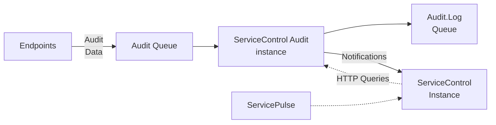

Each endpoint in the system can be [configured to send audit copies of every message that is processed into a central audit queue](/nservicebus/operations/auditing.md). ServiceControl Audit instances consume and store the messages sent to the audit queue and make them available for visualizing message flows in [ServicePulse](/servicepulse/).

ServiceControl Audit can optionally forward these messages into an [audit log queue](configuration.md#transport-servicecontrol-auditforwardauditmessages) for further processing if required.

Data about audit messages is exposed via an HTTP API from a ServiceControl Error instance, which aggregates the data stored in [all connected ServiceControl Audit instances](/servicecontrol/servicecontrol-instances/remotes.md#overview-sharding-audit-messages-with-competing-consumers).

> [!IMPORTANT]
> Connecting ServicePulse directly to a ServiceControl Audit instance is not supported.

> [!NOTE]
> The ServiceControl HTTP API is designed for use by ServicePulse only and may change at any time. Use of this HTTP API for other purposes is discouraged.

## Persistence

Each ServiceControl Audit instance stores message data in a RavenDB database. For instances deployed using the ServiceControl Management utility or PowerShell this database is embedded with the ServiceControl Audit instance. For ServiceControl Audit instances deployed using containers the database resides in a [separate container](/servicecontrol/ravendb/containers.md).

By default, audit data is retained for 7 days. [This retention period can be customized](/servicecontrol/audit-instances/configuration.md#data-retention).

include: ravendb-exclusive-use-warning

### RavenDB versions used

In ServiceControl.Audit version 4.26 and above new instances use RavenDB version 5. Instances created by version 4.25 and below use RavenDB version 3.5.

Upgrading ServiceControl.Audit instances to version 4.26 or higher does not change the database version. Instances using RavenDB version 3.5, when upgraded to the newest version, will still use RavenDB version 3.5. For more details see [upgrade guide to new persistence format](/servicecontrol/migrations/new-persistence.md)

## Notifications

Each ServiceControl Audit instance sends notification messages to a ServiceControl Error instance.

### Endpoint detection

When a ServiceControl Audit instance detects a new endpoint, it sends a notification to the ServiceControl Error instance. The Error instance keeps track of all of the endpoints in the system and can monitor them with heartbeats and custom checks.

include: servicecontrol-self-monitoring
