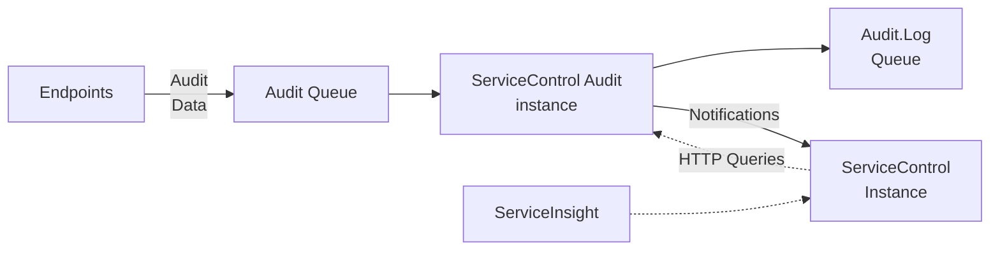

In ServiceControl versions 4 and above, a ServiceControl Audit instance manages the audit queue. Data about audit messages is exposed via an HTTP API on a primary ServiceControl instance. This API is used by [ServiceInsight](/serviceinsight/) for visualizing message flows.

NOTE: The ServiceControl HTTP API is designed for use by ServiceInsight only and may change at any time. Use of this HTTP API for other purposes is discouraged.

Each endpoint in the system should be [configured to send audit copies of every message that is processed into a central audit queue](/nservicebus/operations/auditing.md). A ServiceControl Audit instance reads the messages in the audit queue and makes them available for visualization in ServiceInsight. ServiceControl Audit can optionally forward these messages into an Audit Log queue for further processing if required. In some cases, it might be useful to exclude certain message types from being forwarded to the audit queue. This can be accomplished by making use of a [custom behavior in the pipeline](/samples/pipeline/audit-filtering).

Each ServiceControl Audit instance stores data in an embedded database. Audit data is retained for 30 days. [This retention period can be customized](/servicecontrol/audit-instances/creating-config-file.md#data-retention).

## Connected to a ServiceControl instance

When using ServiceControl Management to create a new ServiceControl instance, a connected ServiceControl Audit instance is automatically created. Using PowerShell, create the ServiceControl instance first, then the ServiceControl Audit instance.

A single ServiceControl instance can have zero or more ServiceControl Audit secondary instances attached to it. ServiceInsight connects directly to the primary ServiceControl instance which will aggregate the data stored in all connected ServiceControl Audit instances.

Connecting ServiceInsight directly to a ServiceControl Audit instance is not supported.

## Notifications

Each ServiceControl Audit instance sends notification messages to a primary ServiceControl instance.

### Endpoint detection

When a ServiceControl Audit instance detects a new endpoint it sends a notification to the primary ServiceControl instance. The primary instance keeps track of all of the endpoints in the system and can monitor them with heartbeats and custom checks.

### Successful retry detection

When a ServiceControl Audit instance detects that an audited message is the result of a retry, it sends a notification to the primary ServiceControl instance.

### Health monitoring

include: self-monitoring
