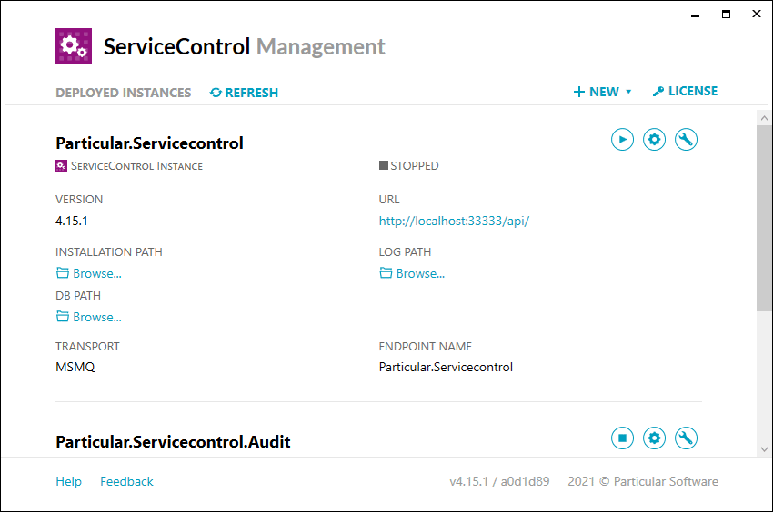

NOTE: Internet Explorer is not supported by RavenDB Management Studio.

ServiceControl audit instances store their data in an embedded RavenDB database. Under normal operation, the RavenDB instance is accessible only by the ServiceControl audit service. The RavenDB instance may be accessed for troubleshooting by following these steps:

1. Launch ServiceControl Management
1. Open Advanced Options
1. Start Maintenance Mode
1. Launch RavenDB Management Studio in a supported browser
1. Stop Maintenance Mode as soon as access to the embedded RavenDB instance is no longer required.

WARNING: The ServiceControl Audit RavenDB embedded instance is used exclusively by ServiceControl and is not intended for external manipulation or modifications.
