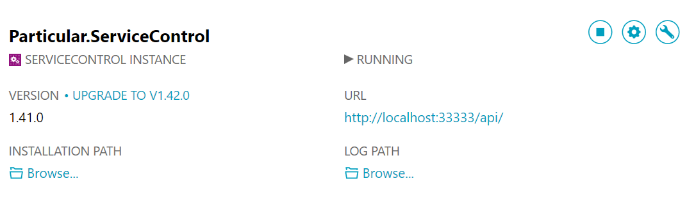

ServiceControl utilizes an embedded RavenDB for data storage. To backup or restore the database instance follow these procedures:

### Backup

1.  Open the ServiceControl Management Utility to view the list of ServiceControl Service instances
	
1. Stop the service you wish to backup from the action icons.        
1. Click the link under data path to go to the data directory. 
1. Copy the contents of the data directory. 
1. Start the service again once the copy is complete

### Restore

1. Open the ServiceControl Management Utility to view the list of ServiceControl Service instances
1. Stop the service you wish to restore to from the action icons.        
1. Click the link under data path to go to the data directory. 
1. Replace the contents of this directory with the previously copied data,  
1. Start the service again once the copy is complete

### Important Notes and Restrictions

Care should be taken when planning to move ServiceControl from one server to another.  Moving databases between servers can be problematic. The embedded RavenDB does not support moving from a new versions of Windows back to older versions of Windows. See this [link](http://stackoverflow.com/questions/25625910/getting-error-while-restoring-backup-file-in-raven-db) for more details.

The ServiceControl database should not be restored to older copies of the ServiceControl service.  This is not supported as both the database structure and the version on RavenDB may change between versions.  These changes aren't necessarily backward compatible.  

