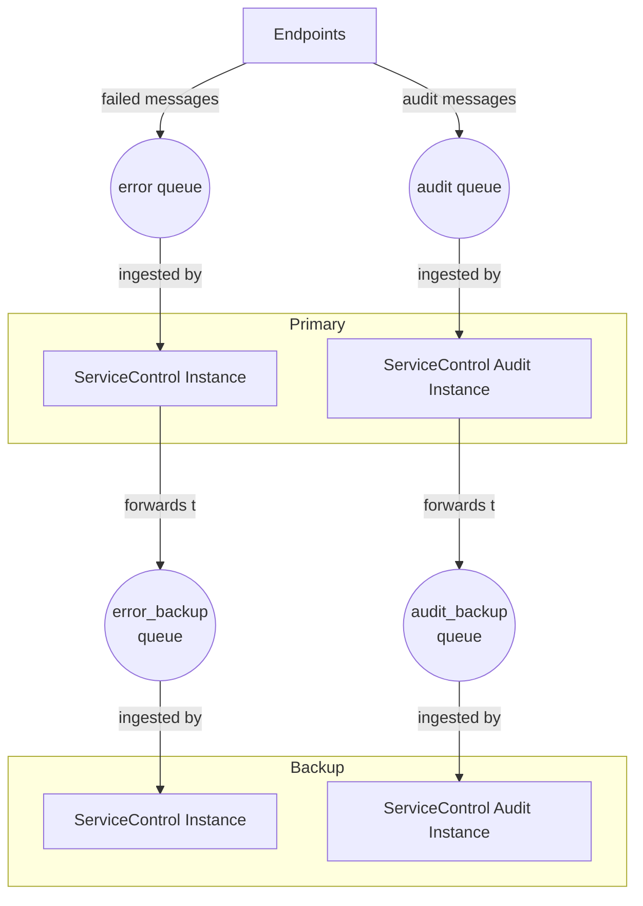

Multiple ServiceControl instances can be used to create a business continuity / disaster recovery configuration. By forwarding failed and audited messages to backup instances of ServiceControl, it is possible to resume operations in the case that the primary instances are no longer available.

This configuration works by combining multiple ServiceControl instances with [audit log forwarding](audit-instances/configuration.md#transport-servicebusauditlogqueue) and [error log forwarding](/servicecontrol/servicecontrol-instances/configuration.md#transport-servicebuserrorlogqueue). Failed and audited messages are forwarded by the primary instances to the backup instances through log forwarding queues.

To install this configuration:

1. Create the standard error and audit queues.
1. Create the backup error and audit queues.
1. Set up the primary ServiceControl instances and configure them to forward errors and audit messages to the backup queues.
1. Set up the backup ServiceControl instances and configure them to use the backup queues.

> [!WARNING]
> Make sure the names of the backup ServiceControl instances are named differently from the primary ServiceControl instances, otherwise unexpected behavior may result.

## How retrying works

Retrying a message from the primary instance will work as usual, however the backup instances will now update the status of the failed messages to "retry pending". Once the successful audit message is received, the backup instance will be notified as well and the failed message record in both instances will reflect the messages as having been successfully retried.

> [!WARNING]
> It is possible to duplicate messages when retrying from the backup instance if a retry has already been sent from the primary instance.

