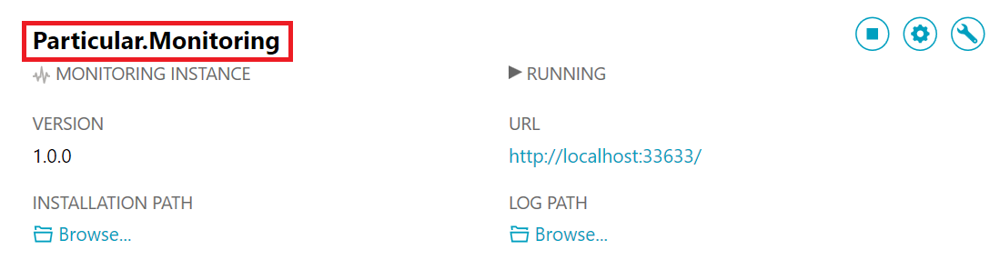

ServiceControl is able to monitor all of the endpoint instances that make up a solution and provide a centralized dashboard within ServicePulse showing the state of the system.

TODO: Screenshot of ServicePulse monitoring page

In order to monitor endpoints, a [ServiceControl Monitoring instance needs to be created](./installation.md). The instance should be configured to use the same transport as the endpoints to be monitored.



Each endpoint instance must be configured to use [NServiceBus.Metrics](/nservicebus/operations/metrics.md) and to send that data to the ServiceControl Monitoring input queue. The input queue will match the name of the ServiceControl Monitoring instance created above. 

## Enabling NServiceBus.Metrics

snippet: Metrics-Enable

## Reporting to ServiceMonitor

To configure an endpoint to report metrics data to ServiceMonitor set the ServiceControl Monitor input queue:

```c#
// TODO: Convert this to a snippet once it is made not-obsolete (it will currently fail the build)
metrics.SendMetricDataToServiceControl("Particular.ServiceMonitor", TimeSpan.FromSeconds(1));
```
