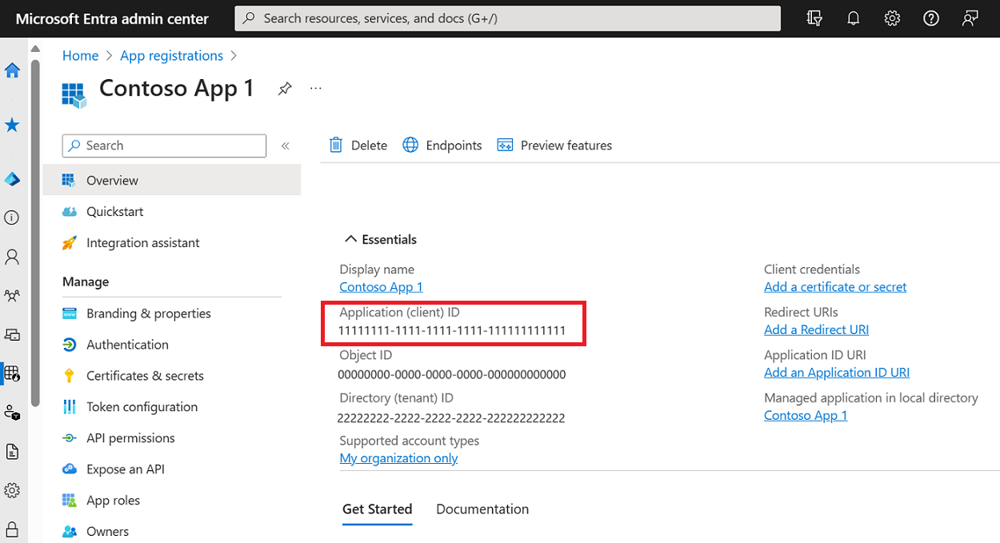

The configuration of a ServiceControl instance can be adjusted via the ServiceControl Management utility or by directly modifying the `ServiceControl.exe.config` file. The settings listed are applicable to the `appSettings` section of the configuration file unless otherwise specified.


## Host settings

The following documents should be reviewed prior to modifying configuration settings:

- [Setting a Custom Hostname](setting-custom-hostname.md) for guidance and details.
- [Securing ServiceControl](securing-servicecontrol.md) for an overview of the security implications of changing the configuration.

### ServiceControl/HostName

The hostname to bind the embedded HTTP server to; modify this setting to bind to a specific hostname, e.g. `sc.mydomain.com`.

Type: string

Default: `localhost`

> [!WARNING]
> If the `ServiceControl/HostName` setting is changed, and the `ServiceControl/DbPath` setting is not set, the path of the embedded RavenDB is changed. Refer to [Customize RavenDB Embedded Location](configure-ravendb-location.md).

### ServiceControl/Port

The port to bind the embedded HTTP server.

Type: int

Default: `33333`.

> [!WARNING]
> If the `ServiceControl/Port` setting is changed, and the `ServiceControl/DbPath` setting is not set, the path of the embedded RavenDB is changed. Refer to [Customize RavenDB Embedded Location](configure-ravendb-location.md).

### ServiceControl/DatabaseMaintenancePort

The port to bind the RavenDB when in maintenance mode or [RavenDB is exposed](creating-config-file.md#troubleshooting-servicecontrolexposeravendb).

Type: int

Default: `33334`.

### ServiceControl/VirtualDirectory

The virtual directory to bind the embedded HTTP server to; modify this setting to bind to a specific virtual directory.

Type: string

Default: `empty`

> [!NOTE]
> This setting is provided for backward compatibility and should be considered obsolete.

### ServiceControl/DbPath

The path where the internal RavenDB is located.

Type: string

Default: `%SYSTEMDRIVE%\ProgramData\Particular\ServiceControl\<instance_name>\DB`

#if-version [,5)

The indexes and Esent logs can be stored in a different path from the the RavenDB database data files by using the following [RavenDB configuration app settings](https://ravendb.net/docs/article-page/2.5/csharp/server/administration/configuration):

### Raven/IndexStoragePath

> [!NOTE]
> Only supported on RavenDB 3.5 storage engine (prior version 5). Use [symbolic links (soft links) to map any RavenDB storage subfolder](https://ravendb.net/docs/article-page/5.4/csharp/server/storage/customizing-raven-data-files-locations) to other physical drives.

The path for the indexes on disk.

Type: string

Default: `%SYSTEMDRIVE%\ProgramData\Particular\ServiceControl\<instance_name>\DB\indexes`

### Raven/Esent/LogsPath

The path for the Esent logs on disk.

Type: string

Default: `%SYSTEMDRIVE%\ProgramData\Particular\ServiceControl\<instance_name>\DB\Logs`

#end-if

### ServiceControl/LogPath

The path for the ServiceControl logs.

Type: string

Default: `%LOCALAPPDATA%\Particular\ServiceControl\logs`

> [!NOTE]
> %LOCALAPPDATA% is a user-specific environment variable.

### ServiceControl/LogLevel

Controls the LogLevel of the ServiceControl logs.

Type: string

Default: `Info`

Valid settings are: `Trace`, `Debug`, `Info`, `Warn`, `Error`, `Fatal`, `Off`.

This setting will default to `Info` if an invalid value is assigned.

### ServiceControl/RavenDBLogLevel

Controls the LogLevel of the RavenDB logs. See [Logging](logging.md).

Type: string

#if-version [5,)
Default: `Operations`

Valid settings are: `None`, `Information`, `Operations`.
#end-if
#if-version [,5)
Default: `Info`

Valid settings are: `Trace`, `Debug`, `Info`, `Warn`, `Error`, `Fatal`, `Off`.
#end-if

This setting will default to `Warn` if an invalid value is assigned.

### ServiceControl/TimeToRestartErrorIngestionAfterFailure

Version: 4.4.1+

Controls the maximum time delay to wait before restarting the error ingestion pipeline after detecting a connection problem.

Type: `TimeSpan`

Default: 60 seconds

Valid settings are between 5 seconds and 1 hour.

### ServiceControl/InternalQueueName

Version: 4.27.0+

Controls the name of the internal queue that ServiceControl uses for internal control messages. This can be used when the internal queue name does not match the Windows Service Name.

Type: string

Default: The Service Name

### ServiceControl/IngestErrorMessages

Version: 4.33.0+

Set to `false` to disable ingesting new error messages. Useful in some upgrade scenarios.

Type: bool `true` or `false`

Default: `true`

## Data retention

### ServiceControl/ExpirationProcessTimerInSeconds

The number of seconds to wait between checking for expired messages.

Type: int

Default: `600` (10 minutes). The default for ServiceControl version 1.3 and below is `60` (1 minute), Starting in version 1.4, the default is `600` (10 minutes). Setting the value to `0` will disable the expiration process. This is not recommended and it is only provided for fault finding. Valid range is `0` to `10800` (3 Hours).

#if-version [,5)

### ServiceControl/ExpirationProcessBatchSize

This setting was introduced in version 1.4. The minimum allowed value for this setting is `10240`; there is no hard-coded maximum as this is dependent on system performance.

Type: int

Default: `65512`.

#end-if

#if-version [,5)

### ServiceControl/AuditRetentionPeriod

This setting is deprecated in version 4.0.0. See [ServiceControl Audit configuration](/servicecontrol/audit-instances/creating-config-file.md).

The period to keep an audit message before it is deleted.

Type: timespan

Default: There is no default; this setting is required.

Valid range for this setting is from 1 hour to 365 days.

#end-if

### ServiceControl/ErrorRetentionPeriod

The grace period that faulted messages are kept before they are deleted.

For a message to be considered for deletion, it needs to have a status of either `Archived`, `RetryIssued`, or `Resolved`.

Type: timespan

Default: There is no default; this setting is required.

Valid range for this setting is between 5 days and 45 days.

### ServiceControl/EventRetentionPeriod

The period to keep event logs before they are deleted.

Type: timespan

Default: `14` (14 days).

Valid range for this setting is from 1 hour to 200 days.

## Performance tuning

### ServiceControl/MaximumConcurrencyLevel

This setting controls how many messages can be processed concurrently (in parallel) by ServiceControl. The default value is 10.

In some cases, the ingestion rate can be too high and the underlying database cannot keep up with indexing the new messages. In this case, consider lowering the maximum concurrency level to a value that still allows a suitable ingestion rate while easing the pressure on the database.

> [!WARNING]
> The maximum concurrency level should be incremented only if there are no verified bottlenecks in CPU, RAM, network I/O, storage I/O, and storage index lag.

#if-version [,5)

### ServiceControl/MaxBodySizeToStore

This setting sets an upper limit on body size to be stored.

> [!NOTE]
> This setting is not available in versions 4.4 and higher. It is still supported in Audit instances via [ServiceControl.Audit/MaxBodySizeToStore](/servicecontrol/audit-instances/creating-config-file.md#performance-tuning-servicecontrol-auditmaxbodysizetostore) setting

Type: int

Default: `102400` (100Kb)

#end-if

### ServiceControl/HttpDefaultConnectionLimit

The maximum number of concurrent connections allowed by ServiceControl. When working with transports that operate over HTTP, the number of concurrent connections can be increased to meet transport concurrency settings.

Type: string

Default: `100`

### ServiceControl/EnableFullTextSearchOnBodies

Version: 4.17.0+

Use this setting to configure whether the bodies of processed error messages should be full-text indexed for searching.

Type: bool `true` or `false`

Default: `true`.

## Transport

### ServiceControl/TransportType

The transport type to run ServiceControl with.

Type: string

Default: `ServiceControl.Transports.Msmq.MsmqTransportCustomization, ServiceControl.Transports.Msmq`

The assembly containing the transport type needs to be present in the ServiceControl directory for ServiceControl being able to instantiate the transport type.

### NServiceBus/Transport

The connection string for the transport. This setting should be placed in the `connectionStrings` section of the configuration file.

Type: string

### ServiceBus/ErrorQueue

The error queue name.

Type: string

Default: `error`

### ServiceBus/ErrorLogQueue

The error queue name to use for forwarding error messages.

Type: string

Default: `<ErrorQueue>.log`

ServiceControl creates the queue specified by this setting only if `ServiceControl/ForwardErrorMessages` is enabled.

> [!NOTE]
> Changing the configuration file directly will not result in the queue being created. Use ServiceControl Management to add or alter the forwarding queue.

### ServiceControl/ForwardErrorMessages

Use this setting to configure whether processed error messages are forwarded to another queue or not.

Type: bool `true` or `false`

Default: There is no default. This setting needs to be specified.

This entry should be set to `false` if there is no external process reading messages from the `Error Forwarding Queue`.

See [Installation](installation.md) for details on how to set this at install time.

## Usage Reporting when using ServiceControl

### LicensingComponent/ServiceControlThroughputDataQueue

The queue on which throughput data is received by the ServiceControl Error instance. This setting must match the equivalent [`Monitoring/ServiceControlThroughputDataQueue`](/servicecontrol/monitoring-instances/installation/creating-config-file.md#usage-reporting-monitoringservicecontrolthroughputdataqueue) setting for the Monitoring instance.

In most instances these settings do not need to be modified.

If running multiple setups of the Platform Tools (i.e. multiple versions of ServiceControl error and monitoring instances) then modify these settings so that the queue on each monitoring instance is matched to the queue of its error instance.

If using [MSMQ transport](/transports/msmq) and the monitoring instance is installed on a different machine than the ServiceControl error instance, only the monitoring instance setting needs to be modified to include the machine name of the error instance in the queue address.

Version: 5.4+

Type: string

Default: `ServiceControl.ThroughputData`

## Usage Reporting when using the Azure Service Bus transport

### LicenseComponent/ASB/TenantId

The Azure [Tenant ID](https://learn.microsoft.com/en-us/azure/azure-portal/get-subscription-tenant-id#find-your-microsoft-entra-tenant).

Version: 5.4+

Type: string

### LicenseComponent/ASB/SubscriptionId

The Azure [subscription ID](https://learn.microsoft.com/en-us/azure/azure-portal/get-subscription-tenant-id#find-your-azure-subscription).

Version: 5.4+

Type: string

### LicenseComponent/ASB/ClientId

The Client ID (aka Application ID) for an [Azure service principal](https://learn.microsoft.com/en-us/entra/identity-platform/app-objects-and-service-principals?tabs=browser#service-principal-object) that has access to read metrics data for the Azure Service Bus namespace.

Version: 5.4+

Type: string

Example Client ID from an Azure App Registration:


### LicenseComponent/ASB/ClientSecret

The [client secret](https://learn.microsoft.com/en-us/entra/identity-platform/howto-create-service-principal-portal#option-3-create-a-new-client-secret) for an Azure service principal that has access to read metrics data for the Azure Service Bus namespace.

Version: 5.4+

Type: string

> [!NOTE]
> Certificates and federated credentials are not supported at this time.

### LicenseComponent/ASB/ManagementUrl

The Azure ManagementUrl URL.

Version: 5.4+

Type: string

Default: https://management.azure.com

This setting only needs to be configured if not using the public AzureCloud environment.
For other environments:

- AzureGermanCloud - https://management.microsoftazure.de
- AzureUSGovernment - https://management.usgovcloudapi.net
- AzureChinaCloud - https://management.chinacloudapi.cn

## Usage Reporting when using the Amazon SQS transport

### LicenseComponent/AmazonSQS/AccessKey

The AWS Access Key ID to use to discover queue names and gather per-queue metrics.

Version: 5.4+

Type: string

### LicenseComponent/AmazonSQS/SecretKey

The AWS Secret Access Key to use to discover queue names and gather per-queue metrics.

Version: 5.4+

Type: string

### LicenseComponent/AmazonSQS/Profile

The name of a local AWS credentials profile to use to discover queue names and gather per-queue metrics.

Version: 5.4+

Type: string

### LicenseComponent/AmazonSQS/Region

The AWS region to use when accessing AWS services.

Version: 5.4+

Type: string

### LicenseComponent/AmazonSQS/Prefix

Report only on queues that begin with the specified prefix. This is commonly used when one AWS account must contain queues for multiple projects or multiple environments.

Version: 5.4+

Type: string

## Usage Reporting when using the RabbitMQ transport

### LicenseComponent/RabbitMQ/ApiUrl

The RabbitMQ management URL.

Version: 5.4+

Type: string

### LicenseComponent/RabbitMQ/UserName

The username to access the RabbitMQ management interface.

Version: 5.4+

Type: string

### LicenseComponent/RabbitMQ/Password

The password to access the RabbitMQ management interface.

Version: 5.4+

Type: string

## Usage Reporting when using the SqlServer transport

### LicenseComponent/SqlServer/ConnectionString

The connection string that will provide at least read access to all queue tables.

Version: 5.4+

Type: string

### LicenseComponent/SqlServer/AdditionalCatalogs

Specifies any additional databases on the same server that also contain NServiceBus message queues.

Version: 5.4+

Type: string

## Plugin-specific

### ServiceControl/HeartbeatGracePeriod

The period that defines whether an endpoint is considered alive or not since the last received heartbeat.

Type: timespan

Default: `00:00:40` (40 secs)

When configuring the heartbeat grace period, make sure it is greater than the [heartbeat interval defined by the plugin](/monitoring/heartbeats/install-plugin.md).

> [!NOTE]
> When monitoring multiple endpoints, ensure that the heartbeat grace period is larger than any individual heartbeat interval set by the endpoints.

## Troubleshooting

### ServiceControl/ExposeRavenDB

ServiceControl stores its data in a RavenDB embedded instance. By default, the RavenDB instance is accessible only by the ServiceControl service. If during troubleshooting, direct access to the RavenDB instance is required while ServiceControl is running, ServiceControl can be configured to expose the RavenDB studio.

> [!NOTE] > [Maintenance mode](maintenance-mode.md) is the recommended way to review documents in the embedded RavenDB instance.

> [!WARNING]
> The ServiceControl RavenDB embedded instance is used exclusively by ServiceControl and is not intended for external manipulation or modifications.

Type: bool

Default: `false`

After restarting the ServiceControl service, access the RavenDB studio locally at the following endpoint:

```no-highlight
http://localhost:{configured ServiceControl instance maintenance port}/studio/index.html#databases/documents?&database=%3Csystem%3E
```

> [!NOTE]
> The ServiceControl embedded RavenDB studio can be accessed from localhost regardless of the hostname customization setting. To allow external access, the hostname must be [set to a fully qualified domain name](setting-custom-hostname.md).

### ServiceControl/DataSpaceRemainingThreshold

The percentage threshold for the [Message database storage space](/servicecontrol/servicecontrol-instances/#self-monitoring-via-custom-checks-message-database-storage-space) check. If the remaining hard drive space drops below this threshold (as a percentage of the total space on the drive), then the check will fail, alerting the user.

Type: int

Default: 20

### ServiceControl/MinimumStorageLeftRequiredForIngestion

This setting was introduced in version 4.28. The percentage threshold for the [Critical message database storage space](/servicecontrol/servicecontrol-instances/#self-monitoring-via-custom-checks-critical-message-database-storage-space) check. If the remaining hard drive space drops below this threshold (as a percentage of the total space on the drive), then the check will fail, alerting the user. The message ingestion will also be stopped to prevent data loss. Message ingestion will resume once more disk space is made available.

Type: int

Default: 5
