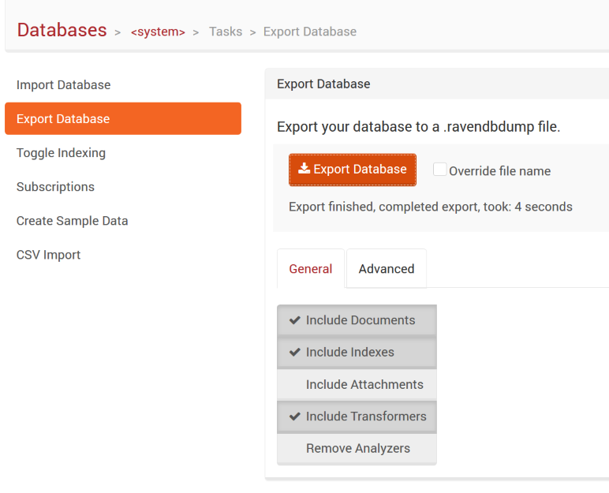

ServiceControl's embedded RavenDB database can be compacted in one of two ways: with the  [Extensible Storage Engine Utility (esentutl)](https://technet.microsoft.com/en-us/library/hh875546.aspx), or by using the RavenDB management portal.

## Using EsentUtl (Preferred approach)

### Step 1: Stop ServiceControl

* Open ServiceControl Management
* Stop the service from the action icons
* Note the "DATA PATH" for the service(e.g. "C:\ProgramData\Particular\ServiceControl\Particular.ServiceControl\DB")   

WARNING: For the `esentutl` command line utility to work, the ServiceControl service must stop without any errors.

### Step 2: Back up the ServiceControl instance

* Follow the [backup instructions](backup-sc-database.md#backup) to back up the embedded RavenDB database.

### Step 3: Administrator command prompt

* Open an elevated command prompt and navigate to the ServiceControl "DATA PATH" directory
* Run **`esentutl /r RVN /l logs /s system`** and wait for it to finish. This will ensure that the database is in a consistent state and is ready for defragmentation.
* Here is the result of running it:  

```txt
Extensible Storage Engine Utilities for Microsoft(R) Windows(R)
Version 10.0
Copyright (C) Microsoft Corporation. All Rights Reserved.

Initiating RECOVERY mode...
   Logfile base name: RVN
   Log files: logs
   System files: system

Performing soft recovery...

Operation completed successfully in 0.78 seconds.
```

* Now run **`esentutl /d Data`** and wait for it to finish. Here is the result of running it:  

```txt
Extensible Storage Engine Utilities for Microsoft(R) Windows(R)
Version 10.0
Copyright (C) Microsoft Corporation. All Rights Reserved.

Initiating DEFRAGMENTATION mode...
           Database: Data

                 Defragmentation Status (% complete)

         0    10   20   30   40   50   60   70   80   90  100
         |----|----|----|----|----|----|----|----|----|----|
         ..................................................
```

### Step 4: Restart ServiceControl

* Start the ServiceControl Windows Service.

## Using the RavenDB management portal

Use the following approach if problems are encountered while running the `EsentUtl` utility.

ServiceControl version 1.4 introduced a database maintenance feature which allows ServiceControl to be run with all features disabled except for RavenDB Studio. While in this mode no messages are ingested from the queuing system.

Once ServiceControl is running in this mode, the following procedure can be used to compact the embedded RavenDB database.

### Step 1: Start ServiceControl in maintenance mode

* Start the ServiceControl instance in [maintenance mode](maintenance-mode.md).

### Step 2: Export the current database

* Open a browser and navigate to `http://localhost:{selected RavenDB port}/studio/index.html#databases/documents?&database=%3Csystem%3E`.
  
* Click the "Tasks" link at the top of the page.
* Select "Export Database" tab and select all checkboxes.
  
* Export the database.
* Select the directory to store the exported data file.
  
* Wait for the export operation to complete.
  
* Once the export operation is complete, stop ServiceControl (from ServiceControl Management).

### Step 3: Delete the existing database

NOTE: At this point, it is advisable to take a backup copy of the existing database directory as re-importing can sometimes fail. To do this, ensure that ServiceControl is not running, then copy the contents of the database directory.

* Delete the database directory contents.
* Start ServiceControl, again in maintenance mode. This will populate the database directory with a blank database.

### Step 4: Import the exported data

* Go to RavenDB studio `http://localhost:{selected RavenDB port}/studio/index.html#databases/documents?&database=%3Csystem%3E` and perform steps to import a database.
* Click the "Tasks" link at the top of the page.
* Select "Import Database" tab and select all checkboxes.
  
* Click "Choose file" and select the file to import.
* Click "Import Database" to proceed.  
* Wait for the operation to complete.
  
* Stop ServiceControl (from ServiceControl Management).

### Step 5: Restart ServiceControl

* Start the ServiceControl Windows Service.
