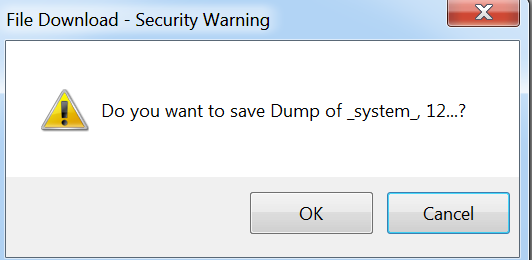

ServiceControl's embedded RavenDB database can be compacted in one of two ways. Using the  [Extensible Storage Engine Utility (esentutl)](https://technet.microsoft.com/en-us/library/hh875546.aspx) or by using ServiceControl in maintenance mode and using the RavenDB management portal.


## Using EsentUtl (Preferred approach)


### Step 1: Stop ServiceControl

 * Open the ServiceControl Management utility.
 * Stop the Service from the actions icons.
 * Note down the "DATA PATH" for the service.
  

WARNING: For the `esentutl` command line utility to work properly, ServiceControl service needs to be shutdown properly without any errors.


### Step 2: Backup ServiceControl instance

 * Follow the [backup instructions](backup-sc-database.md#backup) to backup the embedded RavenDB database.


### Step 3: Administrator command prompt

 * Open an elevated command prompt and navigate to the ServiceControl "DATA PATH" directory
 * Run **`esentutl /r RVN /l logs /s system`** and wait for it to finish. This will ensure that the database is in a consistent state and is ready for defragmentation.
 * Here is the result of running it:

```no-highlight
Extensible Storage Engine Utilities for Microsoft(R) Windows(R)
Version 10.0
Copyright (C) Microsoft Corporation. All Rights Reserved.
	
Initiating RECOVERY mode...
   Logfile base name: RVN
   Log files: logs
   System files: system

Performing soft recovery...

Operation completed successfully in 0.78 seconds.
```

 * Now run **`esentutl /d Data`** and wait for it to finish. Here is the result of running it:

```no-highlight
Extensible Storage Engine Utilities for Microsoft(R) Windows(R)
Version 10.0
Copyright (C) Microsoft Corporation. All Rights Reserved.

Initiating DEFRAGMENTATION mode...
           Database: Data

                 Defragmentation Status (% complete)

         0    10   20   30   40   50   60   70   80   90  100
         |----|----|----|----|----|----|----|----|----|----|
```


### Step 4: Restart ServiceControl

 * Start the ServiceControl Windows Service.


## Using ServiceControl in Maintenance Mode

Use the following approach if problems are encountered while running the `EsentUtl` utility.

ServiceControl 1.4 introduced a database maintenance feature which allows ServiceControl to be run with all features except for RavenDB Studio disabled. While in this mode no messages are ingested from the queuing system.

Once ServiceControl is running in this mode the following procedure can be used to compact the embedded RavenDB database.


### Step 1: Start ServiceControl in the maintenance mode

 * Open the ServiceControl Management utility
 * Stop the Service from the actions icons
 * Note down:
  * the installation path for the service.
  * the database path for the service.
 * Open command line, as Administrator, at installation path for the service
 * Type `ServiceControl -maint`
 * ServiceControl will start in the maintenance mode with RavenDB studio exposed on `http://localhost:{selected port}/storage`.


### Step 2: Export the current database

 * Open a browser and navigate to `http://localhost:{selected port}/storage`
 * Export the existing ServiceControl database.


 * Click Ok



 * Select the directory to store the exported data file.


 * Wait for the export operation to complete.


 * Once the export operation is complete, stop ServiceControl (press `<enter>` in the console).


### Step 3: Delete the existing database

NOTE: At this point it is advisable to take a backup copy of the existing database folder as re-importing can fail. To do this ensure that ServiceControl is not running and the copy the contents of the database directory.

 * Delete the database directory contents.
 * Start ServiceControl, again in the maintenance mode. This will populate the database folder with a blank database.


### Step 4: Import the exported data

 * Go to the RavenDB studio `http://localhost:{selected port}/storage` and perform Import steps.
 * Select the `Tasks` tab and select all the checkboxs


 * Click OK to proceed.


 * Select the file where the exported data was stored.


 * Wait for the operation to complete.

 * After the operation has completed wait for the stale index count in the footer to indicate there are no stale indexes.


 * Stop ServiceControl (press `<enter>` in the console).

NOTE: If an `System.OutOfMemoryException` occurs during import work around this error by reducing the batch size in advanced settings.


### Step 5: Restart ServiceControl

 * Start the ServiceControl Windows Service.