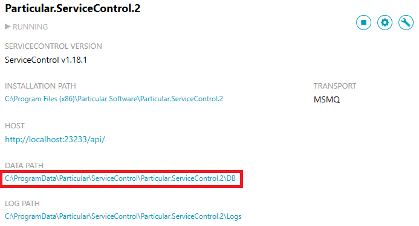

## Overview
In order to compact the embedded RavenDB database used by ServiceControl instances, the Extensible Storage Engine Utility (esentutl) needs to be run.

## Step 1: Backup ServiceControl instance

- Follow the [backup instructions](backup-sc-database#backup).

## Step 1: Stop ServiceControl

- Open the ServiceControl Management utility.
- Stop the Service from the actions icons.
- Note down:
	- the "DATA PATH" for the service.  
	

## Step 2: Administrator command prompt

- Open an elevated command prompt and navigate to the ServiceControl "DATA PATH" directory
- Run `esentutl /d Data` and wait for it to finish
- Here is the result of running it:  
  ```
  Extensible Storage Engine Utilities for Microsoft(R) Windows(R)
  Version 10.0
  Copyright (C) Microsoft Corporation. All Rights Reserved.
  
  Initiating DEFRAGMENTATION mode...
              Database: Data
  
                    Defragmentation Status (% complete)
  
            0    10   20   30   40   50   60   70   80   90  100
            |----|----|----|----|----|----|----|----|----|----|
  ```

## Step 3: Restart ServiceControl

- Start the ServiceControl Windows Service.
