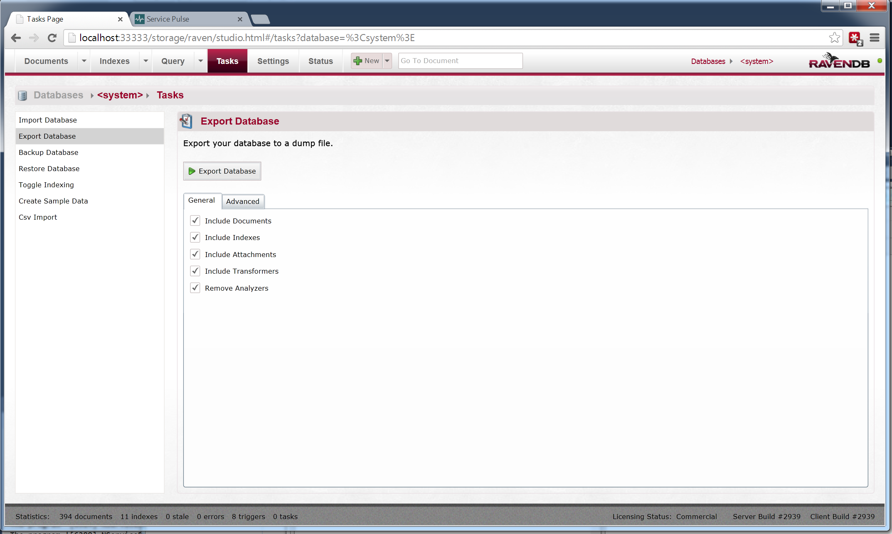

## Overview

ServiceControl 1.4 introduced a database maintenance feature which allows ServiceControl to be run with all features except for RavenDB Studio disabled.   In this mode the following procedure can be used to compact the embedded RavenDB database.

## Step 1: Start ServiceControl in the maintenance mode

- Stop the ServiceControl Windows Service
- Open command line and go to ServiceControl binary folder
- Type `ServiceControl -maint`
- ServiceControl will start in the maintenance mode  with RavenDB studio exposed on `http://localhost:{selected port}/storage`.  Assuming a default installation this URL would be `http://localhost:33333/storage`

## Step 2: Export the current database

- Open a browser and navigate to `http://localhost:33333/storage`
- Export the existing ServiceControl database. 

- Click Ok

- Select the directory where you want to store the exported data file.

- Wait for the export operation to complete.

## Step 3: Delete the existing database

- Once the export operation is complete, stop ServiceControl (press `<enter>` in the console).
- Delete the ServiceControl data file (localhost-33333) located at `C:\ProgramData\Particular\ServiceControl`
- Start ServiceControl, again in the maintenance mode.

## Step 4: Import the backed up data

- Go to the RavenDB studio `http://localhost:33333/storage` and perform Import steps.
- Select the `Tasks` tab and select all the checkboxes

- Click Ok to proceed.

- Select the file where the exported data was stored.

- Wait for the operation to complete.

- Stop ServiceControl (press `<enter>` in the console).

## Step 5: Restart ServiceControl

- Start the ServiceControl WindowsService.