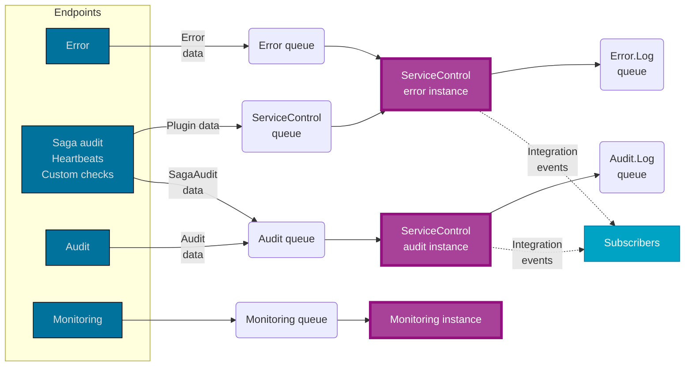

ServiceControl is a background process that will collect and store data and make it available via an HTTP API to ServicePulse and ServiceControl.

NOTE: The ServiceControl HTTP API may change at any time. It is designed for use by ServicePulse and ServiceInsight only. The use of this HTTP API for other purposes is not supported.

## How ServiceControl receives data

For each ServiceControl service type (error, audit, and monitoring) there are different data available that needs to be provided by user-built NServiceBus endpoints.

### Error instances

In NServiceBus, [recoverability](/nservicebus/recoverability/) is a very important feature. It enables automatic retries and continuity within a system, as failed messages will be moved aside. Those messages contain business data that needs to eventually be processed.

NServiceBus will move messages it cannot process to an [error queue](/nservicebus/recoverability/#fault-handling). This is where ServiceControl comes into play to consume these messages. This means it will pick up the message and store it in an internal database. For the internal database, ServiceControl makes use of RavenDB. After it is stored in the database, the message is made available to ServicePulse and ServiceInsight for visualization and retries.

NOTE: It is recommended to not provide end-users with the ability to retry messages. The message could fail again and end up in ServiceControl again anyway. It could be even more problematic when many messages are retried during a peak in message processing. This will result in even more messages being processed by an endpoint, causing valid messages to be delayed even longer.

Find out more about [failed messages](/servicepulse/intro-failed-messages.md) in ServicePulse.

### Audit instances

To enable ServiceInsight to visualize the message flow through the system, it needs to have access to every single message that has been successfully processed by the system. This requires endpoints to [enable auditing](/nservicebus/operations/auditing.md). ServiceControl consumes these messages and stores them in its internal database.

ServiceInsight will retrieve the data from ServiceControl via the HTTP API and use header information (which was added by NServiceBus during message processing) to figure out which message caused other messages to be sent, including which sagas were accessed when the [SagaAudit plugin](/nservicebus/sagas/saga-audit.md) is configured in an endpoint.

## Forwarding

ServiceControl _consumes_ messages from the audit and error queues. That is, it removes all messages from those queues. If a copy of those messages is required for further processing, configure [audit forwarding](/servicecontrol/creating-config-file.md#transport-servicecontrolforwardauditmessages) and/or [error queue forwarding](/servicecontrol/creating-config-file.md#transport-servicecontrolforwarderrormessages).
