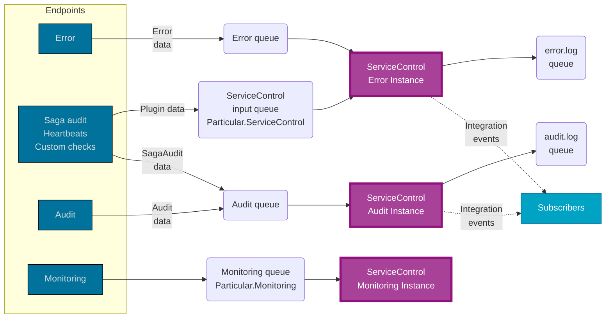

ServiceControl is a background process that will collect and store data and make it available via an HTTP API to ServicePulse.

> [!NOTE]
> The ServiceControl HTTP API may change at any time. It is designed for use by ServicePulse only. The use of this HTTP API for other purposes is not supported.

## How ServiceControl receives data

For each ServiceControl service type (i.e. error, audit, and monitoring) there is different data available that must be provided by user-built NServiceBus endpoints.

### Error instances

[Recoverability](/nservicebus/recoverability/) is an important feature in NServiceBus. It enables automatic retries and continuity within a system, as failed messages will be moved aside to allow other messages to be processed while the errors are investigated. Those error messages contain business data that must eventually be processed.

NServiceBus will move messages it cannot process to an [error queue](/nservicebus/recoverability/#fault-handling). This is where ServiceControl comes into play to consume these messages. ServiceControl will pick up the message from the queue and store it in its RavenDb database. After it is stored in the database, the message is made available to ServicePulse for visualization, retries, and other operations.

> [!NOTE]
> It is recommended not to provide end-users with the ability to retry messages. The message could fail again and end up in ServiceControl once again. It could be even more problematic when many messages are retried during a peak in message processing. This will result in even more messages being processed by an endpoint, causing valid messages to be delayed even longer. Potentially even more messages can fail due to locking in your saga persistence.

Find out more about [failed messages](/servicepulse/intro-failed-messages.md) in ServicePulse.

### Audit instances

To allow ServicePulse to visualize the message flow through the system, ServiceControl must have access to every message that has been successfully processed by the system. This requires endpoints to [enable auditing](/nservicebus/operations/auditing.md). ServiceControl consumes these messages and stores them in its database.

ServicePulse will retrieve the data from ServiceControl via the HTTP API and use header information (added by NServiceBus during message processing) to figure out which message caused other messages to be sent, including which sagas were accessed when the [SagaAudit plugin](/nservicebus/sagas/saga-audit.md) is configured in an endpoint.

### Monitoring instances

For ServicePulse to report metrics on logical endpoints, endpoint instances and on specific messages, each endpoints needs to be [enabled to forward metrics](/monitoring/metrics/install-plugin.md) to ServiceControl. ServicePulse will then be able to retrieve the data from ServiceControl via the HTTP API.

## Forwarding

ServiceControl _consumes_ messages from the audit and error queues. That is, it removes all messages from those queues. If a copy of those messages is required for further processing, configure [audit forwarding](/servicecontrol/audit-instances/configuration.md#transport-servicecontrol-auditforwardauditmessages) and/or [error queue forwarding](/servicecontrol/servicecontrol-instances/configuration.md#transport-servicecontrolforwarderrormessages).
