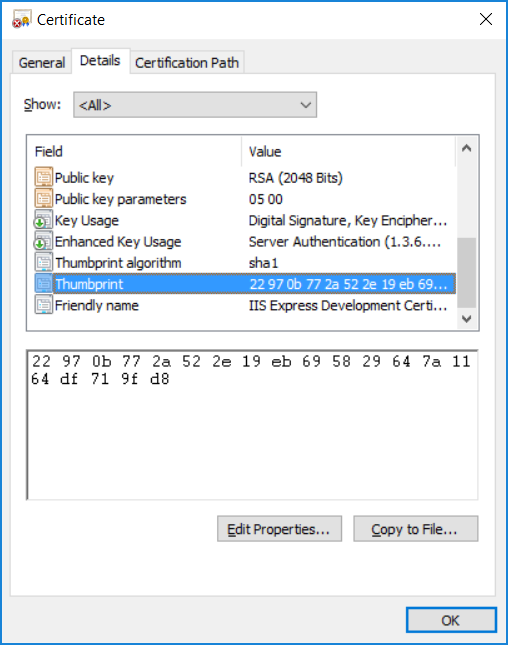

## ServiceControl PowerShell

ServiceControl 1.7 introduced a new graphical management utility to add, remove, update and delete instances of the ServiceControl service. These actions and some additional tools have also exposed via PowerShell module called `ServiceControlMgmt`.


## Prerequisites

The ServiceControlMgmt module requires a Microsoft PowerShell Version 3.0 or greater. Older operating systems such as Windows 7 and Windows 2008 R2 Server do not ship with a compatible version.  To update PowerShell on these operating systems install the [Windows Management Framework Version 3](https://www.microsoft.com/en-us/download/details.aspx?id=34595) or greater.   

## Loading and Running the PowerShell Module

The ServiceControl installation creates a shortcut in the Windows start menu to launch an administrative PowerShell Session with the module loaded. The installation does not add the path to the module to the `PSModulePath` environment variable so to load the module into an existing PowerShell session the fully qualified path must be passed to the `import-module` cmdlet as show below:

```ps
Import-Module "C:\Program Files (x86)\Particular Software\ServiceControl Management\ServiceControlMgmt.psd1"
```

## Cmdlets and Aliases

The following cmdlets are provided by the ServiceControl Management PowerShell module.

| Cmdlet                                       | Alias                  | 
|--------------------------------------------- |----------------------- | 
| Get-ServiceControlInstances                  | sc-instances           |  
| New-ServiceControlInstance                   | sc-add                 |  
| Remove-ServiceControlInstance                | sc-delete              |  
| Invoke-ServiceControlInstanceUpgrade         | sc-upgrade             |  
| Get-ServiceControlLicense                    | sc-findlicense         |  
| Import-ServiceControlLicense                 | sc-addlicense          |  
| Get-ServiceControlMgmtCommands               | sc-help                |  
| Get-ServiceControlTransportTypes             | sc-transportsinfo      |  
| Add-UrlAcl                                   | urlacl-add             |  
| Remove-UrlAcl                                | urlacl-delete          |  
| Get-UrlAcls                                  | urlacl-list            |  
| Test-IfPortIsAvailable                       | port-check             |  
| Get-SecurityIdentifier                       | user-sid               |  

### Removed in Version 2.0

From Version 1.7  the installation executable could be passed an unattended setup file which would install a Servicecontrol instance after the installation of the management tools had completed.  With subsequent releases this unattended file changed to incorporate new features and settings and needed to be check or revised against every release and customers need to write scripts to manage it.  In version 2.0 this feature was removed and it is recommended to script the installation of the instances instead. See [Silent Installation](installation-silent.md) for more information on scripting installation.   
The cmdlets that allowed the creation and testing of the unattended file have been removed since that feature 

| Cmdlet                                       | Alias                  | 
|--------------------------------------------- |----------------------- | 
| New-ServiceControlUnattendedFile             | sc-makeunattendfile    | 
| New-ServiceControlInstanceFromUnattendedFile | sc-addfromunattendfile |  


### Examples

To following commands show some uses of some of the cmdlets provided in the module. 
```ps
Get-Help Get-ServiceControlInstances
```

#### Adding an instance

```ps
New-ServiceControlInstance -Name Test.ServiceControl -InstallPath C:\ServiceControl\Bin -DBPath C:\ServiceControl\DB -LogPath C:\ServiceControl\Logs -Port 33334 -Transport MSMQ -ErrorQueue error1 -AuditQueue audit1
```

There are additional parameters available to set additional configuration options such as forwarding queues, the transport connection string or hostname.  Use `Get-Help New-ServiceControlInstance` for the full list of parameters.


#### Removing an instance

The following commands show how to remove a ServiceControl instance(s). To List existing instances of the ServiceControl service use `Get-ServiceControlInstances`.

Remove the instance that was created in the Add sample and delete the database and logs:

```ps
Remove-ServiceControlInstance -Name Test.ServiceControl -RemoveDB -RemoveLogs
```

Remove all ServiceControl instance created in the Add sample and delete the database and logs for each one:

```ps
Get-ServiceControlInstances | % { Remove-ServiceControlInstance -RemoveDB -RemoveLogs } 
```

There are additional parameters available to set additional configuration options such as forwarding queues, the transport connection string or host name.


#### Upgrading an instance

The following command will list the ServiceControl instances current installed and their version number.

```ps
Get-ServiceControlInstances | % { Select Name, Version }
```

To upgrade and instance to the latest version of the binaries run.

```ps
Invoke-ServiceControlInstanceUpgrade -Name <Instance To upgrade>
```

The upgrade will stop the service if it is running. Additional parameters for `Invoke-ServiceControlInstanceUpgrade` may be required. The configuration file of the existing version is examined prior to determine if all the required settings are present. If a configuration setting is missing then the cmdlet will throw an error indicating the required additional parameter. In Version 2.0 the `auto` parameter was added to make upgrades easier.  If the `auto` parameter is used then defaults are provide for any required values.

More details about scripting the installation and upgrading of ServiceControl instances can be found in the [unattended installation](installation-silent.md) guide

### Switching To HTTPS

NOTE: To switch to HTTPS a valid SSL certificate must be installed into the Local Machine store.

ServiceControl Version 2.0 requires Windows Credentials to be supplied when connecting to the  Raven Management Studio. To ensure these credentials are not passed in plain text it is possible to switch ServiceControl to use HTTPS.  

To switch to HTTPS the thumbprint of the certificate is required. This can be found by viewing the certificate through the Certificate Store



Or alternatively by listing the certificates using the `Get-Certificates` cmdlet. For example: 

```ps
Get-Certificates | FL 

```

This is a sample of the output of the `Get-Certificates` cmdlet

```os
Subject      : CN=localhost
Issuer       : CN=localhost
Thumbprint   : 22970B772A522E19EB695829647A1164DF719FD8
FriendlyName : IIS Express Development Certificate
NotBefore    : 25/08/2016 10:42:20 PM
NotAfter     : 25/08/2021 10:00:00 AM
Extensions   : {System.Security.Cryptography.Oid, System.Security.Cryptography.Oid}
```

To switch an instance to HTTPS use the the thumbprint in the `Switch-ServiceControlInstanceToHTTPS` command

```ps
Switch-ServiceControlInstanceToHTTPS -Name <Instance To upgrade> -Thumbprint <Certificate Thumbprint>
```

The cmdlet will:
 - delete the existing HTTP URLACL associated with the instance 
 - create a new HTTPS URLACL
 - bind the certificate to the port used by the instance.

To complete the transition any associated ServicePulse instance would need to be reconfigured to use the HTTPS URL.

### Licensing

Add the license file to the registry by running the following cmdlet.

```ps
Import-ServiceControlLicense <License-File>
```

The license file is added to the `HKEY_LOCAL_MACHINE` registry hive so it available to all instances of ServiceControl installed on the machine.

## Troubleshooting via PowerShell

The ServiceControl Management PowerShell offers some cmdlets to assist with troubleshooting the install of ServiceControl instances.


### Check if a Port is already in use

Before adding an instance of ServiceControl test if the port to use is currently in use.

```ps
Test-IfPortIsAvailable -Port 33333
```

This example shows the available ports out of a range of ports

```ps
33330..33339 | Test-IfPortIsAvailable | ? Available
```

### Checking and manipulating UrlAcls

The Window HTTPServer API is used by underlying components in ServiceControl. This API uses a permissions system to limit what accounts can add a HTTP listener to a specific URI.
The standard mechanism for viewing and manipulating these ports in via the [netsh.exe](https://technet.microsoft.com/en-us/library/Cc725882.aspx) command line tool.

For example `netsh.exe http show urlacl` will list all of the available. This output is detailed but not very friendly to query. The ServiceControl Management PowerShell provides simplified PowerShell equivalents for listing, add and removing UrlAcls and makes the output easier to query.

For example the following command lists all of the UrlAcls assigned to any URI for port 33333.

```ps
Get-UrlAcls | ? Port -eq 33333
```

In this example any UrlAcl on port 33335 is remove

```ps
Get-UrlAcls | ? Port -eq 33335 | Remove-UrlAcl
```

The following example shows how to add UrlAcl for a ServiceControl service that should only respond to a specific DNS name. This would require an update of the ServiceControl configuration file as well. Refer to [setting a custom host name and port number](setting-custom-hostname.md)

```ps
Add-UrlAcl -Url http://servicecontrol.mycompany.com:33333/api/ -Users Users
```

