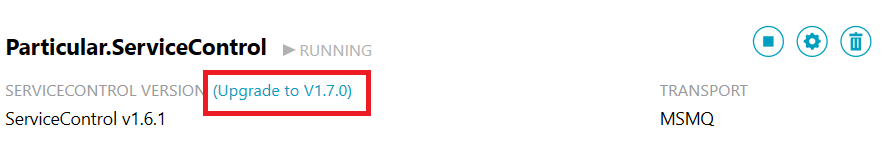

The ServiceControl installation file consists of an embedded MSI bootstrapper EXE and an embedded MSI. This installation can be executed standalone or via the Particular Software Platform Installer. The installation package include a utility to manage the installation, upgrade and remove of ServiceControl services. This utility is launched as the final step in the installation process and is also available via the Windows Start Menu.

### Prerequisites

The ServiceControl Installation has the following prerequisites:

1. The Microsoft .Net 4.5 Runtime

If ServiceControl is installed via the Particular Software Platform Installer then the installation and configuration of these prerequisites are managed for you.

### Transport Support

From ServiceControl 1.7 the transport DLLs are managed by the installation and do not need to be downloaded from NuGet.
ServiceControl can be configured to use one of the NServiceBus supported transports listed below using the ServiceControl Management Utility:

* Microsoft Message Queuing (MSMQ)
* Azure Storage Queues
* Azure Service Bus
* SQL Server
* RabbitMQ

Adding third party transports via the Management Utility is not supported at this stage. If MSMQ is the transport you intend to use then  ensure the service has been installed and configured as outlined in [Installing The Platform Components Manually](/platform/installer/offline.md#msmq). When using the Particular Platform Installer the MSMQ service is added automatically as part of the `NServiceBus Pre-Requisites` option

#### Performance Counter

ServiceControl reports metrics via the NServiceBus Performance Counters if the counters are installed.

For instructions on how to install the Performance Counters without the Platform Installer refer to [Installing The Platform Components Manually](/platform/installer/offline.md)

The installation of the NServiceBus Performance counters is optional for ServiceControl 1.7 or higher. When using the Particular Platform Installer the Performance counters are added as part of the `NServiceBus Pre-Requisites` option.

#### Using the ServiceControl Management Utility to upgrade ServiceControl instances.

The ServiceControl Management Utility provides a simple means of setting up one or more instances of the ServiceControl service. For production systems it is recommended to limit the number of instances per machine to one. 

WARN: The ability to add multiple instances is primarily intended to assist development and test environments.

The ServiceControl Management Utility can be launched automatically at the end of the installation process to enable adding or upgrading ServiceControl instances.

The Management Utility will display the instances of the ServiceControl service installed. If the version of the binaries used by an instance are older that those shipped with the ServiceControl Management Utility an upgrade link will be shown against the version label. 

To upgrade the service just click the upgrade link next to the Service name

Clicking the upgrade link will

 * Prompt for any additional information that is required such as values for new mandatory settings introduced in the newer version 
 * Stop the Service
 * Remove the old binaries for ServiceControl and the configured Transport
 * Run the new binaries to create any required queues
 * Start the Service

#### Using the ServiceControl Management Utility to add ServiceControl instances.

If this is a new installation of ServiceControl click on the `Add New Instance` button in the center of the screen or the "New Instance" link at the top of the screen,  both options launch the same "New instance form". Complete the form to register a new ServiceControl service.

#### Service Name and Plugins

When adding the first instance of the ServiceControl service the default service name is "Particular.ServiceControl". You may choose to change this name to a custom service name. In doing so you are also changing the queue name associated with this instance of ServiceControl. 

The endpoint plugins such as the heartbeat and custom check plugins assume that the ServiceControl queue name is the default. If a custom service name was used then see [ServiceControl plugins](/servicecontrol/plugins) for more details on how to configure the endpoint plugins to use the custom queue name. 
