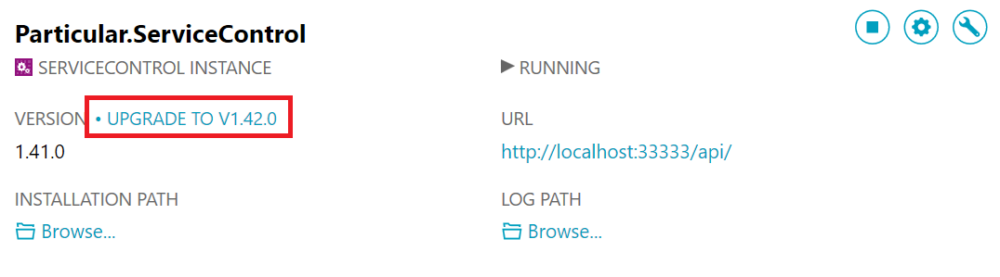

The ServiceControl installation file consists of an embedded MSI bootstrapper EXE and an embedded MSI.  This installation can be executed standalone or via the Particular Software Platform Installer. From version 1.7 on-wards the installation package include a utility to manage the installation, upgrade and remove of ServiceControl services.  This utility is launched as the final step in the installation process and is also available via the Windows start menu.  

NOTE: As of version 1.7 the installation does not automatically deploy or upgrade an instance of the ServiceControl service but instead launches the ServiceControl Management Utility. See the [Silent Installation](silent-installation.md) if you wish to deploy the ServiceControl service as part of the installation. 

### Prerequisites

The ServiceControl Installation has the following prerequisites:

For Version 1.7 and higher

1. The Microsoft .Net 4.5 Runtime

For older versions of the installer the following are also required

1. The Microsoft Message Queuing (MSMQ) service * (for versions below 1.7)
2. NServiceBus Performance Counters

If ServiceControl is installed via the Particular Software Platform Installer then the installation and configuration of these pre-requisites are managed for you.

#### MSMQ

From ServiceControl V1.7 the installation also allows a choice of transport.  For older version of the installer the MSMQ service was a mandatory prerequisite, without it initial installation and upgrades would fail.

If MSMQ is the transport you are using ensure the service has been installed and configured as outlined in [Installing The Platform Components Manually](/platform/installer/offline.md#msmq)

To enabling and configuring MSMQ without the Platform Installer refer to the MSMQ section of [Installing The Platform Components Manually](/platform/installer/offline.md#msmq)

#### Performance Counter

ServiceControl reports metrics via the NServiceBus Performance Counters.

For instructions on how to install the Performance Counters without the Platform Installer refer to [Installing The Platform Components Manually](/platform/installer/offline.md)

The installation of the NServiceBus Performance counters is optional for ServiceControl 1.7 or higher.

#### Using the ServiceControl Management Utility

The ServiceControl Management Utility provides a simple means of setting up one or more instances of the ServiceControl service.  For production systems it is highly recommended to limit the number of instances per machine to one. The ability to add multiple instances is primarily intended to assist development and test environments.

The ServiceControl Management Utility will be automatically launched at the end of the installation process to enable adding or upgrading ServiceControl instances. The ServiceControl Management Utility can also be launched via the Start Menu.

If you had a previous version of  ServiceControl installed the Management utility will display the instances of ServiceControl and the current version. If the version of the binaries used by the instance are older that those shipped with the ServiceControl Management Utility you an upgrade link will be shown.  

Clicking the upgrade link will
 * Stop the Service
 * Remove the old binaries for ServiceControl and the configured Transport 
 * Run the new binaries to create any required queues
 * Start the Service
  
If this is a new installation of ServiceControl click on the `Add New Instance` button in the center of the screen or the "New Instance" link at the top of the screen,  both options launch the the new instance form to register a new ServiceControl service.
