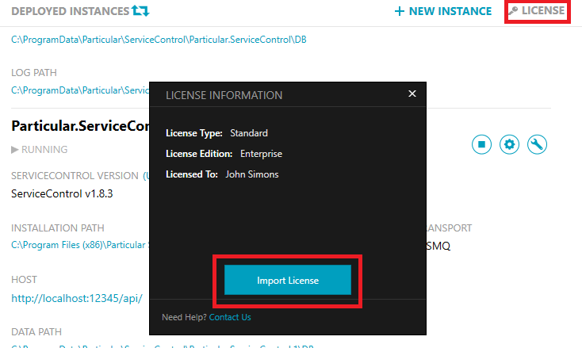

## Licensing ServiceControl

The following options outline how to add a license to ServiceControl.

### ServiceControl Management Utility

The ServiceControl Management utility has a license user interface which will import the designated license file into the registry. The license file is added to the `HKEY_LOCAL_MACHINE` registry hive so it is available to all instances of ServiceControl regardless of the service account used.




### ServiceControl PowerShell

To import a license using PowerShell:

* Start the ServiceControl PowerShell Management Console from the start menu 
* Execute the following cmdlet with the path to the license file.

```ps
Import-ServiceControlLicense <LicenseFile>
```

### Instance Licensing

In Version 1.17 and below, a license can be applied to an individual instance rather than using a license installed in the registry. To do this, copy the `license.xml` file to a `license` folder under the installation path of the instance.

NOTE: Instance Licensing is deprecated in Version 1.18 and above. Use the ServiceControl Management Utility or PowerShell module to install the license file to the registry. 

### Troubleshooting

#### ServiceControl license was updated but ServicePulse reports the license has expired

ServiceControl reads license information at service start up and caches it. Once a new license is applied the ServiceControl instance must be restarted to detect the license change, until then the license status shown in ServicePulse is based on the cached state.