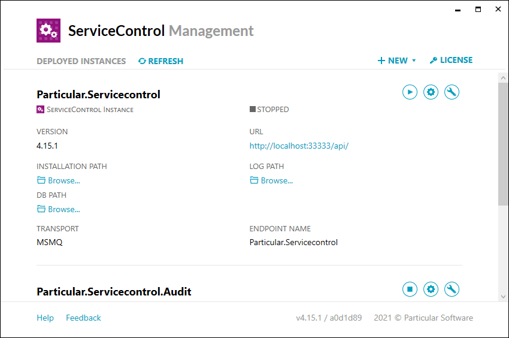

NOTE: Requires a currently-supported version of Edge, Chrome, Firefox, or Safari. **Internet Explorer is unsupported!**

ServiceControl stores data in a RavenDB embedded instance. By default, the RavenDB instance is accessible only by the ServiceControl service. If direct access to the RavenDB instance is required for troubleshooting, launch ServiceControl Management and follow these steps:

1. Open Advanced Options
1. Start Maintenance Mode
1. Launch RavenDB Management Studio
1. Stop Maintenance Mode as soon as access to the embedded RavenDB instance is no longer required.

WARNING: The ServiceControl RavenDB embedded instance is used exclusively by ServiceControl and is not intended for external manipulation or modifications.
