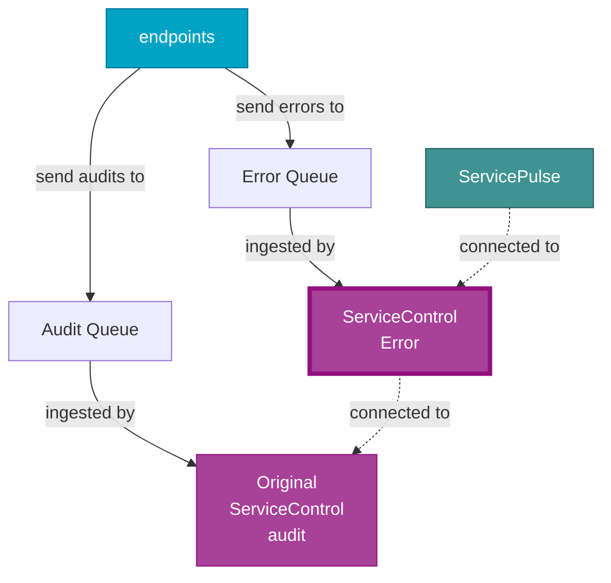
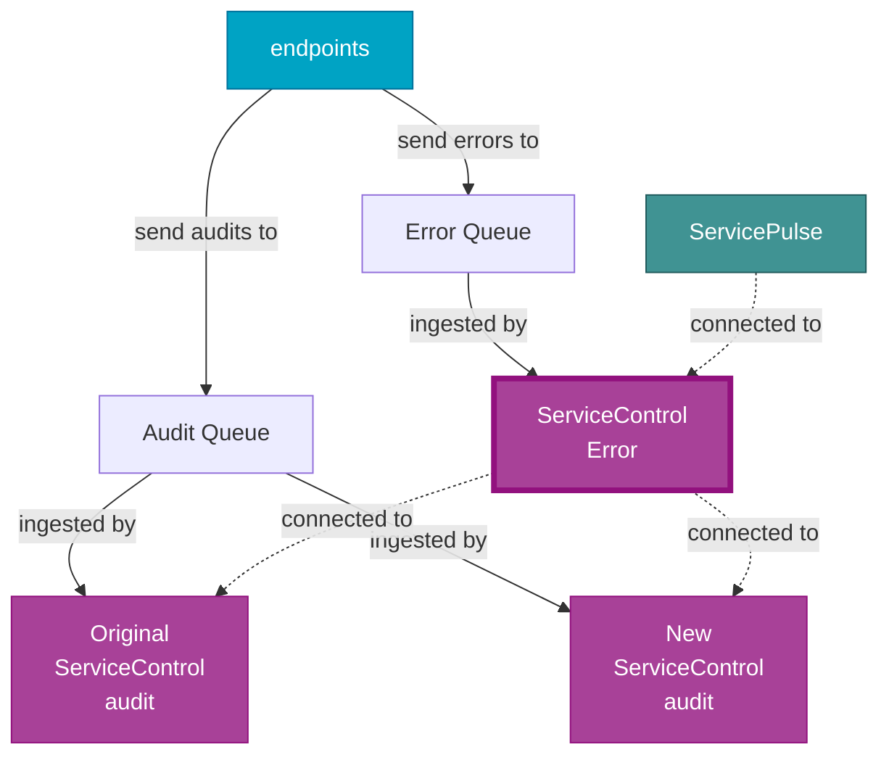
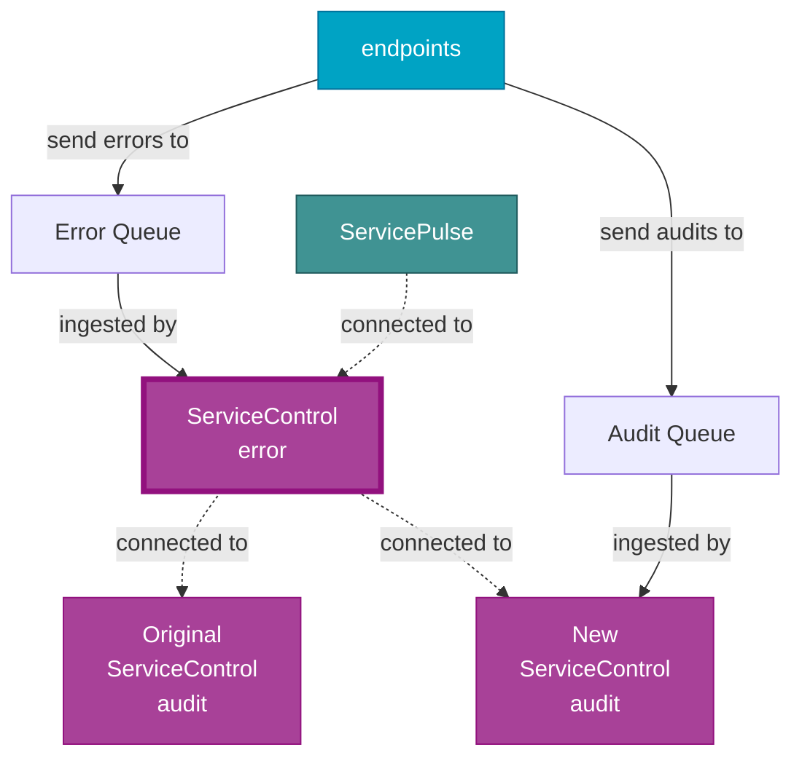
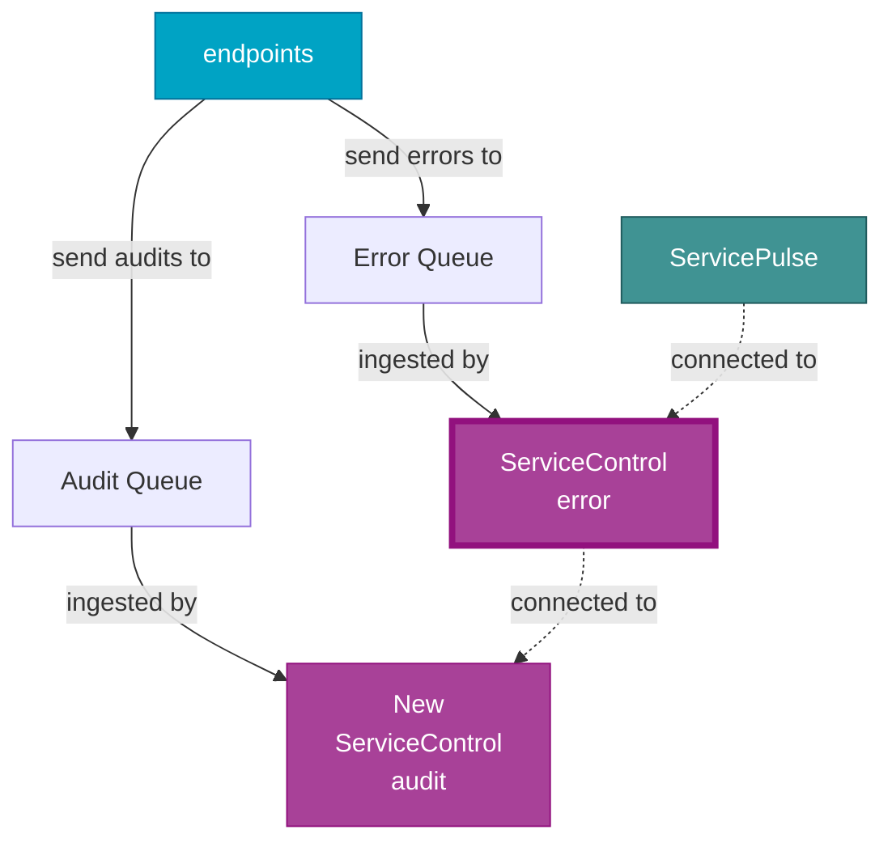

ServiceControl, which exists to serve the management of distributed systems, is itself a distributed system. As a result, pieces of the system can be upgraded and managed separately.

This document describes in general terms how to replace a ServiceControl Audit instance, and links to more specific information on how to accomplish these tasks for each potential deployment method.

See [Replacing an Error Instance](../replacing-error-instances/) for similar guidance for Error instances.

## Overview

ServiceControl Audit instances store audit data for a configured period of time, after which expired audit data is removed. Using the [ServiceControl remotes feature](/servicecontrol/servicecontrol-instances/remotes.md), multiple audit instances can store a portion of the overall audit data (sharding) which is queried in a scatter-gather fashion.

Using this capability, an Audit instance that can't be upgraded can be replaced without downtime. The process follows these steps:

1. Add a new audit instance as a remote
2. Disable audit queue ingestion on the old audit instance
3. Decommission the old audit instance when all audit information is expired

> [!NOTE]
> For scenarios where retaining audit message data is not required (e.g. transient data that does not merit effort to retain), this process is not necessary -- the audit instance can simply be deleted and recreated with the same name.

## Initial state

Before doing anything, the deployment looks like this:

## Add a new audit instance

The first step is to create a new audit instance:

* [Adding a new audit instance with ServiceControl Management](scmu.md#add-a-new-audit-instance)
* [Adding a new audit instance with PowerShell](powershell.md#add-a-new-audit-instance)
* [Adding a new audit instance with Containers](containers.md#add-a-new-audit-instance)

Then, the new Audit instance must be added to the Error instance's remotes collection:

* [Updating the remotes collection with ServiceControl Management](scmu.md#add-the-instance-to-remoteinstances)
* [Updating the remotes collection with PowerShell](powershell.md#add-the-instance-to-remoteinstances)
* [Updating the remotes collection with Containers](containers.md#add-the-instance-to-remoteinstances)

After this step the installation looks like this:

Although both ServiceControl Audit instances ingest messages from the audit queue, each message only ends up in a single instance. The ServiceControl Error instance queries both Audit instances transparently.

## Disable audit queue ingestion on the old instance

Now that the new audit instance exists, the old audit instance must be configured so that it does not ingest any new audit data from the audit queue. This will make the old audit instance effectively read-only. The only reason it is not fully read-only is that old audit data that the old instance will continue to delete expired audit data that has passed the [audit retention period](/servicecontrol/audit-instances/configuration.md#data-retention-servicecontrol-auditauditretentionperiod).

* [Disabling audit queue ingestion with ServiceControl Management](scmu.md#disable-audit-queue-ingestion-on-the-old-instance)
* [Disabling audit queue ingestion with PowerShell](powershell.md#disable-audit-queue-ingestion-on-the-old-instance)
* [Disabling audit queue ingestion with Containers](containers.md#disable-audit-queue-ingestion-on-the-old-instance)

After this step the installation looks like this:

The ServiceControl Error instance continues to query both instances but the original Audit instance no longer reads new messages.

## Decommission the old audit instance, when it is empty

As the original audit instance is no longer ingesting messages, it will be empty after the audit retention period has elapsed and can be removed. The following steps describe how to determine when an audit instance is empty:

1. [Access the database directly](/servicecontrol/ravendb/accessing-database.md)
2. Launch RavenDB Management Studio with a browser.
3. If the instance is using RavenDB 3.5 for persistence, go to the `<system>` database. If the instance is using RavenDB 5, go to the `audit` database.
4. Check the documents count in the `ProcessedMessages` collection.

When the `ProcessedMessages` collection is empty, the audit instance can be decomissioned:

* [Decommissioning the old audit instance using ServiceControl Management](scmu.md#decommission-the-old-audit-instance)
* [Decommissioning the old audit instance using PowerShell](powershell.md#decommission-the-old-audit-instance)
* [Decommissioning the old audit instance using Containers](containers.md#decommission-the-old-audit-instance)

After this step the installation looks like this:

At this point, the old Audit instance has been completely replaced by the new instance.