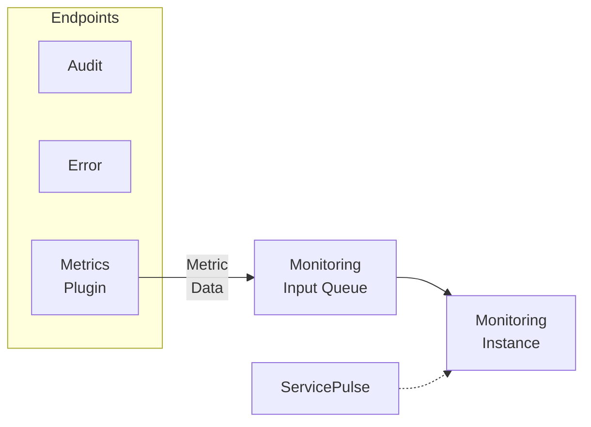

A monitoring instance can be installed to collect and analyze metric data generated by the [metrics plugin](/monitoring/metrics/) installed in NServiceBus endpoints. This data is exposed to [ServicePulse](/servicepulse/) via an HTTP API.

NOTE: The ServiceControl HTTP API is designed for use by ServicePulse only and may change at any time. Use of this HTTP API for other purposes is discouraged.

NOTE: Monitoring instances store data about each endpoint in memory for 10 minutes. Monitoring instances do not store persistent data. Restarting the monitoring instance will clear the in-memory cache.

Each environment should have a single monitoring instance that all endpoints are configured to use.
