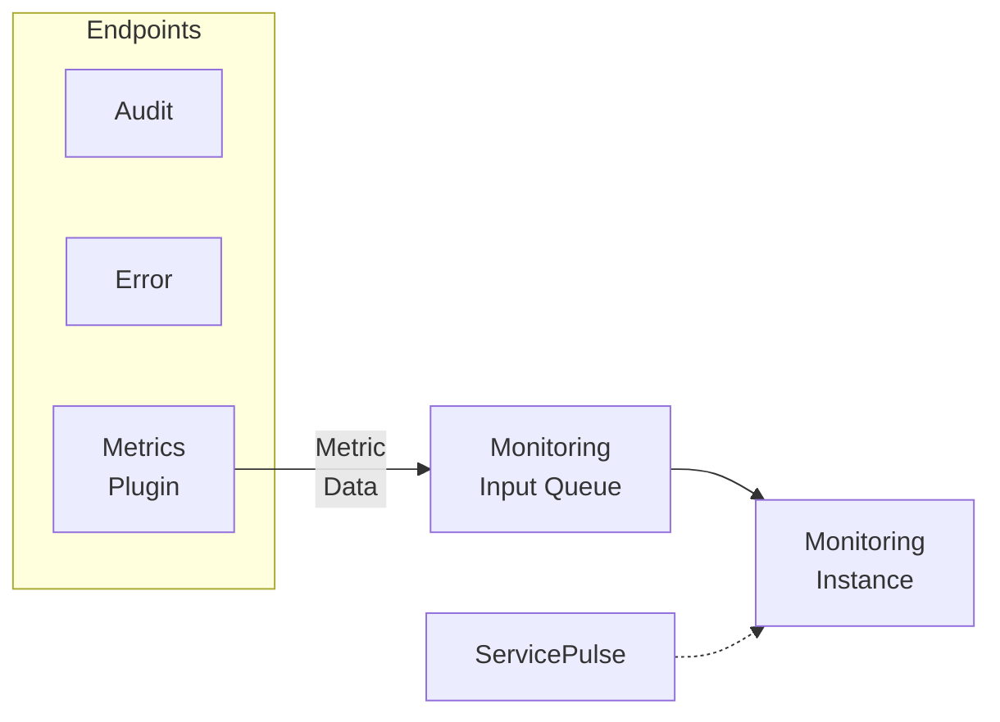

Monitoring instances collect and analyze metric data collected by the [metrics plugin](/monitoring/metrics/) installed in NServiceBus endpoints. This data is exposed to [ServicePulse](/servicepulse/) via an HTTP API.

NOTE: The ServiceControl HTTP API is designed for use by ServicePulse only and may change at any time. Use of this HTTP API for other purposes is discouraged.

Each endpoint in the system should be [configured to send metric data](/monitoring/metrics/). A Monitoring instance consumes this data makes it available for visualization in ServicePulse. 

NOTE: Monitoring instances store data about each endpoint in memory for 10 minutes. Monitoring instances do not store persistent data. Restarting the monitoring instance will clear the in-memory cache.

Each environment should have a single Monitoring instance that all endpoints are configured to use.