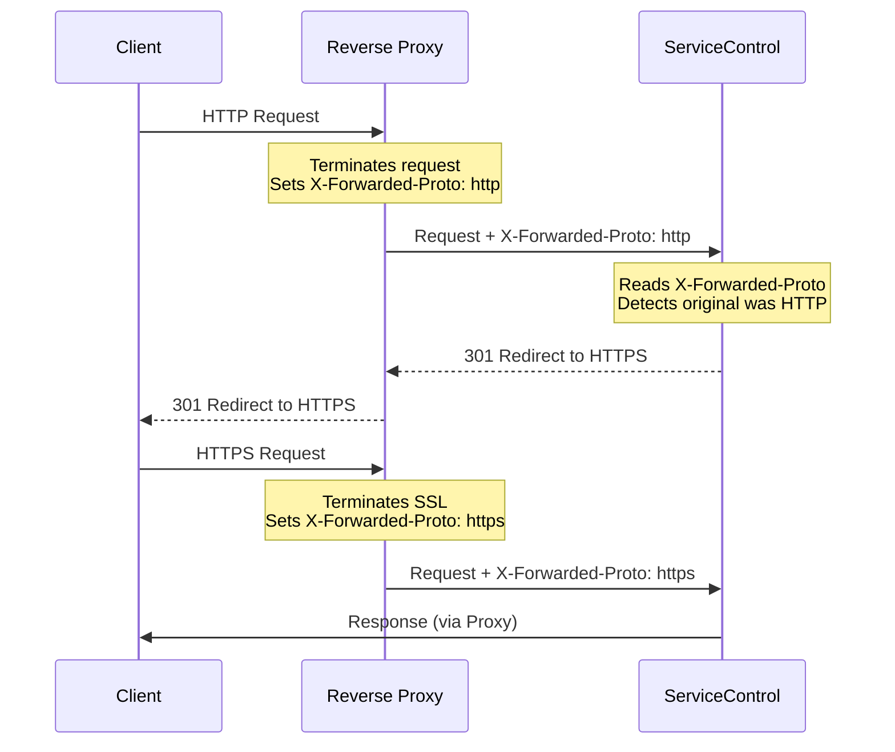

When ServiceControl instances are deployed behind a reverse proxy that terminates SSL/TLS (like NGINX, Traefik, or a cloud load balancer), you need to configure forwarded headers so ServiceControl correctly understands the original client request.

## Configuration

ServiceControl instances can be configured via environment variables or App.config. Each instance type uses a different prefix. See the [Hosting Guide](../hosting-guide.md) for example usage of these configuration settings in conjunction with [Authentication](authentication.md) and [TLS](tls.md) configuration settings in a scenario based format.

- [Primary Instance](/servicecontrol/servicecontrol-instances/configuration.md#forwarded-headers)
- [Audit Instance](/servicecontrol/audit-instances/configuration.md#forwarded-headers)
- [Monitoring Instance](/servicecontrol/monitoring-instances/configuration.md#forwarded-headers)

## What Headers are Processed

When enabled, ServiceControl instances process:

- `X-Forwarded-For` - Original client IP address
- `X-Forwarded-Proto` - Original protocol (http/https)
- `X-Forwarded-Host` - Original host header

When the proxy is trusted:

- `Request.Scheme` will be set from `X-Forwarded-Proto` (e.g. `https`)
- `Request.Host` will be set from `X-Forwarded-Host` (e.g. `servicecontrol.example.com`)
- Client IP will be available from `X-Forwarded-For`

When the proxy is **not** trusted (incorrect `KnownProxies`):

- `X-Forwarded-*` headers are **ignored** (not applied to the request)
- `Request.Scheme` remains `http`
- `Request.Host` remains the internal hostname
- The request is still processed (not blocked)

## HTTP to HTTPS Redirect

When using a reverse proxy that terminates SSL, ServiceControl instances can be configured to redirect HTTP requests to HTTPS. This works in combination with forwarded headers:

1. The reverse proxy forwards both HTTP and HTTPS requests to ServiceControl
2. The proxy sets `X-Forwarded-Proto` to indicate the original protocol
3. ServiceControl reads this header (via forwarded headers processing)
4. If the original request was HTTP and redirect is enabled, ServiceControl returns a redirect to HTTPS



To enable HTTP to HTTPS redirect, see [TLS Configuration](tls.md).

## Proxy Chain Behavior (ForwardLimit)

When processing `X-Forwarded-For` headers with multiple IPs (proxy chains), the behavior depends on trust configuration:

| Configuration             | ForwardLimit      | Behavior                                      |
|---------------------------|-------------------|-----------------------------------------------|
| `TrustAllProxies = true`  | `null` (no limit) | Processes all IPs, returns original client IP |
| `TrustAllProxies = false` | `1` (default)     | Processes only the last proxy IP              |

For example, with `X-Forwarded-For: 203.0.113.50, 10.0.0.1, 192.168.1.1`:

- **TrustAllProxies = true**: Returns `203.0.113.50` (original client)
- **TrustAllProxies = false**: Returns `192.168.1.1` (last proxy)

## Configuration examples

The following examples show common forwarded headers configurations for different deployment scenarios using the primary ServiceControl instance.

### Single reverse proxy (known IP)

When running behind a single reverse proxy with a known IP address:

```xml
<add key="ServiceControl/ForwardedHeaders.Enabled" value="true" />
<add key="ServiceControl/ForwardedHeaders.TrustAllProxies" value="false" />
<add key="ServiceControl/ForwardedHeaders.KnownProxies" value="10.0.0.5" />
```

### Multiple reverse proxies

When running behind multiple proxies (e.g. load balancer and application gateway):

```xml
<add key="ServiceControl/ForwardedHeaders.Enabled" value="true" />
<add key="ServiceControl/ForwardedHeaders.TrustAllProxies" value="false" />
<add key="ServiceControl/ForwardedHeaders.KnownProxies" value="10.0.0.5,10.0.0.6" />
```

### Container/Kubernetes environment

When running in a container environment where proxy IPs are dynamic, trust a network range:

```xml
<add key="ServiceControl/ForwardedHeaders.Enabled" value="true" />
<add key="ServiceControl/ForwardedHeaders.TrustAllProxies" value="false" />
<add key="ServiceControl/ForwardedHeaders.KnownNetworks" value="10.0.0.0/8" />
```

### Development/trusted environment

For development or fully trusted environments (not recommended for production):

```xml
<add key="ServiceControl/ForwardedHeaders.Enabled" value="true" />
<add key="ServiceControl/ForwardedHeaders.TrustAllProxies" value="true" />
```

## Troubleshooting

include: forward-header-troubleshooting
