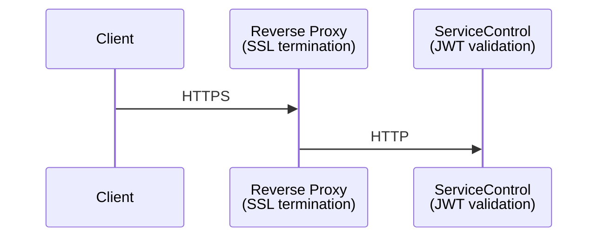
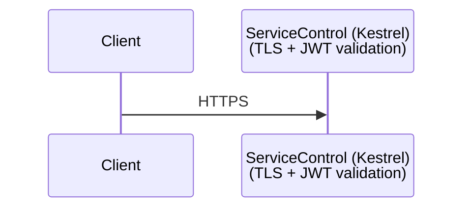
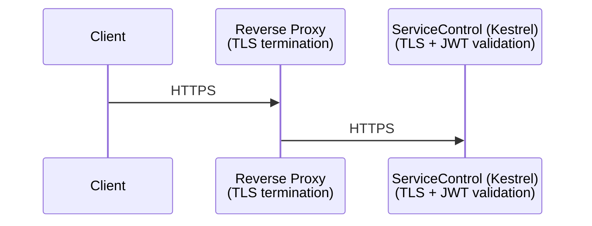

This guide covers hosting and security options available for ServiceControl, ServiceControl.Audit, and ServiceControl.Monitoring instances.

> [!NOTE]
> All scenarios assume HTTPS and authentication are required.

## Hosting Model

ServiceControl runs as a standalone Windows service with Kestrel as the built-in web server. It does not support being hosted inside IIS (in-process hosting).

If you place IIS, nginx, or another web server in front of ServiceControl, it acts as a **reverse proxy** forwarding requests to Kestrel.

## Deployment Scenarios

> [!WARNING]
> When authentication is enabled, all instances (Primary, Audit, Monitoring) must use the **same** Identity Provider (IdP) Authority and Audience settings. Client tokens are forwarded to remote instances during scatter-gather operations.

The scenarios below assume the use of `App.config` and only show the configuration for the primary ServiceControl instance. For additional details on environment variables and the other ServiceControl instances, see [Authentication](configuration/authentication.md), [TLS](configuration/tls.md), and [Forward Headers](configuration/forward-headers.md).

### Scenario 0: Default / Backward Compatible Configuration

The default configuration with no additional setup required. Backwards compatible with existing deployments.

#### Security Features

| Feature                 | Status                  |
|-------------------------|-------------------------|
| JWT Authentication      | ❌ Disabled              |
| Kestrel HTTPS           | ❌ Disabled              |
| HTTPS Redirection       | ❌ Disabled              |
| HSTS                    | ❌ Disabled              |
| Restricted CORS Origins | ❌ Disabled (any origin) |
| Forwarded Headers       | ✅ Enabled (trusts all)  |
| Restricted Proxy Trust  | ❌ Disabled              |

#### Example Configuration

```xml
<!-- No configuration needed - defaults work out of the box -->
<!-- Authentication: disabled by default -->
<!-- CORS: allows any origin by default -->
<!-- HTTPS: disabled by default (HTTP only) -->
<!-- Forwarded Headers: enabled and trusts all proxies by default -->
```

Or explicitly:

```xml
<appSettings>
  <add key="ServiceControl/Authentication.Enabled" value="false" />
  <add key="ServiceControl/Https.Enabled" value="false" />
  <add key="ServiceControl/Cors.AllowAnyOrigin" value="true" />
  <add key="ServiceControl/ForwardedHeaders.Enabled" value="true" />
  <add key="ServiceControl/ForwardedHeaders.TrustAllProxies" value="true" />
</appSettings>
```

### Scenario 1: Strict Reverse Proxy

Strict Reverse proxy with SSL termination and JWT authentication via an identity provider (Azure AD, Okta, Auth0, Keycloak, etc.).

#### Architecture



#### Security Features

| Feature                 | Status                        |
|-------------------------|-------------------------------|
| JWT Authentication      | ✅ Enabled                     |
| Kestrel HTTPS           | ❌ Disabled (handled by proxy) |
| HTTPS Redirection       | ✅ Enabled (optional)          |
| HSTS                    | ❌ Disabled (handled by proxy) |
| Restricted CORS Origins | ✅ Enabled                     |
| Forwarded Headers       | ✅ Enabled                     |
| Restricted Proxy Trust  | ✅ Enabled                     |

> [!NOTE]
> HTTPS redirection is optional in this scenario. The reverse proxy typically handles HTTP to HTTPS redirection at its layer, however enabling it at ServiceControl provides defense-in-depth; if an HTTP request somehow bypasses the proxy and reaches ServiceControl directly, it will be redirected to the HTTPS URL. This requires configuring `Https.Port` to specify the external [HTTPS port](configuration/tls.md) used by the proxy.

#### Example Configuration

```xml
<appSettings>
  <!-- Authentication -->
  <add key="ServiceControl/Authentication.Enabled" value="true" />
  <add key="ServiceControl/Authentication.Authority" value="https://login.microsoftonline.com/{tenant-id}/v2.0" />
  <add key="ServiceControl/Authentication.Audience" value="api://servicecontrol" />

  <!-- Token validation settings -->
  <add key="ServiceControl/Authentication.ValidateIssuer" value="true" />
  <add key="ServiceControl/Authentication.ValidateAudience" value="true" />
  <add key="ServiceControl/Authentication.ValidateLifetime" value="true" />
  <add key="ServiceControl/Authentication.ValidateIssuerSigningKey" value="true" />
  <add key="ServiceControl/Authentication.RequireHttpsMetadata" value="true" />

  <!-- ServicePulse client configuration -->
  <add key="ServiceControl/Authentication.ServicePulse.ClientId" value="your-servicepulse-client-id" />
  <add key="ServiceControl/Authentication.ServicePulse.Authority" value="https://login.microsoftonline.com/{tenant-id}/v2.0" />
  <add key="ServiceControl/Authentication.ServicePulse.ApiScopes" value="api://servicecontrol/access_as_user" />

  <!-- Forwarded headers for reverse proxy -->
  <add key="ServiceControl/ForwardedHeaders.Enabled" value="true" />
  <add key="ServiceControl/ForwardedHeaders.TrustAllProxies" value="false" />
  <add key="ServiceControl/ForwardedHeaders.KnownProxies" value="10.0.0.5" />
  <!-- Or use CIDR notation: -->
  <!-- <add key="ServiceControl/ForwardedHeaders.KnownNetworks" value="10.0.0.0/24" /> -->

  <!-- HTTP to HTTPS redirect (optional - can also be handled by proxy) -->
  <add key="ServiceControl/Https.RedirectHttpToHttps" value="true" />
  <add key="ServiceControl/Https.Port" value="443" />

  <!-- Restrict CORS to your ServicePulse domain -->
  <add key="ServiceControl/Cors.AllowedOrigins" value="https://servicepulse.yourcompany.com" />
</appSettings>
```

### Scenario 2: Direct HTTPS with Authentication

Kestrel handles TLS directly with JWT authentication without a reverse proxy.

#### Architecture



#### Security Features

| Feature                 | Status                |
|-------------------------|-----------------------|
| JWT Authentication      | ✅ Enabled             |
| Kestrel HTTPS           | ✅ Enabled             |
| HSTS                    | ✅ Enabled             |
| Restricted CORS Origins | ✅ Enabled             |
| Forwarded Headers       | ❌ Disabled (no proxy) |
| Restricted Proxy Trust  | N/A                   |

> [!NOTE]
> HTTPS redirection is not configured in this scenario because clients connect directly over HTTPS. There is no HTTP endpoint exposed that would need to redirect. HTTPS redirection is only useful when a reverse proxy handles SSL termination and ServiceControl needs to redirect HTTP requests to the proxy's HTTPS endpoint.

#### Example Configuration

```xml
<appSettings>
  <!-- Kestrel HTTPS -->
  <add key="ServiceControl/Https.Enabled" value="true" />
  <add key="ServiceControl/Https.CertificatePath" value="C:\certs\servicecontrol.pfx" />
  <add key="ServiceControl/Https.CertificatePassword" value="your-certificate-password" />
  <add key="ServiceControl/Https.EnableHsts" value="true" />
  <add key="ServiceControl/Https.HstsMaxAgeSeconds" value="31536000" />

  <!-- Authentication -->
  <add key="ServiceControl/Authentication.Enabled" value="true" />
  <add key="ServiceControl/Authentication.Authority" value="https://login.microsoftonline.com/{tenant-id}/v2.0" />
  <add key="ServiceControl/Authentication.Audience" value="api://servicecontrol" />

  <!-- Token validation settings -->
  <add key="ServiceControl/Authentication.ValidateIssuer" value="true" />
  <add key="ServiceControl/Authentication.ValidateAudience" value="true" />
  <add key="ServiceControl/Authentication.ValidateLifetime" value="true" />
  <add key="ServiceControl/Authentication.ValidateIssuerSigningKey" value="true" />
  <add key="ServiceControl/Authentication.RequireHttpsMetadata" value="true" />

  <!-- ServicePulse client configuration -->
  <add key="ServiceControl/Authentication.ServicePulse.ClientId" value="your-servicepulse-client-id" />
  <add key="ServiceControl/Authentication.ServicePulse.Authority" value="https://login.microsoftonline.com/{tenant-id}/v2.0" />
  <add key="ServiceControl/Authentication.ServicePulse.ApiScopes" value="api://servicecontrol/access_as_user" />

  <!-- Restrict CORS to your ServicePulse domain -->
  <add key="ServiceControl/Cors.AllowedOrigins" value="https://servicepulse.yourcompany.com" />

  <!-- No forwarded headers (no proxy) -->
  <add key="ServiceControl/ForwardedHeaders.Enabled" value="false" />
</appSettings>
```

### Scenario 3: End-to-End Encryption with Reverse Proxy and Direct HTTPS

For environments requiring encryption of internal traffic. End-to-end TLS encryption exists where the reverse proxy terminates external TLS and re-encrypts traffic to ServiceControl over HTTPS.

#### Architecture



#### Security Features

| Feature                    | Status                   |
|----------------------------|--------------------------|
| JWT Authentication         | ✅ Enabled                |
| Kestrel HTTPS              | ✅ Enabled                |
| HTTPS Redirection          | N/A (no HTTP endpoint)   |
| HSTS                       | N/A (configure at proxy) |
| Restricted CORS Origins    | ✅ Enabled                |
| Forwarded Headers          | ✅ Enabled                |
| Restricted Proxy Trust     | ✅ Enabled                |
| Internal Traffic Encrypted | ✅ Yes                    |

> [!NOTE]
> HTTPS redirection and HSTS are not applicable in this scenario because ServiceControl only exposes an HTTPS endpoint (Kestrel HTTPS is enabled). There is no HTTP endpoint to redirect from. The reverse proxy is responsible for redirecting external HTTP requests to HTTPS and sending HSTS headers to browsers. Compare this to Scenario 1, where Kestrel HTTPS is disabled and ServiceControl exposes an HTTP endpoint - in that case, HTTPS redirection can optionally be enabled as defense-in-depth.

#### Example Configuration

```xml
<appSettings>
   <!-- Kestrel HTTPS for internal encryption -->
  <add key="ServiceControl/Https.Enabled" value="true" />
  <add key="ServiceControl/Https.CertificatePath" value="C:\certs\servicecontrol-internal.pfx" />
  <add key="ServiceControl/Https.CertificatePassword" value="your-certificate-password" />

  <!-- Authentication -->
  <add key="ServiceControl/Authentication.Enabled" value="true" />
  <add key="ServiceControl/Authentication.Authority" value="https://login.microsoftonline.com/{tenant-id}/v2.0" />
  <add key="ServiceControl/Authentication.Audience" value="api://servicecontrol" />

  <!-- Token validation settings -->
  <add key="ServiceControl/Authentication.ValidateIssuer" value="true" />
  <add key="ServiceControl/Authentication.ValidateAudience" value="true" />
  <add key="ServiceControl/Authentication.ValidateLifetime" value="true" />
  <add key="ServiceControl/Authentication.ValidateIssuerSigningKey" value="true" />
  <add key="ServiceControl/Authentication.RequireHttpsMetadata" value="true" />

  <!-- ServicePulse client configuration -->
  <add key="ServiceControl/Authentication.ServicePulse.ClientId" value="your-servicepulse-client-id" />
  <add key="ServiceControl/Authentication.ServicePulse.Authority" value="https://login.microsoftonline.com/{tenant-id}/v2.0" />
  <add key="ServiceControl/Authentication.ServicePulse.ApiScopes" value="api://servicecontrol/access_as_user" />

  <!-- Forwarded headers - trust only your reverse proxy -->
  <add key="ServiceControl/ForwardedHeaders.Enabled" value="true" />
  <add key="ServiceControl/ForwardedHeaders.TrustAllProxies" value="false" />
  <add key="ServiceControl/ForwardedHeaders.KnownProxies" value="10.0.0.5" />

  <!-- Restrict CORS -->
  <add key="ServiceControl/Cors.AllowedOrigins" value="https://servicepulse.yourcompany.com" />
</appSettings>
```
