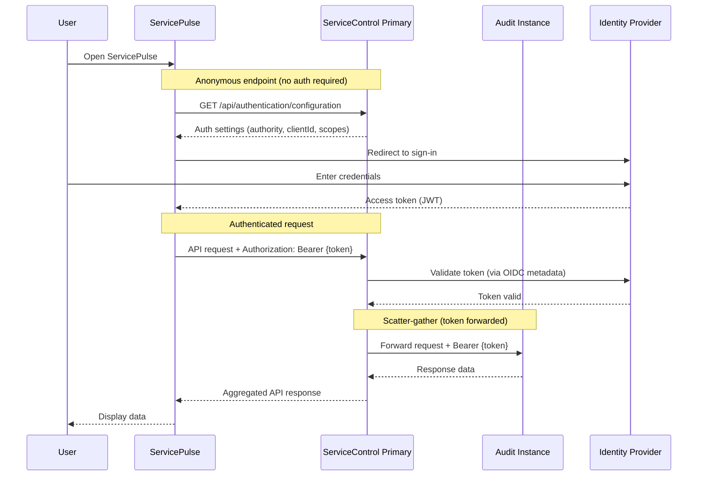

This section covers security features for ServiceControl, including authentication, transport layer security (TLS), and reverse proxy configuration.

## In this section

- Security Configuration - Configuration reference for authentication, TLS, and forward headers
- [Hosting Guide](hosting-guide.md) - Deployment scenarios with complete configuration examples
- [Microsoft Entra ID](entra-id-authentication.md) - Step-by-step guide for configuring authentication with Microsoft Entra ID

## [Authentication](configuration/authentication.md)

ServiceControl and [ServicePulse](/servicepulse/) support standards-based authentication using [OAuth 2.0](https://oauth.net/2/) with [JSON Web Tokens (JWT)](https://en.wikipedia.org/wiki/JSON_Web_Token), and [OpenID Connect (OIDC)](https://openid.net/developers/how-connect-works/). When enabled, users must sign in through the configured identity provider before accessing ServicePulse.

> [!WARNING]
> Authentication is disabled by default to maintain backward compatibility with existing deployments. Until authentication is enabled, ServicePulse and ServiceControl are accessible without credentials.

Any OIDC-compliant identity provider can be used, including Microsoft Entra ID, Okta, Auth0, Keycloak, AWS IAM Identity Center, and others.

When authentication is enabled:

1. ServicePulse retrieves authentication configuration from an anonymous endpoint
2. Users sign in through the configured identity provider
3. API requests include a JWT bearer token in the `Authorization` header
4. ServiceControl validates the token against the configured authority
5. For scatter-gather requests, the Primary instance forwards the client token to Audit and Monitoring instances

Certain endpoints remain accessible without authentication to support API discovery, client bootstrapping, and service-to-service communication between ServiceControl instances.

### Anonymous endpoints

The following endpoints remain anonymous to support API Discovery, health checks, and authentication bootstrapping:

| Endpoint                            | Method  | Instance                   | Purpose                                                            |
|-------------------------------------|---------|----------------------------|--------------------------------------------------------------------|
| `/api`                              | GET     | Primary, Audit             | API root/discovery - returns available endpoints                   |
| `/api/instance-info`                | GET     | Primary, Audit             | Returns instance configuration information                         |
| `/api/configuration`                | GET     | Primary, Audit             | Returns instance configuration information (alias)                 |
| `/api/configuration/remotes`        | GET     | Primary                    | Returns remote instance configurations                             |
| `/api/authentication/configuration` | GET     | Primary                    | Returns authentication configuration for clients like ServicePulse |
| `/api/connection`                   | GET     | Primary, Audit, Monitoring | API Discovery for the Platform Connector Plugin                    |
| `/`                                 | GET     | Monitoring                 | API root/discovery - returns instance information                  |
| `/`                                 | OPTIONS | Monitoring                 | CORS support - returns supported operations                        |
| `/endpoints`                        | OPTIONS | Monitoring                 | CORS support - returns supported operations                        |

### Token Forwarding Security Considerations

- Client tokens are forwarded to remote instances in their entirety
- Remote instances see the same token as the primary instance
- Token scope/claims are not modified during forwarding

## [TLS](configuration/tls.md)

When authentication is enabled, access tokens are exchanged between ServicePulse and ServiceControl. To protect these tokens, TLS must be enabled.

> [!IMPORTANT]
> Without TLS, tokens are transmitted in clear text, exposing the system to interception and unauthorized access. Always use HTTPS in production environments.

ServiceControl supports two approaches for HTTPS:

- **Direct HTTPS**: Configure Kestrel to handle TLS with a certificate
- **Reverse proxy**: Terminate TLS at a reverse proxy (NGINX, IIS, Azure App Gateway, etc.) and forward requests to ServiceControl over HTTP

## [Reverse proxy support](configuration/forward-headers.md)

When ServiceControl runs behind a reverse proxy, forwarded headers ensure ServiceControl correctly interprets client requests. This is important for:

- Determining the original client IP address
- Understanding whether the original request used HTTPS
- Generating correct redirect URLs

## [Deployment scenarios](hosting-guide.md)

The Hosting Guide provides complete configuration examples for common deployment patterns:

- **Default configuration**: No authentication, HTTP only (backward compatible)
- **Reverse proxy with authentication**: TLS termination at proxy, JWT authentication
- **Direct HTTPS with authentication**: Kestrel handles TLS directly
- **End-to-end encryption**: TLS at both proxy and Kestrel for internal traffic encryption

## ServiceInsight compatibility

[ServiceInsight has been sunset](/serviceinsight/) and does not support OAuth 2.0 or OpenID Connect authentication. If authentication is enabled on a ServiceControl instance, ServiceInsight cannot connect.

Users relying on ServiceInsight can:

1. **[Use ServicePulse](/servicepulse/installation.md)** instead (Recommended. Functionality previously in ServiceInsight has been migrated to ServicePulse.)
2. **Leave authentication disabled** on the relevant ServiceControl instance
