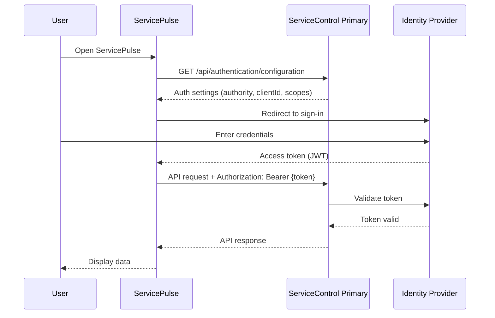

ServiceControl and ServicePulse support standards-based authentication using [OpenID Connect (OIDC)](https://openid.net/developers/how-connect-works/). When enabled, users must sign in through an identity provider before accessing ServicePulse, and all API calls to ServiceControl require a valid [JWT](https://en.wikipedia.org/wiki/JSON_Web_Token) token.

> [!WARNING]
> Authentication is disabled by default. ServiceControl and ServicePulse are accessible without credentials until authentication is enabled.

Authentication requires HTTPS. Without TLS, tokens are transmitted in plain text and can be intercepted.

## How it works

Authentication is configured once on ServiceControl. ServicePulse retrieves the OIDC settings from ServiceControl at startup and handles the sign-in flow automatically. Users sign in once through ServicePulse, and the resulting token is used for all API calls, including calls that the primary ServiceControl instance forwards to Audit and Monitoring instances.

```mermaid
sequenceDiagram
    participant User
    participant ServicePulse
    participant Primary as ServiceControl Primary
    participant IdP as Identity Provider

    User->>ServicePulse: Open ServicePulse
    ServicePulse->>Primary: GET /api/authentication/configuration
    Primary-->>ServicePulse: Auth settings (authority, clientId, scopes)
    ServicePulse->>IdP: Redirect to sign-in
    User->>IdP: Enter credentials
    IdP-->>ServicePulse: Access token (JWT)
    ServicePulse->>Primary: API request + Authorization: Bearer {token}
    Primary->>IdP: Validate token
    IdP-->>Primary: Token valid
    Primary-->>ServicePulse: API response
    ServicePulse-->>User: Display data
```

## What's involved

Securing the platform requires changes in three places: the identity provider, ServiceControl, and ServicePulse.

**Identity provider**: Both ServiceControl and ServicePulse need an app registration. The ServiceControl registration represents the API being protected. The ServicePulse registration is what users sign into, and it needs permission to call the ServiceControl API on their behalf.

**ServiceControl**: HTTPS must be enabled so tokens are never sent over a plain HTTP connection. Authentication settings tell ServiceControl which identity provider to trust, what audience to expect in tokens, and how ServicePulse should initiate the sign-in flow. All instances (Primary, Audit, and Monitoring) need authentication configured with the same values.

**ServicePulse**: HTTPS must be enabled here too, since ServicePulse is where users interact and where tokens are held in the browser session. ServicePulse does not have its own authentication configuration; it reads those settings from ServiceControl automatically.

## Step 1: Register your applications with an identity provider

Authentication requires two app registrations:

1. **ServiceControl API** - represents the backend API that ServicePulse calls
2. **ServicePulse** - the single-page application that users sign into

See the [Microsoft Entra ID guide](entra-id-authentication.md) for a step-by-step walkthrough. For other OIDC-compliant providers (Auth0, Okta, Keycloak, AWS IAM Identity Center, and others), follow your provider's documentation and use the [Entra ID guide](entra-id-authentication.md) as a reference for the values you need.

## Step 2: Enable HTTPS on ServiceControl

Configure a TLS certificate so ServiceControl serves HTTPS directly. This protects tokens in transit between ServicePulse and ServiceControl.

See [TLS configuration](configuration/tls.md) for certificate options and configuration examples.

## Step 3: Configure authentication settings on ServiceControl

Add authentication settings to all ServiceControl instances (Primary, Audit, and Monitoring). All instances must use the same authority and audience.

The ServicePulse-specific settings (`ServicePulse.ClientId`, `ServicePulse.Authority`, `ServicePulse.ApiScopes`) are only required on the **primary** instance.

See [authentication configuration](configuration/authentication.md) for all settings and configuration examples for common identity providers.

## Step 4: Enable HTTPS on ServicePulse

ServicePulse also needs HTTPS. See [ServicePulse security](/servicepulse/security) for TLS configuration.

## Step 5: Configure CORS

When ServicePulse is hosted on a different domain or port than ServiceControl, configure [CORS](configuration/cors.md) to allow requests from the ServicePulse origin.

## Step 6: Restart and verify

Restart all ServiceControl instances after updating the configuration.

Open ServicePulse in a browser. You should be redirected to your identity provider's sign-in page. After signing in, ServicePulse should load and display data from ServiceControl.

If authentication fails, check the ServiceControl logs for token validation errors. See [authentication configuration](configuration/authentication.md#troubleshooting) for common error messages and solutions.

## Restricting what users can do

Authentication verifies who a user is. To additionally restrict what each authenticated user is allowed to do — for example, granting some users read-only access while others can retry or edit messages — enable [role-based access control](configuration/authorization.md). Authorization is optional and disabled by default; when it is off, every authenticated user has full access.

## Advanced deployment patterns

For deployments that use a reverse proxy for TLS termination, or require end-to-end encryption between a proxy and ServiceControl, see the [hosting guide](hosting-guide.md).

## Reference

- [Authentication configuration](configuration/authentication.md)
- [Role-based access control](configuration/authorization.md)
- [TLS configuration](configuration/tls.md)
- [CORS configuration](configuration/cors.md)
- [Hosting guide](hosting-guide.md)
- [Microsoft Entra ID guide](entra-id-authentication.md)
- [ServicePulse security](/servicepulse/security)

## ServiceInsight compatibility

[ServiceInsight has been sunset](/serviceinsight/) and does not support OAuth 2.0 or OpenID Connect authentication. If authentication is enabled on a ServiceControl instance, ServiceInsight cannot connect.

Alternatives:

1. **[Use ServicePulse](/servicepulse/installation.md)** - the recommended path; functionality previously exclusive to ServiceInsight has been migrated to ServicePulse.
2. **Leave authentication disabled** on the relevant ServiceControl instance.
