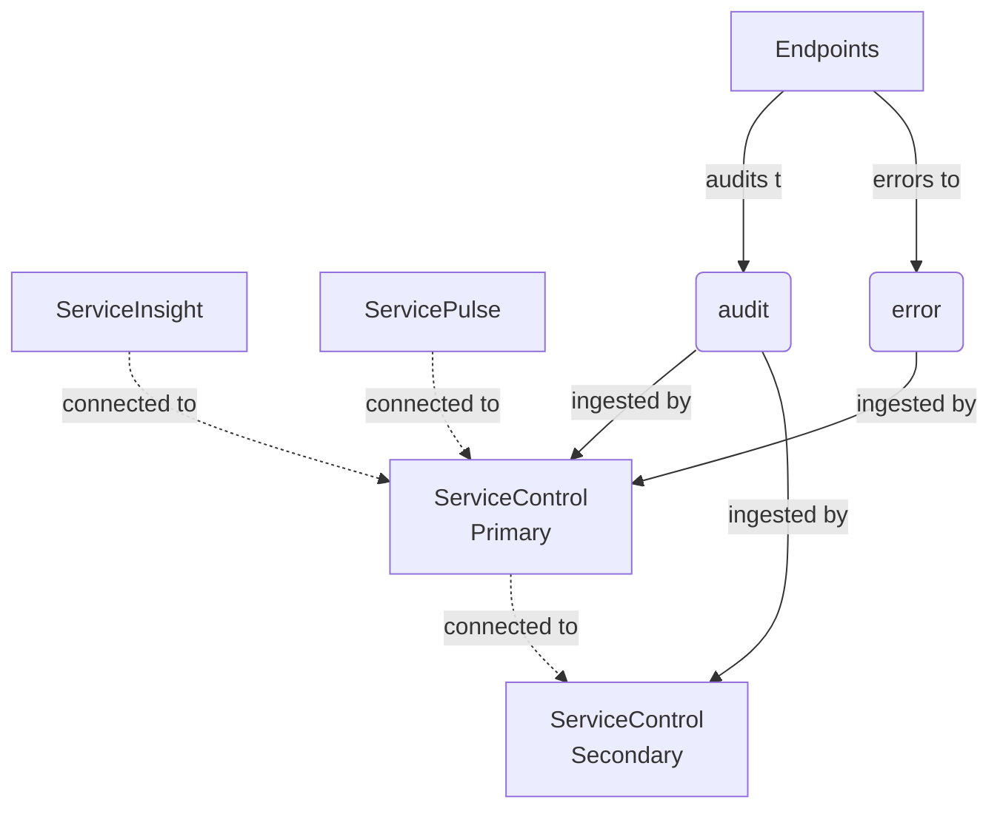
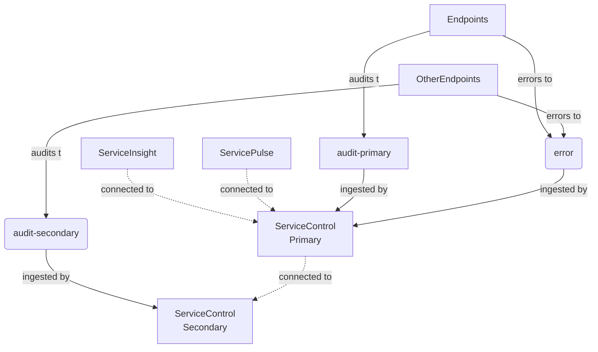
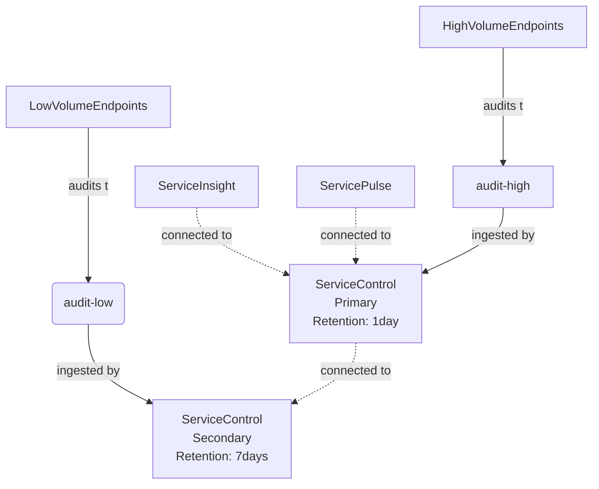
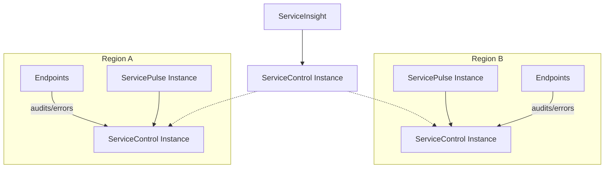

WARN: The approach described in this document is not recommended for new deployments. For new installations, use [ServiceControl remote instances](/servicecontrol/servicecontrol-instances/remotes.md). For guidance upgrading existing multi-instance ServiceControl installations, see [Upgrade ServiceControl from Version 3 to Version 4](/servicecontrol/upgrades/3to4/).

NOTE: A multi-instance ServiceControl installation can be complex to maintain. Before splitting ServiceControl, it is recommended to follow the capacity planning guides described in the [ServiceControl Capacity Planning](/servicecontrol/capacity-and-planning.md) documentation.

Audit message processing can become a performance challenge due to high message throughput when running NServiceBus systems at scale. Multi-instance deployment helps mitigate this problem by enabling audit data sharding between a group of ServiceControl instances. 

ServiceControl multi-instance deployments should be considered in scenarios when the audit message load is continuously high and too big for a single instance to handle. In a message-based system, the audit queue, in contrast to the error queue, is the one with the most load as every single message is forwarded to it for auditing purposes. ServiceControl ingests the messages in the audit queue and aggregates them for querying and analysis within [ServiceInsight](/serviceinsight/). 

Aggregating the data for querying and analysis takes considerable resources, such as CPU, memory, disk I/O, as well as the queuing system. Under high load, a single instance might not be able to keep up with indexing the data, and the audit queue length might start to increase. If the load spikes only occasionally, this may not be a problem since ServiceControl will eventually catch up processing the incoming audit messages. If the load is continuously high, however, multiple instances of ServiceControl may be needed to cope with it.

## Overview

Multi-instance deployments consist of at least two ServiceControl instances. In this scenario, there is a single designated instance, a _primary_  instance, responsible for processing error messages and optionally audit messages. All other existing ServiceControl instances are secondary instances responsible **only** for processing audit messages. 

It is only the primary instance that handles the external API requests (from [ServicePulse](/servicepulse/) or [ServiceInsight](/serviceinsight/)). Primary is the only party communicating with secondary instances directly for query execution.

The following is a high-level look at the steps needed to deploy ServiceControl in multi-instance mode:

- Install one or more ServiceControl secondary instances
- Install a ServiceControl primary instance and configure it to route API queries to its secondary instances
- When using audit queue per shard, the production endpoints must be reconfigured to forward audit messages to different [audit queues](/nservicebus/operations/auditing.md) consumed by different ServiceControl instances

WARNING: Error queue sharding is not supported and all endpoints need to route error messages to a centralized [error queue](/nservicebus/recoverability/configure-error-handling.md) handled by the primary instance.

WARNING: All instances of ServiceControl MUST have a unique name

### Sharding audit messages with competing consumers

This section walks through a fresh installation of multiple ServiceControl instances where audit messages are sharded with a competing consumers approach. That is, two instances of ServiceControl (primary and secondary) compete for audit messages on a single audit queue. All of the endpoints will forward their audit messages to `audit`. All error messages are forwarded to the `error` queue. ServiceInsight and ServicePulse are connected to the primary instance.



Setup steps:
1. Install the ServiceControl secondary instance (on separate infrastructure) which points to `audit` according to the [installation guidelines](/servicecontrol/installation.md). Each secondary instance must have a unique name. The ServiceControl instance name and the port are required to configure the primary instance (for example `Particular.ServiceControl.Secondary` and the port `33334`). Make sure error queue processing is disabled by specifying `!disable` as the error queue field in the ServiceControl Management Utility, or as the error queue parameter of the [PowerShell](/servicecontrol/installation-powershell.md) installation script, or by editing `ServiceControl.exe.config` as shown below:

```xml
<?xml version="1.0" encoding="utf-8"?>
<configuration>
    <appSettings>
        <add key="ServiceBus/ErrorQueue" value="!disable" />
    </appSettings>
</configuration>
```

If the error queue is set to `!disable` then error forwarding will be ignored even if enabled.

2. Install the ServiceControl primary instance which points to `audit` according to the [installation guidelines](/servicecontrol/installation.md).
3. Stop the ServiceControl primary instance and edit the [`ServiceControl.exe.config` ](/servicecontrol/creating-config-file.md) with the `RemoteInstances` key. The value for the key is a json array.

```xml
<configuration>
  <appSettings>
    <add key="ServiceControl/RemoteInstances" value="[{'api_uri':'http://localhost:33334/api', 'queue_address':'Particular.ServiceControl.Secondary'}]"/>
  </appSettings>/
</configuration>
```

4. Start the ServiceControl primary instance.
5. Validate ServiceInsight and ServicePulse are connecting to the primary instance only.

### Sharding audit messages with split audit queue

This section walks through a fresh installation of multiple instances of ServiceControl in which audit messages are sharded with separate audit queues. Some of the endpoints will forward their audit messages to `audit-primary` processed by the primary instance while others will forward their audit messages to `audit-secondary` processed by the secondary instance. All error messages are forwarded to the `error` queue. ServiceInsight and ServicePulse are connected to the primary instance.



Setup steps:

1. Install the ServiceControl secondary instance (on separate infrastructure) which ingests messages from the `audit-secondary` queue according to the [installation guidelines](/servicecontrol/installation.md). Each secondary instance must have a unique name. The ServiceControl instance name and the port are required to configure the primary instance. In this example, the name `Particular.ServiceControl.Secondary` and the port `33334` is used. Make sure error queue processing is disabled by specifying `!disable` as the error queue field in the ServiceControl Management Utility, or as the error queue parameter of the [PowerShell](/servicecontrol/installation-powershell.md) installation script, or by editing `ServiceControl.exe.config` as shown below:

```xml
<?xml version="1.0" encoding="utf-8"?>
<configuration>
    <appSettings>
        <add key="ServiceBus/ErrorQueue" value="!disable" />
    </appSettings>
</configuration>
```

If the error queue is set to `!disable` then error forwarding will be ignored even if enabled.

2. Install the ServiceControl primary instance which ingests messages from the `audit-primary` queue according to the [installation guidelines](/servicecontrol/installation.md).
3. Stop the ServiceControl primary instance and edit the [`ServiceControl.exe.config` ](/servicecontrol/creating-config-file.md) with the `RemoteInstances` key. The value for the key is a json array.

```xml
<configuration>
  <appSettings>
    <add key="ServiceControl/RemoteInstances" value="[{'api_uri':'http://localhost:33334/api', 'queue_address':'Particular.ServiceControl.Secondary'}]"/>
  </appSettings>/
</configuration>
```

4. Start the ServiceControl primary instance.
5. Validate ServiceInsight and ServicePulse are connecting to the primary instance only.

### Splitting an existing installation

This section walks through converting a single existing ServiceControl installation into a primary-secondary configuration.

1. Add a ServiceControl instance (on separate infrastructure and with a unique name) intended to ingest audit messages only. Disable error queue processing as described above. This will be a secondary instance.
2. Configure production endpoints to send audit messages to the newly added ServiceControl instance.
3. Make the original endpoint a designated primary by adding `ServiceControl/RemoteInstances` setting, pointing to the secondary instance of ServiceControl.

## Advanced scenarios

### Audit retention



Each ServiceControl instance can have different settings. For example, it is possible to have different [audit retention periods](/servicecontrol/creating-config-file.md#data-retention-servicecontrolauditretentionperiod). With that in mind, high volume endpoints can report audits to a ServiceControl instance with shorter retention periods (thus evicting old messages faster). This allows catering settings as well as resources being used by ServiceControl to the needs of the endpoints configured to audit to a specific ServiceControl instance.

NOTE: If there are message conversations that span `HighVolumeEndpoints` and `LowVolumeEndpoints` data available in audit store might be incomplete.

### Migration

Sometimes it is necessary to migrate a ServiceControl primary instance to a different machine with better hardware. By taking the audit retention period into account, it is possible to migrate ServiceControl instances without needing to backup and restore data.

Describe

Server Slow: Primary (7 days, error enabled, audit enabled)
Server Fast 1: Secondary 1 (error disabled, audit enabled)
Server Fast 2: Secondary 2 (error disabled, audit enabled)

endpoints point to Secondary 1 Audit and Secondary 2 audit
after seven days
Configure Secondary 1 to be the new primary, enable error
Shutdown primary
Point tools to Secondary 1 which is the new primary

### Multi-region deployments

Multi-region deployments are partially supported (error data sharding is not supported). This scenario consists of a ServiceControl secondary instance deployed in each region and a primary instance responsible for aggregating audit data. 

In this scenario, all cross-region audit data can be queried via ServiceInsight connected to the primary instance. However, to use the recoverability features, a dedicated ServicePulse installation in each region is required. 


## Configuration of multiple secondaries

Multiple secondary instances can be configured as follows:

```xml
<configuration>
  <appSettings>
    <add key="ServiceControl/RemoteInstances" value="[{'api_uri':'http://localhost:33334/api', 'queue_address':'Particular.ServiceControl.Secondary1'},{'api_uri':'http://localhost:33335/api', 'queue_address':'Particular.ServiceControl.Secondary2'}]"/>
  </appSettings>/
</configuration>
```

## Disabling auditing

With multiple instances in place, it is possible to disable the auditing in the primary instance and only perform auditing in the secondaries. Auditing can be disabled by specifying `!disable` in the audit queue name field in the ServiceControl Management utility, or by editing the `ServiceControl.exe.config` as follows:

```xml
<?xml version="1.0" encoding="utf-8"?>
<configuration>
    <appSettings>
        <add key="ServiceBus/AuditQueue" value="!disable" />
    </appSettings>
</configuration>
```
Audit forwarding, if enabled, will be ignored.

## Known limitations

- Splitting into multiple ServiceControl instances is supported only for auditing.
- Only one ServiceControl instance, usually the primary instance, should have error handling / recoverability enabled unless the multi-region scenario is used.
- Only one ServiceControl instance, usually the primary instance, should be the target for [plugins](/servicecontrol/plugins/) unless the multi-region scenario is used.
- Pagination with ServiceInsight may not work as traditional pagination would. For example, some pages might be filled unevenly depending on how the load is scattered between the different ServiceControl instances.
- Data from remote instances that cannot be reached by the primary instance will not be included in the results.
- Multi-instance configuration is a manual setup process and cannot be done via the ServiceControl Management application.
- An incorrect configuration could introduce cyclic loops.
- Having multiple primary instances is discouraged.
