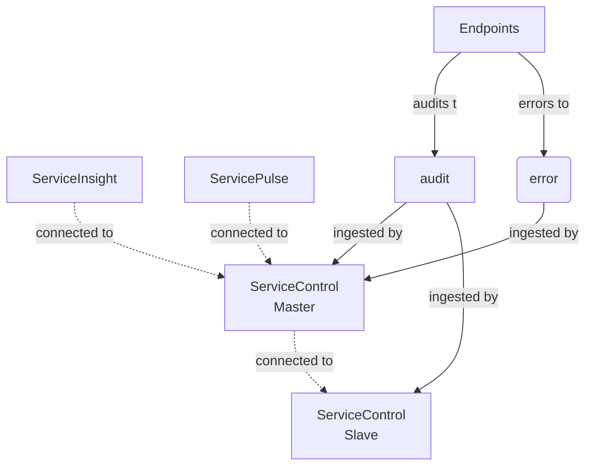
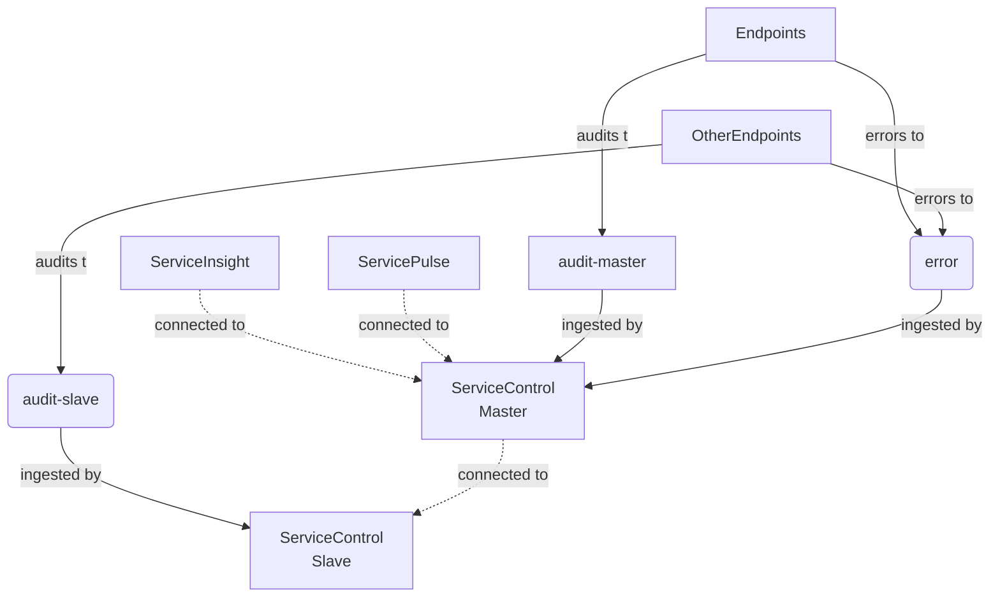
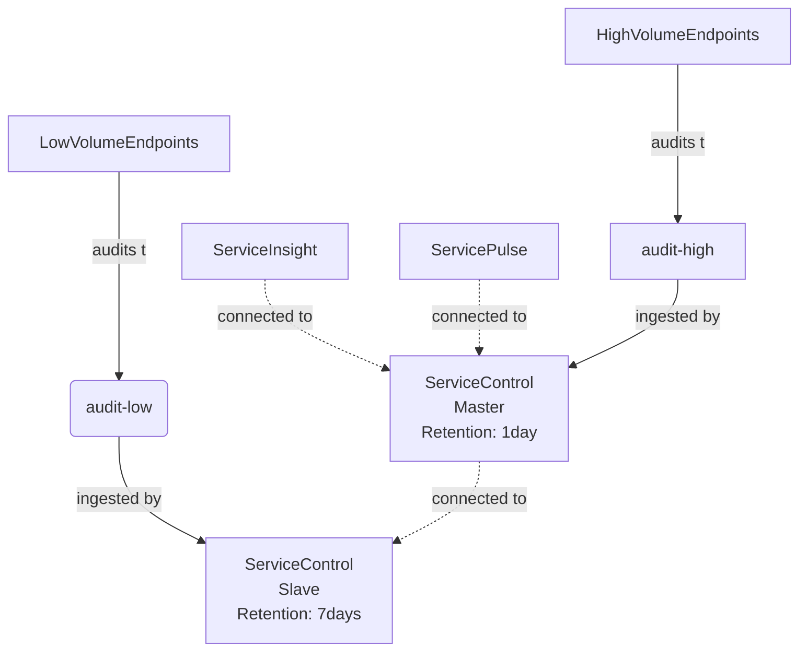
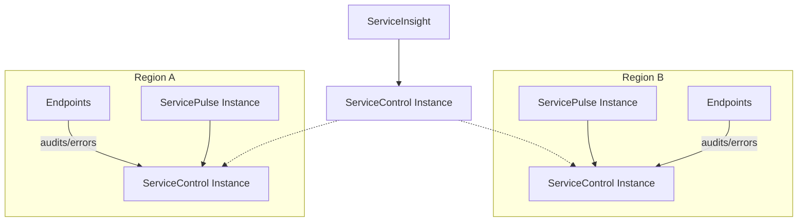

NOTE: A multi-instance ServiceControl installation might be more complex to maintain. Before splitting ServiceControl it is recommended to follow the capacity planning guides described in the [ServiceControl Capacity Planning](/servicecontrol/capacity-and-planning.md) documentation.

Operating ServiceControl at scale with many endpoints producing many thousands of audit messages per second can lead to bottlenecks and congestions when a single Service Control instance is used. ServiceControl can be operated in a "multi-instance mode" which allows to overcome the bottlenecks of a single ServiceControl instance. 

Running multiple instances of ServiceControl is supported to reduce the load of a ServiceControl instance by either running multiple instances of ServiceControl on the same audit queue (competing consumer) or by splitting the audit queue into multiple audit queues. In a message based system the audit queue, in contrast to the error queue for recoverability purposes, is the queue with the most load since all consumed messages are forwarded to the audit queue. ServiceControl ingests the messages available in the audit queue and aggregates them for querying and analysis purposes within [ServiceInsight](/serviceinsight/). 

Aggregating the data for querying and analysis takes considerable computation, memory, disk IO, as well as queuing system resources. Under high load a single instance might not be able to keep up with indexing the data and the incoming audited queue length might start to increase. If the load only spikes occasionally, this might not be a problem since ServiceControl will eventually catch up processing the incoming audit messages. If the load is continuous high however, it might make sense to deploy multiple instances of ServiceControl in a manner that enables competing consumers on the same incoming audit queue, or splits the single audit queue into multiple audit queues (Or a combination of both).

The following high-level actions need to be taken:

- A ServiceControl master instance needs to be installed and configured to route API queries to its slave instances
- One or more ServiceControl slave instances need to be installed
- If the audit queue was split then the production endpoints need to route audited messages to different [audit queues](/nservicebus/operations/auditing.md) which will be consumed by different instances of ServiceControl (either master instances or slave instances)

WARN: Recoverability or error queue handling cannot be scaled out to multiple ServiceControl instances yet. Thus all endpoints still need to route error messages to a centralized [error queue](/nservicebus/recoverability/configure-error-handling.md).

### Multi-instance installation with competing consumers

This section walks through a fresh installation of multiple ServiceControl instances.



As an example two ServiceControl instances are used where one is the master and the other one the slave for auditing. All of the endpoints will forward their audit messages to `audit`. All error messages are forwarded to `error` queue. ServiceInsight and ServicePulse are connected to the master instance.

1. Install ServiceControl master instance which points to `audit` according to the [installation guidelines](/servicecontrol/installation.md).
2. Install ServiceControl slave instance (on separate infrastructure) which points to `audit` according to the [installation guidelines](/servicecontrol/installation.md). The ServiceControl instance name and the port are required to configure the master instance. For example `Particular.ServiceControl.Slave` and the port `33334`. Make sure error queue processing is disabled by specifying `!disable` as the error queue field in the ServiceControl Management Utility, or as the error queue parameter of the [Powershell](/servicecontrol/installation-powershell.md) installation script, or by editing `ServiceControl.exe.config` as shown below:

```xml
<?xml version="1.0" encoding="utf-8"?>
<configuration>
    <appSettings>
        <add key="ServiceBus/ErrorQueue" value="!disabled" />
    </appSettings>
</configuration>
```

If the error queue is set to `!disable` then Error forwarding will be ignored even if enabled.

3. Stop the ServiceControl master instance and edit the [`ServiceControl.exe.config` ](/servicecontrol/creating-config-file.md) with the `RemoteInstances` key. The value for the key is a json array.

```xml
<configuration>
  <appSettings>
    <add key="ServiceControl/RemoteInstances" value="[{'api_uri':'http://localhost:33334/api', 'queue_address':'Particular.ServiceControl.Slave'}]'"/>
  </appSettings>/
</configuration>
```

4. Start ServiceControl master.
5. Validate ServiceInsight and ServicePulse are connecting to the master instance only.

### Multi-instance installation with split audit queue

This section walks through a fresh installation of multiple instances of ServiceControl with split audit queues. 



As an example two ServiceControl instances are used where one is the master and the other one the slave for auditing. Some of the endpoints will forward their audit messages to `audit-master` while some of the endpoints will forward their audit messages to `audit-slave`. All error messages are forwared to `error` queue. ServiceInsight and ServicePulse are connected to the master instance.

1. Install the ServiceControl master instance which ingests messages from the `audit-master` queue according to the [installation guidelines](/servicecontrol/installation.md).
2. Install the ServiceControl slave instance (on separate infrastructure) which ingests messages from the `audit-slave` queue according to the [installation guidelines](/servicecontrol/installation.md). The ServiceControl instance name and the port are required to configure the master instance. In this example, the name `Particular.ServiceControl.Slave` and the port `33334` is used. Make sure error queue processing is disabled by specifying `!disable` as the error queue field in the ServiceControl Management Utility, or as the error queue parameter of the [Powershell](/servicecontrol/installation-powershell.md) installation script, or by editing `ServiceControl.exe.config` as shown below:

```xml
<?xml version="1.0" encoding="utf-8"?>
<configuration>
    <appSettings>
        <add key="ServiceBus/ErrorQueue" value="!disabled" />
    </appSettings>
</configuration>
```

If the error queue is set to `!disable` then Error forwarding will be ignored even if enabled.

3. Stop the ServiceControl master instance and edit the [`ServiceControl.exe.config` ](/servicecontrol/creating-config-file.md) with the `RemoteInstances` key. The value for the key is a json array.

```xml
<configuration>
  <appSettings>
    <add key="ServiceControl/RemoteInstances" value="[{'api_uri':'http://localhost:33334/api', 'queue_address':'Particular.ServiceControl.Slave'}]'"/>
  </appSettings>/
</configuration>
```

4. Start ServiceControl master.
5. Validate ServiceInsight and ServicePulse are connecting to the master instance only.

### Splitting an existing installation

This section walks through converting a single existing ServiceControl installation into a master-slave configuration.

1. Add an additional ServiceControl instance (on separate infrastructure) intended to ingest audit messages only. Disable Error queue processing as described above. This will be a slave instance.
2. Configure production endpoints to send audit messages to the newly added ServiceControl instance.
3. Make the original endpoint a designated master by adding `ServiceControl/RemoteInstances` setting, pointing to the slave instance of ServiceControl.

### Advanced scenarios

#### Audit retention



Each ServiceControl instance can have different settings. For example it is possible to have different [audit retention periods](/servicecontrol/creating-config-file.md#data-retention-servicecontrolauditretentionperiod). With that in mind high volume endpoints can report audits to a ServiceControl instance with shorter retention periods (thus evicting old messages faster). This allows to cater settings as well as resources being used by ServiceControl to the needs of the endpoints configured to audit to a specific ServiceControl instance.

#### Migration

Sometimes it is required to migrate a ServiceControl master to a different machine with more hardware resources. By taking the audit retention period into account it is possible to migrate ServiceControl instances without needing to backup and restore data.

Describe

Server Slow: Master (7 days, error enabled, audit enabled)
Server Fast 1: Slave 1 (error disabled, audit enabled)
Server Fast 2: Slave 2 (error disabled, audit enabled)

endpoints point to Slave 1 Audit and Slave 2 audit
after 7 days
Configure slave 1 to be the new master, enable error
Shutdown master
Point tools to Slave 1 which is the new master

#### Multi-region handling



Using ServiceInsight with a system split into multiple regions is possible using multiple ServiceControl instances. In this scenario each region will contain a dedicated instance of ServiceControl and ServicePulse.

An instance of ServiceControl configured as a master will be required that does not service any region. ServiceInsight can then be connected to the master instance of ServiceControl in order to view messages across all regions.

#### Configuration of multiple slaves

Multiple slave instances can be configured like shown below.

```xml
<configuration>
  <appSettings>
    <add key="ServiceControl/RemoteInstances" value="[{'api_uri':'http://localhost:33334/api', 'queue_address':'Particular.ServiceControl.Slave1'},{'api_uri':'http://localhost:33335/api', 'queue_address':'Particular.ServiceControl.Slave2'}]'"/>
  </appSettings>/
</configuration>
```

#### Disabling Auditing

With multiple instances in place it is possible to disable the auditing in the master and only perform auditing in the slaves. Auditing can be disabled by specifying `!disabled` to the audit queue name field in the ServiceControl Management utility, or by editing the `ServiceControl.exe.config` as shown below.

```xml
<?xml version="1.0" encoding="utf-8"?>
<configuration>
    <appSettings>
        <add key="ServiceBus/AuditQueue" value="!disabled" />
    </appSettings>
</configuration>
```
Audit forwarding, if enabled, will be ignored.

### Known Limitations

- Splitting into multiple ServiceControl instances is only supported for auditing.
- Only one ServiceControl instance should have error handling / recoverability enabled (usually the master) unless the multi-region scenario is used.
- Pagination with ServiceInsight may not work as traditional pagination would. For example some pages might be filled unevenly depending on how the load is scattered between the different ServiceControl instances.
- Data from remote instances that cannot be reached by the master instance will not be included in the results.
- Multi-instance configuration is a manual setup process and cannot be done via the ServiceControl Management application.
- Incorrect configuration could introduce cyclic loops.
- Having multiple masters is discouraged.
