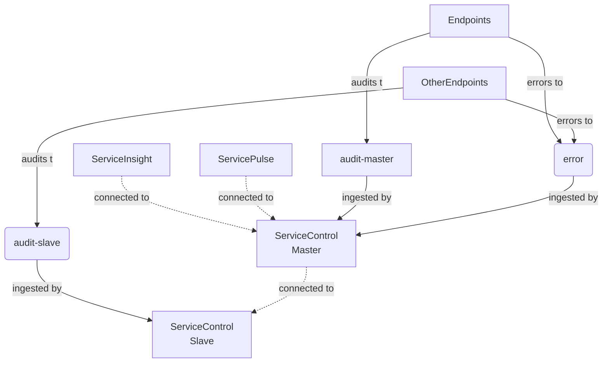
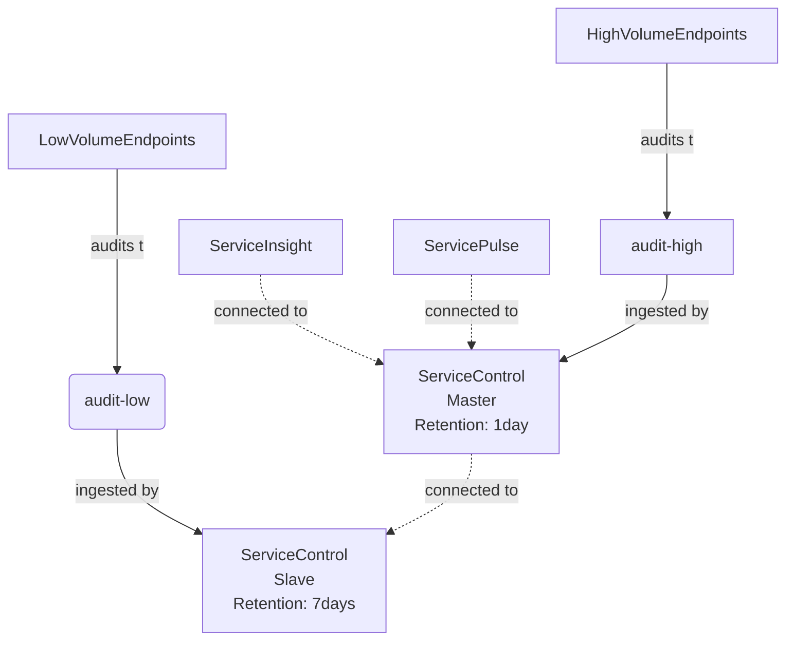

NOTE: A multi-instance ServiceControl installation might be more complex to maintain. Before splitting ServiceControl it is recommended to follow the capacity planning guides described in the [ServiceControl Capacity Planning](/servicecontrol/capacity-and-planning.md) documentation.

Operating ServiceControl at scale with many endpoints producing many thousands of audit messages per second can lead to bottlenecks and congestions when a single Service Control instance is used. ServiceControl can be operated in a "multi-instance mode" which allows to overcome the bottlenecks of a single ServiceControl instance. 

Running multiple instances of ServiceControl is supported to reduce the load of a ServiceControl instance by spliting the audit queue into multiple audit queues. In a message based system the audit queue, in contrast to the error queue for recoverability purposes, is the queue with the most load since all consumed messages are forwarded to the audit queue. ServiceControl ingests the messages available in the audit queue and aggregates them for querying and analysis purposes for [ServiceInsight](/serviceinsight/). 

Aggregating the data for querying and analysis takes up considerable amount of computation, memory as well as queuing system ressources. Under high load a single instance might not be able to keep up with indexing that data and the audited messages might start piling up. Under occasional spiky loads this might not be a problem since ServiceControl will eventually catch up processing the data. Under continuous high load it might make sense to split up ServiceControl into multiple instances and the single audit queue into multiple audit queues. 

The following high-level actions need to be taken:

- A ServiceControl master instance needs to be installed and configured to route API queries to its slave instances
- One or multiple ServiceControl slave instances need to be installed
- Endpoints need to route audited messages to different [audit queues](/nservicebus/operations/auditing.md) either of the master or one of the slaves

WARN: Recoverability or error queue handling with multiple ServiceControl instances is not supported. Thus all endpoints still need to route error messages to a centralized [error queue](/nservicebus/recoverability/configure-error-handling.md).

### Multi-instance installation

This section walks through a fresh installation of multiple ServiceControl instances. 



As an example two ServiceControl instances are used where one is the master and the other one the slave for auditing. Some of the endpoints will forward their audit messages to `audit-master` while some of the endpoints will forward their audit messages to `audit-slave`. All error messages are forwared to `error` queue. ServiceInsight and ServicePulse are connected to the master instance.

1. Install ServiceControl master instance which points to `audit-master` according to the [installation guidelines](https://docs.particular.net/servicecontrol/installation).
1. Install ServiceControl slave instance which points to `audit-slave` according to the [installation guidelines](https://docs.particular.net/servicecontrol/installation). The ServiceControl instance name and the port are required to configure the master instance. For example `Particular.ServiceControl.Slave` and the port `33334`. Make sure the error queue processing is disabled by either entering `!disable` into the error queue field in the ServiceControl Management or passing as the error queue parameter of the [Powershell](/servicecontrol/installation-powershell.md) installation script. Error forwarding, if enabled, will be ignored.
1. Stop the ServiceControl master instance and edit the [`ServiceControl.exe.config` ](/servicecontrol/creating-config-file.md) with the `RemoteInstances` key. The value for the key is a json array.

```xml
<configuration>
  <appSettings>
    <add key="ServiceControl/RemoteInstances" value="[{'api_uri':'http://localhost:33334/api', 'queue_address':'Particular.ServiceControl.Slave'}]'"/>
  </appSettings>/
</configuration>
```
1. Start ServiceControl master.
1. Validate ServiceInsight and ServicePulse are connecting to the master instance only.

### Splitting an existing installation

This section walks through converting a single existing ServiceControl installation into a master-slave configuration.

1. Add an additional ServiceControl instance intended to inject audit messages only. Disable Error queue processing. This will be a slave instance.
2. Configure endpoints to send audit messages to the newly added ServiceControl instance.
3. Make the original endpoint a designated master by adding `ServiceControl/RemoteInstances` setting, pointing to the slave instance of ServiceControl.

### Advanced scenarios

#### Audit retention



Each ServiceControl instance can have different settings. For example it is possible to have different [audit retention periods](/servicecontrol/creating-config-file.md#data-retention-servicecontrolauditretentionperiod). With that in mind high volume endpoints can report audits to a ServiceControl instance with shorter retention periods (thus evicting old messages faster). This allows to cater settings as well as ressources being used by ServiceControl to the needs of the endpoints configured to audit to a specific ServiceControl instance.

#### Migration

Sometimes it is required to migrate a ServiceControl master to a different machine with more hardware ressources. By taking the audit retention period into account it is possible to migrate ServiceControl instances without needing to backup and restore data.

Describe

Server Slow: Master (7 days, error enabled, audit enabled)
Server Fast 1: Slave 1 (error disabled, audit enabled)
Server Fast 2: Slave 2 (error disabled, audit enabled)

endpoints point to Slave 1 Audit and Slave 2 audit
after 7 days
Configure slave 1 to be the new master, enable error
Shutdown master
Point tools to Slave 1 which is the new master

#### Multi-region handling

ServiceInsight connected to
- ServiceControl with Audit and Error disabled
- ServiceControl points to Region A and Region B ServiceControl instances

Region A:
- ServicePulse Region A connected to ServiceControl Region A

Region B:
- ServicePulse Region B connected to ServiceControl Region B

### Known Limitations

- Splitting into multiple ServiceControl instances is only supported for auditing
- Only one ServiceControl instance should have error handling / recoverability enabled (usually the master) unless the multi-region scenario is used
- Pagination with ServiceInsight doesn't work as traditional pagination would. For example pages might be filled unevenly depending on how the load is scattered between the different ServiceControl instances that are aggregated
- Data from remote instances that cannot be reached by the master instance will not be included in the results
- Multi-instance configuration is a manual setup process and cannot be done via the ServiceControl Management
- Incorrect configuration could introduce cyclic loops
- Having multiple masters is discouraged

### Disabling Auditing

- Set Audit queue name to `!disabled`
- Audit forwarding, if enabled, will be ignored.